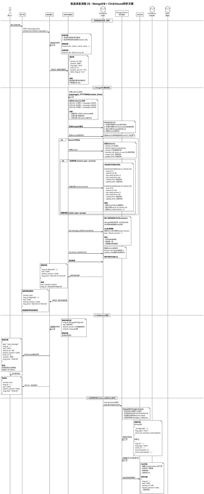

```plantuml
@startuml 发送消息流程V5-MongoDB同步方案
!theme plain
skinparam backgroundColor #FFFFFF
skinparam handwritten false
skinparam defaultFontSize 13
skinparam arrowThickness 2

title 发送消息流程 V5 - MongoDB + ClickHouse同步方案

actor 用户A as Client
participant "客户端" as ClientApp
participant "推送服务" as PushSvc
participant "消息存储服务" as StorageSvc
database "MongoDB\n(主库)" as MongoDB
participant "Change Stream\n同步服务" as ChangeStream
participant "MQ队列" as MQ
database "ClickHouse\n(分析库)" as ClickHouse
database "Redis\n(缓存)" as Redis

== 1. 消息发送与存储（同步） ==

Client -> ClientApp: 输入消息内容
ClientApp -> PushSvc: POST /messages/send\n{session_id, content, msg_type...}

PushSvc -> PushSvc: 查询会话成员
note right
  <b>查询内容:</b>
  1. 会话在线成员(用于推送)
  2. 会话所有成员ID(填充receiver_ids)

  <b>群聊场景:</b>
  receiver_ids = [user1, user2, user3, ...]

  <b>私聊场景:</b>
  receiver_ids = [from_id, to_id]
end note

PushSvc -> StorageSvc: 【同步】调用存储服务
note right
  <b>请求体:</b>
  {
    session_id: "AB",
    content: "你好",
    msg_type: "text",
    from_id: "A",
    receiver_ids: ["A", "B"],
    client_msg_id: "xxx"
  }

  <b>说明:</b>
  推送服务等待存储完成
  不再是异步 MQ
end note

== 2. MongoDB 事务存储 ==

StorageSvc -> StorageSvc: 计算collection名称\n= messages_YYYYMM(create_time)

note right of StorageSvc
  <b>按月分collection示例:</b>
  2025-01-15消息 → messages_202501
  2025-02-20消息 → messages_202502
  2025-03-10消息 → messages_202503

  **优势:**
  ✅ 清理历史: DROP collection秒级
  ✅ 归档方便: 整表导出
  ✅ 冷热分离: 旧collection移HDD
end note

StorageSvc -> MongoDB: **开始MongoDB事务**
note right
    事务保证原子性:
    1. 检查并创建Session(如不存在)
    2. 检查并创建UserSessionState(私聊场景)
    3. 插入消息(MongoDB生成_id)
    4. 更新Session版本号
end note

StorageSvc -> MongoDB: 检查Session是否存在
note right
  查询Session表中是否存在session_id记录
end note

alt Session不存在

    StorageSvc -> MongoDB: 创建Session
    note right
      <b>初始化Session:</b>
      - session_id: 会话ID
      - session_type: private/group
      - version: 0 (初始版本号)
      - member_ids: [user_A, user_B] (成员列表)
      - create_time: 当前时间
      - update_time: 当前时间
    end note

    alt 私聊场景 (session_type = private)

        StorageSvc -> MongoDB: 批量创建UserSessionState
        note right
          <b>为会话双方初始化状态:</b>

          UserSessionState(user_A, session_id):
            - user_id: A
            - session_id: AB
            - last_read_version: 0
            - last_read_time: null
            - create_time: 当前时间
            - update_time: 当前时间

          UserSessionState(user_B, session_id):
            - user_id: B
            - session_id: AB
            - last_read_version: 0
            - last_read_time: null
            - create_time: 当前时间
            - update_time: 当前时间

          <b>说明:</b>
          - 使用 insertMany 批量插入
          - 联合主键: (user_id, session_id)
          - 初始 last_read_version = 0
        end note

    else 群聊场景 (session_type = group)

        note right
          <b>群聊处理:</b>

          UserSessionState不在发送消息时创建
          而是在以下时机创建:
          1. 用户首次进入群聊
          2. 用户被邀请入群
          3. 用户主动加群

          <b>原因:</b>
          - 群成员可能很多,批量创建成本高
          - 按需创建更高效
        end note

    end

end

StorageSvc -> MongoDB: db.messages_202503.insertOne()
note right
  <b>插入消息到按月分片的collection</b>

  MongoDB自动生成 _id (ObjectId)
  并分配单调递增的seq字段

  <b>seq生成策略:</b>
  使用 $inc 原子递增 Session.version
  seq = Session.version + 1

  <b>特点:</b>
  - 会话内单调递增
  - 保证唯一性
  - 无需额外放号服务
end note

StorageSvc -> MongoDB: db.session.updateOne()
note right
  更新Session版本号:
  Session.version从当前值+1
  update_time更新为当前时间

  <b>版本号即为消息seq</b>
end note

StorageSvc -> MongoDB: **提交事务**

MongoDB --> StorageSvc: 返回消息结果
note left
  <b>返回内容:</b>
  {
    msg_id: ObjectId("..."),
    seq: 12345,
    session_version: 12345,
    msg_time: "2025-03-10 10:05:30"
  }

  <b>说明:</b>
  seq = session_version
  msg_id = MongoDB ObjectId
end note

StorageSvc --> PushSvc: 【同步】返回存储结果
note left
  <b>返回给推送服务:</b>
  {
    success: true,
    msg_id: ObjectId("..."),
    seq: 12345,
    session_version: 12345,
    msg_time: "2025-03-10 10:05:30"
  }

  <b>推送服务等待存储完成</b>
end note

== 3. WebSocket 推送 ==

PushSvc -> PushSvc: 构建推送消息
note right
  <b>推送内容包含:</b>
  - msg_id: MongoDB ObjectId
  - seq: 消息序号
  - session_version: 会话最新版本
  - content, msg_type等

  <b>推送对象:</b>
  会话在线成员
end note

PushSvc -> ClientApp: WebSocket推送消息
note left
  <b>推送内容:</b>
  {
    type: "new_message",
    msg_id: "...",
    seq: 12345,
    session_id: "AB",
    session_version: 12345,
    from_id: "A",
    content: "你好",
    msg_time: "10:05:30"
  }

  <b>延迟:</b>
  存储完成后立即推送
  总延迟: 50-100ms
end note

ClientApp --> Client: 显示新消息

PushSvc --> ClientApp: 200 OK - 发送成功
note left
  <b>响应体:</b>
  {
    success: true,
    msg_id: "...",
    seq: 12345,
    session_version: 12345,
    msg_time: "10:05:30"
  }
end note

== 4. 自动同步到ClickHouse和Redis(异步) ==

MongoDB -> ChangeStream: Change Stream监听\noperationType=insert

note right of ChangeStream
  <b>MongoDB Change Stream:</b>
  - 原生支持,无需第三方组件
  - 实时监听INSERT/UPDATE/DELETE
  - 支持断点续传(Resume Token)
  - 可监听所有messages_*collection
end note

ChangeStream -> ChangeStream: 转换文档格式

note right
  <b>转换示例:</b>
  MongoDB:
  {
    _id: ObjectId("..."),
    msg_type: "voice",
    voice: {url, duration, transcription}
  }

  转换为:
  {
    msg_id: "...",
    msg_type: "voice",
    voice_url: "...",
    voice_duration: 15,
    voice_transcription: "..."
  }
end note

ChangeStream -> ChangeStream: 批量缓冲(1000条或1秒)

ChangeStream -> MQ: 发送消息变更事件
note right
  <b>MQ作用:</b>
  - 解耦 Change Stream 和下游
  - 支持多个消费者
  - 削峰填谷
  - 消息持久化

  <b>事件内容:</b>
  {
    msg_id: "...",
    seq: 12345,
    session_id: "AB",
    session_version: 12345,
    ...其他字段
  }
end note

par ClickHouse同步 和 Redis缓存更新 并行

    MQ -> ClickHouse: 消费消息事件
    note right
      <b>消费者1: ClickHouse同步</b>

      INSERT INTO message_analytics
      VALUES (...)

      同步性能:
      - 延迟: 1-3秒
      - 吞吐: 10万条/分钟
      - 失败自动重试
    end note

    ClickHouse -> ClickHouse: 写入按月分区\nPARTITION 202503
    note right
      <b>ClickHouse分区:</b>
      - 按月自动分区(202501, 202502...)
      - 列存储+ZSTD压缩(10:1)
      - TTL自动删除10年前数据

      <b>查询性能:</b>
      - 合规查询: 200-500ms
      - 复杂组合: 800ms-2s
      - 支持任意维度 ✅
    end note

    MQ -> Redis: 消费消息事件
    note right
      <b>消费者2: Redis缓存服务</b>

      <b>Redis List 操作:</b>
      PIPELINE
        LPUSH msg_cache:{session_id} {json}
        LTRIM msg_cache:{session_id} 0 149
        EXPIRE msg_cache:{session_id} 604800
      EXEC

      <b>缓存策略:</b>
      - 所有会话(私聊+群聊)都缓存
      - 只保留最新150条
      - 7天过期(604800秒)
      - 实时更新

      <b>设计理念:</b>
      - 缓存是消息镜像
      - 不维护消息状态
      - 撤回消息也正常缓存
      - 客户端本地处理状态
    end note

end

@enduml
```
