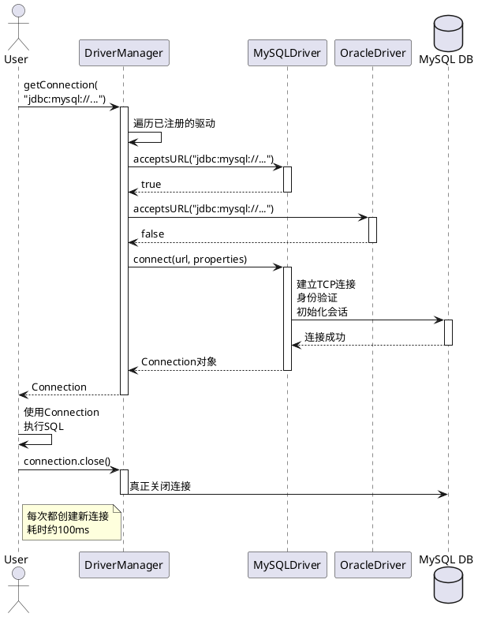
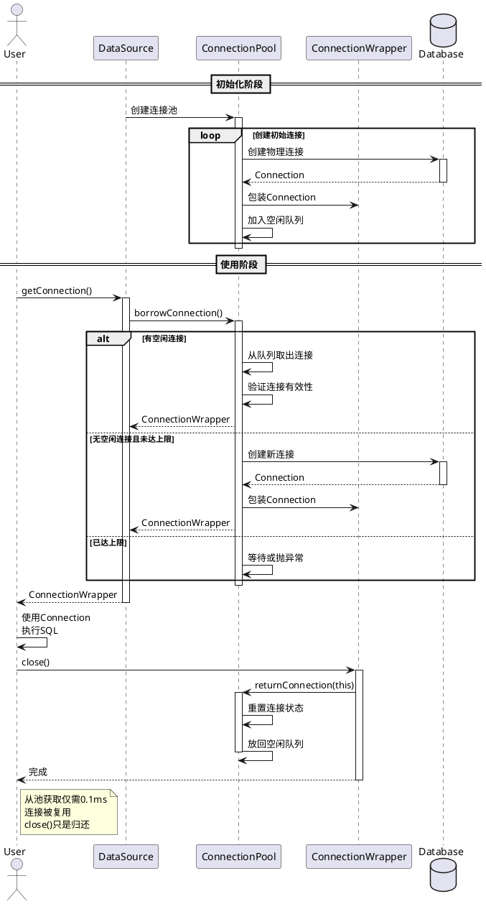
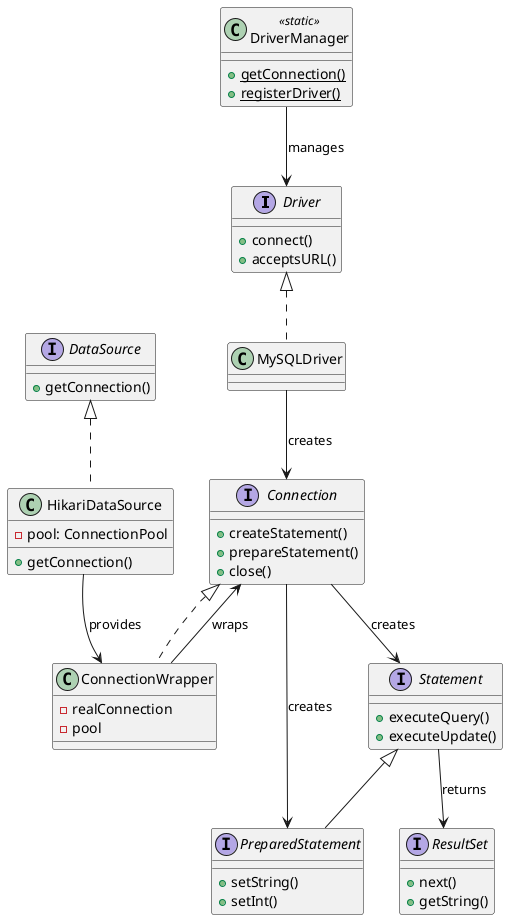

## 1. DriverManager工作流程图

```plantuml
@startuml DriverManager工作流程

actor User
participant "DriverManager" as DM
participant "MySQLDriver" as MySQL
participant "OracleDriver" as Oracle
database "MySQL DB" as DB

User -> DM: getConnection(\n"jdbc:mysql://...")
activate DM

DM -> DM: 遍历已注册的驱动
DM -> MySQL: acceptsURL("jdbc:mysql://...")
activate MySQL
MySQL --> DM: true
deactivate MySQL

DM -> Oracle: acceptsURL("jdbc:mysql://...")
activate Oracle
Oracle --> DM: false
deactivate Oracle

DM -> MySQL: connect(url, properties)
activate MySQL
MySQL -> DB: 建立TCP连接\n身份验证\n初始化会话
activate DB
DB --> MySQL: 连接成功
deactivate DB
MySQL --> DM: Connection对象
deactivate MySQL

DM --> User: Connection
deactivate DM

User -> User: 使用Connection\n执行SQL

User -> DM: connection.close()
activate DM
DM -> DB: 真正关闭连接
deactivate DM

note right of User
  每次都创建新连接
  耗时约100ms
end note

@enduml
```

## 2. DataSource工作流程图

```plantuml
@startuml DataSource工作流程

actor User
participant "DataSource" as DS
participant "ConnectionPool" as Pool
participant "ConnectionWrapper" as Wrapper
database "Database" as DB

== 初始化阶段 ==
DS -> Pool: 创建连接池
activate Pool
loop 创建初始连接
  Pool -> DB: 创建物理连接
  activate DB
  DB --> Pool: Connection
  deactivate DB
  Pool -> Wrapper: 包装Connection
  Pool -> Pool: 加入空闲队列
end
deactivate Pool

== 使用阶段 ==
User -> DS: getConnection()
activate DS
DS -> Pool: borrowConnection()
activate Pool

alt 有空闲连接
  Pool -> Pool: 从队列取出连接
  Pool -> Pool: 验证连接有效性
  Pool --> DS: ConnectionWrapper
else 无空闲连接且未达上限
  Pool -> DB: 创建新连接
  activate DB
  DB --> Pool: Connection
  deactivate DB
  Pool -> Wrapper: 包装Connection
  Pool --> DS: ConnectionWrapper
else 已达上限
  Pool -> Pool: 等待或抛异常
end

deactivate Pool
DS --> User: ConnectionWrapper
deactivate DS

User -> User: 使用Connection\n执行SQL

User -> Wrapper: close()
activate Wrapper
Wrapper -> Pool: returnConnection(this)
activate Pool
Pool -> Pool: 重置连接状态
Pool -> Pool: 放回空闲队列
deactivate Pool
Wrapper --> User: 完成
deactivate Wrapper

note right of User
  从池获取仅需0.1ms
  连接被复用
  close()只是归还
end note

@enduml
```

## 3. 完整的类关系图（简化版）

```plantuml
@startuml JDBC核心类关系

' 定义接口
interface Driver {
  + connect()
  + acceptsURL()
}

interface DataSource {
  + getConnection()
}

interface Connection {
  + createStatement()
  + prepareStatement()
  + close()
}

interface Statement {
  + executeQuery()
  + executeUpdate()
}

interface PreparedStatement {
  + setString()
  + setInt()
}

interface ResultSet {
  + next()
  + getString()
}

' 定义类
class DriverManager <<static>> {
  {static} + getConnection()
  {static} + registerDriver()
}

class HikariDataSource {
  - pool: ConnectionPool
  + getConnection()
}

class MySQLDriver {
}

class ConnectionWrapper {
  - realConnection
  - pool
}

' 关系
DataSource <|.. HikariDataSource
Driver <|.. MySQLDriver
Connection <|.. ConnectionWrapper

DriverManager --> Driver : manages
HikariDataSource --> ConnectionWrapper : provides
MySQLDriver --> Connection : creates
ConnectionWrapper --> Connection : wraps

Connection --> Statement : creates
Connection --> PreparedStatement : creates
Statement <|-- PreparedStatement
Statement --> ResultSet : returns

@enduml
```

