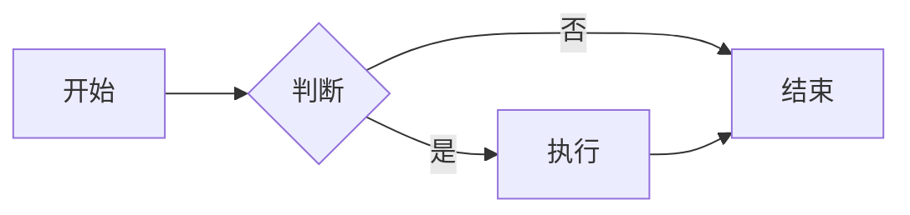
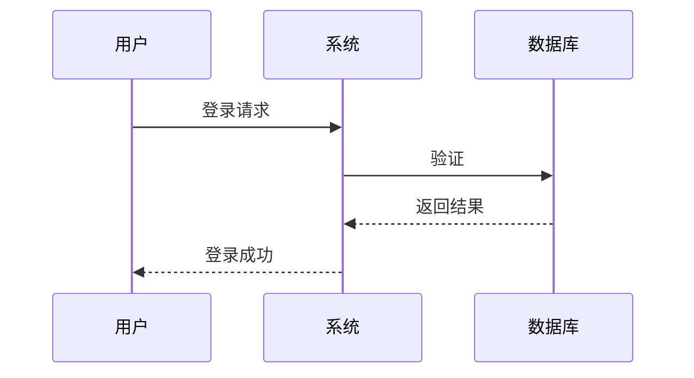
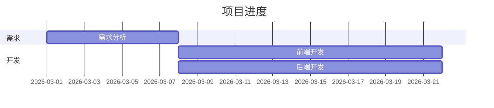

# 图表可视化

在 Obsidian 中创建各种图表。

---

## 📋 目录

- [Charts 插件](#charts-插件)
- [Mermaid 图表](#mermaid-图表)
- [实践案例](#实践案例)

---

## Charts 插件

### 安装配置
```yaml
设置 → 社区插件 → 浏览 → 搜索 "Charts" → 安装
```

### 使用方法
````markdown
```charts
type: bar
labels: [一月, 二月, 三月]
series:
  - title: 收入
    data: [100, 120, 140]
  - title: 支出
    data: [80, 90, 95]
```
````

---

## Mermaid 图表

### 内置支持
```yaml
Obsidian 内置支持 Mermaid，无需额外安装
```

### 常用图表

**流程图**：
````markdown

````

**时序图**：
````markdown

````

**甘特图**：
````markdown

````

---

## 实践案例

### 案例1：项目统计
````markdown
```charts
type: pie
labels: [完成, 进行中, 待办]
series:
  - data: [30, 50, 20]
```
````

---

**文档版本**：v2.0
**最后更新**：2026-03-06
