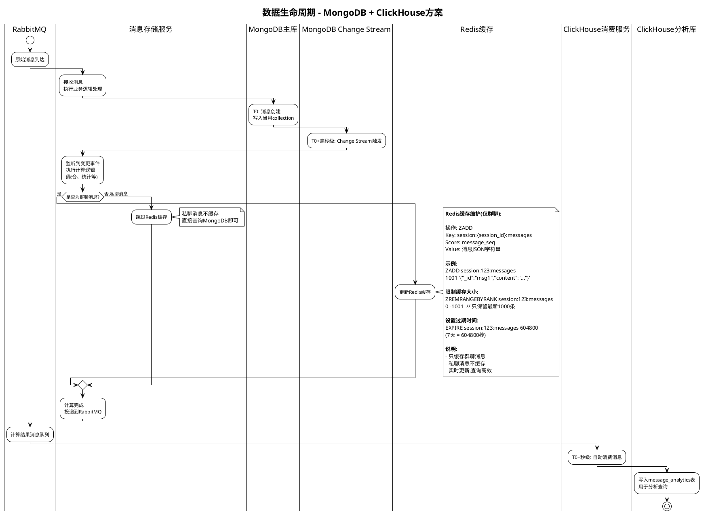

```plantuml
@startuml 数据生命周期V4-MongoDB+ClickHouse
!theme plain

title 数据生命周期 - MongoDB + ClickHouse方案

|RabbitMQ|

start

:原始消息到达;

|消息存储服务|

:接收消息
执行业务逻辑处理;

|MongoDB主库|

:T0: 消息创建
写入当月collection;

|MongoDB Change Stream|

:T0+毫秒级: Change Stream触发;

|消息存储服务|

:监听到变更事件
执行计算逻辑
(聚合、统计等);

if (是否为群聊消息?) then (是)

    |Redis缓存|

    :更新Redis缓存;
    note right
        <b>Redis缓存维护(仅群聊):</b>

        操作: ZADD
        Key: session:{session_id}:messages
        Score: message_seq
        Value: 消息JSON字符串

        <b>示例:</b>
        ZADD session:123:messages
        1001 '{"_id":"msg1","content":"..."}'

        <b>限制缓存大小:</b>
        ZREMRANGEBYRANK session:123:messages
        0 -1001  // 只保留最新1000条

        <b>设置过期时间:</b>
        EXPIRE session:123:messages 604800
        (7天 = 604800秒)

        <b>说明:</b>
        - 只缓存群聊消息
        - 私聊消息不缓存
        - 实时更新,查询高效
    end note

else (否,私聊消息)

    |消息存储服务|

    :跳过Redis缓存;
    note right
        私聊消息不缓存
        直接查询MongoDB即可
    end note

endif

|消息存储服务|

:计算完成
投递到RabbitMQ;

|RabbitMQ|

:计算结果消息队列;

|ClickHouse消费服务|

:T0+秒级: 自动消费消息;

|ClickHouse分析库|

:写入message_analytics表
用于分析查询;

stop

@enduml
```
