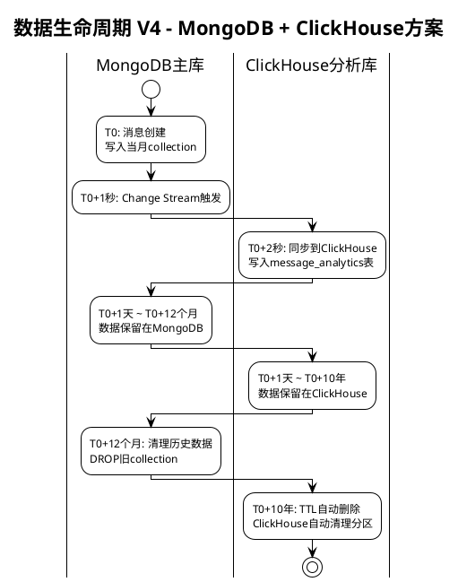

```plantuml
@startuml 数据生命周期V4-MongoDB+ClickHouse
!theme plain

title 数据生命周期 V4 - MongoDB + ClickHouse方案

|MongoDB主库|

start

:T0: 消息创建
写入当月collection;

:T0+1秒: Change Stream触发;

|ClickHouse分析库|

:T0+2秒: 同步到ClickHouse
写入message_analytics表;

|MongoDB主库|

:T0+1天 ~ T0+12个月
数据保留在MongoDB;

|ClickHouse分析库|

:T0+1天 ~ T0+10年
数据保留在ClickHouse;

|MongoDB主库|

:T0+12个月: 清理历史数据
DROP旧collection;

|ClickHouse分析库|

:T0+10年: TTL自动删除
ClickHouse自动清理分区;

stop

@enduml

```
