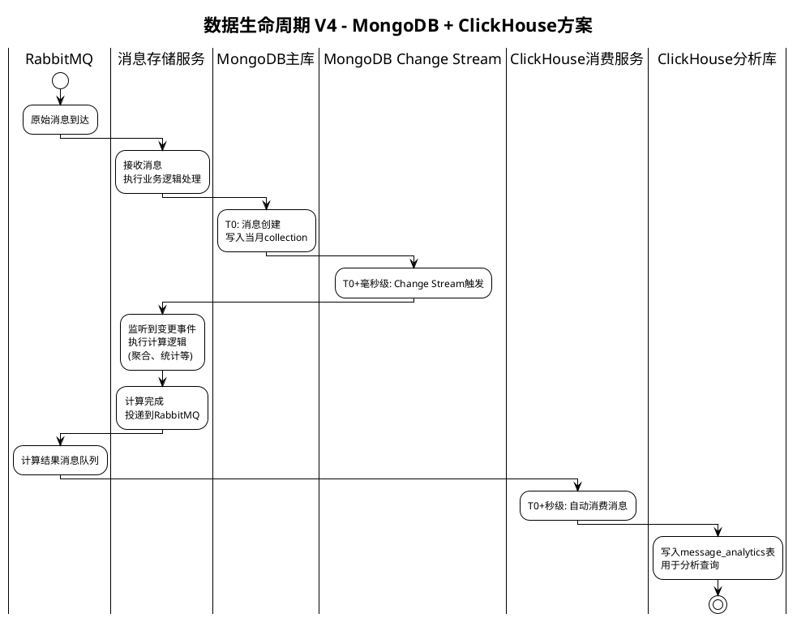

```plantuml
@startuml 数据生命周期V4-MongoDB+ClickHouse
!theme plain

title 数据生命周期 V4 - MongoDB + ClickHouse方案

|RabbitMQ|

start

:原始消息到达;

|消息存储服务|

:接收消息
执行业务逻辑处理;

|MongoDB主库|

:T0: 消息创建
写入当月collection;

|MongoDB Change Stream|

:T0+毫秒级: Change Stream触发;

|消息存储服务|

:监听到变更事件
执行计算逻辑
(聚合、统计等);

:计算完成
投递到RabbitMQ;

|RabbitMQ|

:计算结果消息队列;

|ClickHouse消费服务|

:T0+秒级: 自动消费消息;

|ClickHouse分析库|

:写入message_analytics表
用于分析查询;

stop

@enduml
```
