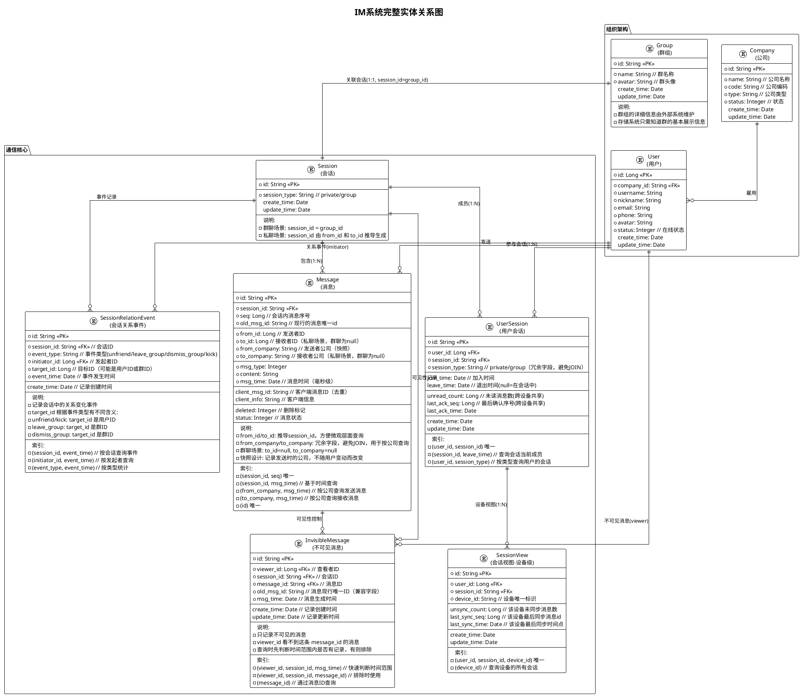

## 核心设计思想

### 1. session_id 的设计

**群聊场景**：
```
session_id = group_id
- Session 表和 Group 表通过 id 直接关联
- 不需要 Session 表中的 group_id 字段
- session_type = 'group' 表示这是群聊
```

**私聊场景**：
```
session_id 由 from_id 和 to_id 推导
- 规则示例: "p_{min(from_id, to_id)}_{max(from_id, to_id)}"
- 例如: user_123 和 user_456 的私聊
  session_id = "p_123_456"
- 保证同两个用户的会话 ID 唯一且可推导
```

### 2. Group 表的简化设计

```
Group 表只存储：
- id: 群组ID（= session_id）
- name: 群名称
- avatar: 群头像

不存储：
- company_id ❌ (群组不属于某个公司)
- creator_id ❌ (由外部系统维护)
- owner_id ❌ (由外部系统维护)
- members ❌ (由外部系统维护)
- max_members ❌ (由外部系统维护)
```

**原因**：
- 存储系统只需要知道群的展示信息（名称、头像）
- 群组的业务逻辑（权限、成员管理等）由外部群组服务维护
- 保持存储系统的职责单一

### 3. Message 表的字段设计

**核心字段**：
```
from_id + to_id:
- 私聊场景: 可以推导出 session_id
- 群聊场景: to_id = null
- 便于从消息微观层面获取上层数据

from_company + to_company:
- 记录发送时的公司（快照）
- 用于按公司维度查询消息（合规审计）
- 群聊场景: to_company = null
- 不随用户换公司而改变
```

**查询示例**：
```sql
-- 查询某公司在某时间段的所有发送消息
SELECT * FROM Message
WHERE from_company = 'CompanyA'
  AND msg_time BETWEEN '2024-01-01' AND '2024-01-31';

-- 查询某公司在某时间段的所有接收消息（私聊）
SELECT * FROM Message
WHERE to_company = 'CompanyA'
  AND msg_time BETWEEN '2024-01-01' AND '2024-01-31';
```

### 4. 实体关系层次

```
Company (1) -----> (N) User
                     |
                     +--> (1:N) UserSession (一个用户参与多个会话)
                                    |
                                    +--> (1:N) SessionView (一个会话多个设备)

Group (1) <----> (1) Session (session_id = group_id)
                      |
                      +--> (1:N) UserSession (一个会话有多个成员)
                      +--> (1:N) Message (一个会话包含多条消息)
```

### 5. 消息可见性控制（核心设计）

#### 问题背景

**解除好友后的消息可见性需求**：
```
场景：A 和 B 解除好友（时间点 T）
需求：
- A 看不到 B 在 T 之后发的消息 ❌
- B 看不到 A 在 T 之后发的消息 ❌
- A 能看到自己在 T 之后发的消息 ✅
- B 能看到自己在 T 之后发的消息 ✅
```

**为什么时间区间方案不行**：
```
如果用不可见时间区间 [T, null]：
- A 的不可见区间: [10:00:05, null]
  - 结果: A 看不到 10:00:05 后的所有消息
  - ❌ 错误: A 自己发的消息也看不到了

核心问题: 时间区间无法区分"谁发的消息"
```

#### 最终方案: InvisibleMessage + SessionRelationEvent（两表分离）

**核心思想**：
- **InvisibleMessage**：记录哪些消息对哪些用户不可见（结果）
- **SessionRelationEvent**：记录导致不可见的事件（原因）
- 两表职责分离，各司其职

**InvisibleMessage（不可见消息）**：
```
InvisibleMessage:
- viewer_id: 查看者ID
- session_id: 会话ID
- message_id: 消息ID（这条消息对 viewer_id 不可见）
- old_msg_id: 消息现行唯一ID（兼容字段）
- msg_time: 消息生成时间
- create_time: 记录创建时间
- update_time: 记录更新时间
```

**SessionRelationEvent（会话关系事件）**：
```
SessionRelationEvent:
- session_id: 会话ID
- event_type: 事件类型（unfriend/leave_group/dismiss_group/kick）
- initiator_id: 发起者ID
- target_id: 目标用户ID（踢人场景）
- event_time: 事件发生时间
- create_time: 记录创建时间
```

**解除好友场景**：
```
T1 (10:00:05): A 主动解除与 B 的好友关系
  - SessionRelationEvent 表: 插入事件记录
    (session_id, event_type='unfriend',
     initiator_id=A, target_id=B,
     event_time='10:00:05')

T2 (10:00:06): B 发送消息 msg1
  - Message 表: 正常存储 msg1
  - InvisibleMessage 表: 插入
    (viewer_id=A, message_id=msg1, msg_time='10:00:06')
  - 含义: A 看不到这条消息

T3 (10:00:07): A 发送消息 msg2
  - Message 表: 正常存储 msg2
  - InvisibleMessage 表: 插入
    (viewer_id=B, message_id=msg2, msg_time='10:00:07')
  - 含义: B 看不到这条消息

T4 (10:00:08): B 再发消息 msg3
  - InvisibleMessage 表: 插入
    (viewer_id=A, message_id=msg3, msg_time='10:00:08')
```

**群解散场景**：
```
T1 (15:00:00): 群主解散群（群有100个成员）
  - SessionRelationEvent 表: 插入事件记录
    (session_id, event_type='dismiss_group',
     initiator_id=群主ID, target_id=null,
     event_time='15:00:00')

T2 (15:00:01): 某成员尝试发送消息 msg1
  - Message 表: 正常存储 msg1（存储层不禁止）
  - InvisibleMessage 表: 批量插入 99 条记录
    (viewer_id=成员1, message_id=msg1, msg_time='15:00:01')
    (viewer_id=成员2, message_id=msg1, msg_time='15:00:01')
    ...
    (viewer_id=成员99, message_id=msg1, msg_time='15:00:01')
  - 发送者自己能看到，其他人看不到
```

**踢出群场景**：
```
T1 (12:00:00): 管理员踢出用户 C
  - SessionRelationEvent 表: 插入事件记录
    (session_id, event_type='kick',
     initiator_id=管理员ID, target_id=C,
     event_time='12:00:00')

T2 (12:00:01): 群内其他成员发送消息
  - InvisibleMessage 表: 插入
    (viewer_id=C, message_id=..., msg_time='12:00:01')
  - 被踢的 C 看不到后续消息
```

**查询逻辑（基于游标分页）**：
```sql
-- 步骤1: 快速判断当前查询范围是否有可见性问题
SELECT EXISTS(
  SELECT 1 FROM InvisibleMessage
  WHERE viewer_id = ?
    AND session_id = ?
    AND msg_time >= ?  -- 游标起始时间
) AS has_visibility_issue;

-- 步骤2: 如果没有可见性问题，直接查询
SELECT m.*
FROM Message m
WHERE m.session_id = ?
  AND m.msg_time >= ?  -- 游标
ORDER BY m.seq
LIMIT 100;

-- 步骤3: 如果有可见性问题，排除不可见消息
SELECT m.*
FROM Message m
WHERE m.session_id = ?
  AND m.msg_time >= ?  -- 游标
  AND NOT EXISTS (
    SELECT 1 FROM InvisibleMessage im
    WHERE im.viewer_id = ?
      AND im.message_id = m.id
  )
ORDER BY m.seq
LIMIT 100;
```

**重新添加好友**：
```
T5 (10:00:20): A 和 B 重新添加好友
  - SessionRelationEvent 表: 可选记录事件
    (session_id, event_type='add_friend',
     initiator_id=A, target_id=B,
     event_time='10:00:20')

处理方式1: 不做任何操作（推荐）
  - 历史消息的可见性保持不变（隐私保护）
  - 10:00:20 之后的新消息不再插入 InvisibleMessage
  - InvisibleMessage 表的历史记录保留（审计）

处理方式2: 删除记录（可选）
  - 如果希望重新添加好友后能看到历史消息
  - DELETE FROM InvisibleMessage
    WHERE session_id = ?
      AND viewer_id IN (A, B)
      AND msg_time >= '10:00:05'  -- 解除好友时间
      AND msg_time < '10:00:20';  -- 重新添加时间
```

**两表分离的优点**：
- ✅ **职责清晰**：
  - InvisibleMessage: 存储结果（哪条消息不可见）
  - SessionRelationEvent: 存储原因（为什么不可见）
- ✅ **查询高效**：先判断是否有可见性问题，有则排除
- ✅ **适配游标分页**：基于 msg_time 的游标查询天然支持
- ✅ **语义直观**：直接记录"这条消息这个用户看不到"
- ✅ **数据量可控**：只记录不可见的消息，不是所有消息
- ✅ **事件可追溯**：SessionRelationEvent 记录完整的事件历史

**写入时机**：
```java
// 场景1: 解除好友时（关系服务通知存储服务）
public void onUnfriendEvent(UnfriendEvent event) {
    // 1. 插入关系事件
    SessionRelationEvent sre = new SessionRelationEvent();
    sre.setSessionId(event.getSessionId());
    sre.setEventType("unfriend");
    sre.setInitiatorId(event.getInitiatorId());
    sre.setTargetId(event.getTargetId());
    sre.setEventTime(event.getEventTime());

    eventRepo.insert(sre);
}

// 场景2: 发送消息时
public void sendMessage(Message msg) {
    // 1. 保存消息
    messageRepo.save(msg);

    // 2. 判断是否需要插入不可见记录
    // 查询关系状态（可缓存）
    RelationStatus status = relationService.getStatus(
        msg.fromId, msg.toId, msg.sessionId
    );

    if (status.isUnfriended() || status.isBlocked()) {
        // 3. 插入不可见记录（对方看不到）
        InvisibleMessage im = new InvisibleMessage();
        im.setViewerId(msg.toId);  // 接收方看不到
        im.setSessionId(msg.sessionId);
        im.setMessageId(msg.id);
        im.setOldMsgId(msg.oldMsgId);
        im.setMsgTime(msg.msgTime);

        invisibleMessageRepo.insert(im);
    }
}
```

**表关联查询（审计场景）**：
```sql
-- 查询某条消息为什么不可见
SELECT
    im.viewer_id,
    im.message_id,
    im.msg_time,
    sre.event_type,
    sre.initiator_id,
    sre.event_time
FROM InvisibleMessage im
LEFT JOIN SessionRelationEvent sre
    ON im.session_id = sre.session_id
    AND im.msg_time >= sre.event_time
WHERE im.message_id = ?
ORDER BY sre.event_time DESC
LIMIT 1;
```

### 6. 关键约束

**seq 不连续**：
- seq 只保证单调自增，不保证连续
- 可见性判断必须依赖时间（msg_time）
- seq 只用于排序和去重

**时间精度**：
- msg_time 使用毫秒级时间戳
- 边界时间（invisible_start_time/end_time）也是毫秒级

## 设计优势总结

1. ✅ **session_id 语义明确**：群聊直接用 group_id，私聊可推导
2. ✅ **Group 表简化**：只存储展示信息，业务逻辑外部维护
3. ✅ **消息微观完整**：from_id/to_id/from_company/to_company 便于查询
4. ✅ **可见性控制直观**：不可见区间设计，查询时直接排除
5. ✅ **存储系统职责单一**：只关注消息存储和可见性，不涉及业务逻辑
