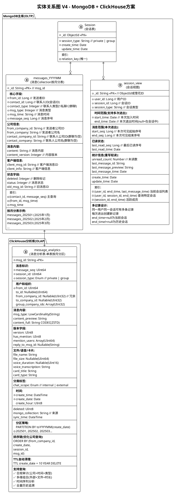

```plantuml
@startuml 实体关系图V4-MongoDB方案
!theme plain
skinparam linetype ortho

title 实体关系图 V4 - MongoDB + ClickHouse方案

' ============ MongoDB实体 ============

package "MongoDB主库(OLTP)" {

  entity "Session\n(会话表)" as Session {
    * _id: ObjectId <<PK>>
    --
    * session_type: String // private | group
    * create_time: Date
    update_time: Date
    ---
    索引:
    - relation_key (唯一)
  }

  entity "messages_YYYYMM\n(消息Collection按月分表)" as Message {
    * _id: String <<PK>> // msg_id
    --
    <b>核心字段:</b>
    * from_id: Long // 发送者ID
    * contact_id: Long // 联系人ID(会话ID)
    * contact_type: Integer // 联系人类型(1私聊/2群聊)
    * msg_type: Integer // 消息类型
    * msg_time: String // 消息时间
    * message_seq: Long // 消息序号
    --
    <b>公司信息:</b>
    from_company_id: String // 发送者公司ID
    from_company: String // 发送者公司名
    contact_company_id: String // 联系人公司ID(群聊为空)
    contact_company: String // 联系人公司名(群聊为空)
    --
    <b>消息内容:</b>
    content: String // 消息内容
    content_version: Integer // 内容版本
    --
    <b>客户端信息:</b>
    client_msg_id: String // 客户端消息ID
    client_info: String // 客户端信息
    --
    <b>状态字段:</b>
    deleted: Integer // 删除标记
    status: Integer // 消息状态
    old_msg_id: String // 旧消息ID
    ---
    索引:
    - (contact_id, message_seq) 主查询
    - (from_id, msg_time)
    - msg_time
    ---
    <b>按月分表示例:</b>
    messages_202501 (2025年1月)
    messages_202502 (2025年2月)
    messages_202503 (2025年3月)
    ...
  }

  entity "session_view\n(会话视图)" as SessionView {
    * _id: String <<PK>> // ObjectId或雪花ID
    --
    * user_id: Long // 用户ID
    * session_id: Long // 会话ID
    * session_type: String // 会话类型
    --
    <b>时间范围(支持多次进出):</b>
    * start_time: Date // 本次加入时间
    end_time: Date // 本次退出时间(null=在会话中)
    --
    <b>消息范围(本次进出):</b>
    start_seq: Long // 本次可见起始序号
    end_seq: Long // 本次可见结束序号
    --
    <b>已读状态:</b>
    last_read_seq: Long // 最后已读序号
    last_read_time: Date
    --
    <b>统计信息(重写轻读):</b>
    unread_count: Number // 未读数
    last_message_id: String
    last_message_preview: String
    last_message_time: Date
    --
    create_time: Date
    update_time: Date
    ---
    索引:
    - (user_id, end_time, last_message_time) 当前会话列表
    - (user_id, session_id, end_time) 查询特定会话
    - (session_id, end_time) 活跃成员
    ---
    <b>多记录设计:</b>
    同一用户同一会话可有多条记录
    每次进出创建新记录
    end_time=null为当前会话
    end_time!=null为历史会话
  }

}

' ============ ClickHouse实体 ============

package "ClickHouse分析库(OLAP)" {

  entity "message_analytics\n(消息分析表-单表按月分区)" as Analytics {
    * msg_id: String <<PK>>
    --
    <b>消息标识:</b>
    * message_seq: UInt64
    * session_id: UInt64
    * session_type: Enum // private | group
    --
    <b>用户和组织:</b>
    * from_id: UInt64
    to_id: Nullable(UInt64)
    from_company_id: Nullable(UInt32) // 冗余
    to_company_id: Nullable(UInt32)
    group_company_ids: Array(UInt32)
    --
    <b>消息内容:</b>
    msg_type: LowCardinality(String)
    content_preview: String
    content_full: String CODEC(ZSTD)
    --
    <b>版本字段:</b>
    version: UInt8
    has_mention: UInt8
    mention_users: Array(UInt64)
    reply_to_msg_id: Nullable(String)
    --
    <b>文件/语音/卡片:</b>
    file_name: String
    file_size: Nullable(UInt64)
    voice_duration: Nullable(UInt16)
    voice_transcription: String
    card_title: String
    card_type: String
    --
    <b>分类标签:</b>
    chat_scope: Enum // internal | external
    --
    <b>时间:</b>
    * create_time: DateTime
    * create_date: Date
    create_hour: UInt8
    --
    deleted: UInt8
    mongo_collection: String // 来源
    sync_time: DateTime
    ---
    <b>分区策略:</b>
    PARTITION BY toYYYYMM(create_date)
    - 202501, 202502, 202503...
    ---
    <b>排序键(优化公司查询):</b>
    ORDER BY (from_company_id,
              create_date,
              session_id,
              msg_id)
    ---
    <b>TTL自动清理:</b>
    TTL create_date + 10 YEAR DELETE
    ---
    <b>支持查询:</b>
    ✅ 合规审计(公司+时间+类型)
    ✅ 多维组合(外部+文件+时长)
    ✅ 时间序列分析
    ✅ 全量历史追溯
  }

}

' ============ 关系 ============

Session ||--o{ Message 


Session ||--o{ SessionView 
Message ||--|| Analytics 

@enduml

```
