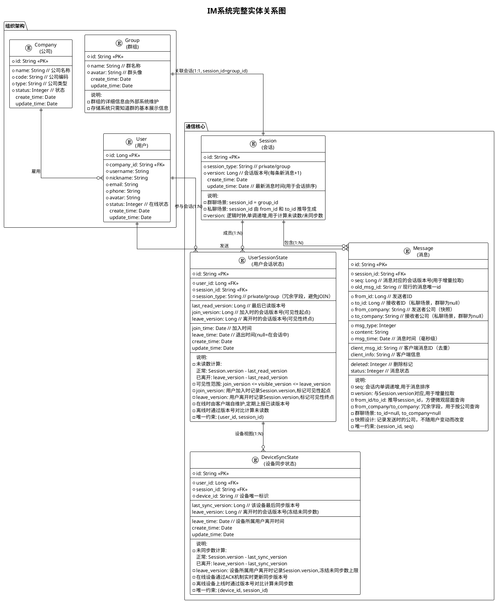

```plantuml
@startuml 完整实体关系图-IM系统
!theme plain
skinparam linetype ortho

title IM系统完整实体关系图

' ============ 组织架构实体 ============
package "组织架构" {
  entity "Company\n(公司)" as Company {
    * id: String <<PK>>
    --
    * name: String // 公司名称
    * code: String // 公司编码
    * type: String // 公司类型
    * status: Integer // 状态
    create_time: Date
    update_time: Date
  }

  entity "User\n(用户)" as User {
    * id: Long <<PK>>
    --
    * company_id: String <<FK>>
    * username: String
    * nickname: String
    * email: String
    * phone: String
    * avatar: String
    * status: Integer // 在线状态
    create_time: Date
    update_time: Date
  }

  entity "Group\n(群组)" as Group {
    * id: String <<PK>>
    --
    * name: String // 群名称
    * avatar: String // 群头像
    create_time: Date
    update_time: Date
    --
    说明:
    - 群组的详细信息由外部系统维护
    - 存储系统只需知道群的基本展示信息
  }
}

' ============ 通信核心实体 ============
package "通信核心" {
  entity "Session\n(会话)" as Session {
    * id: String <<PK>>
    --
    * session_type: String // private/group
    * version: Long // 会话版本号(每条新消息+1)
    create_time: Date
    update_time: Date // 最新消息时间(用于会话排序)
    --
    说明:
    - 群聊场景: session_id = group_id
    - 私聊场景: session_id 由 from_id 和 to_id 推导生成
    - version: 逻辑时钟,单调递增,用于计算未读数/未同步数
  }

  entity "UserSessionState\n(用户会话状态)" as UserSessionState {
    * id: String <<PK>>
    --
    * user_id: Long <<FK>>
    * session_id: String <<FK>>
    * session_type: String // private/group（冗余字段，避免JOIN）
    --
    last_read_version: Long // 最后已读版本号
    join_version: Long // 加入时的会话版本号(可见性起点)
    leave_version: Long // 离开时的会话版本号(可见性终点)
    --
    join_time: Date // 加入时间
    leave_time: Date // 退出时间(null=在会话中)
    create_time: Date
    update_time: Date
    --
    说明:
    - 未读数计算:
      正常: Session.version - last_read_version
      已离开: leave_version - last_read_version
    - 可见性范围: join_version <= visible_version <= leave_version
    - join_version: 用户加入时记录Session.version,标记可见性起点
    - leave_version: 用户离开时记录Session.version,标记可见性终点
    - 在线时由客户端自维护,定期上报已读版本号
    - 离线时通过版本号对比计算未读数
    - 唯一约束: (user_id, session_id)
  }

  entity "DeviceSyncState\n(设备同步状态)" as DeviceSyncState {
    * id: String <<PK>>
    --
    * user_id: Long <<FK>>
    * session_id: String <<FK>>
    * device_id: String // 设备唯一标识
    --
    last_sync_version: Long // 该设备最后同步版本号
    leave_version: Long // 离开时的会话版本号(冻结未同步数)
    --
    leave_time: Date // 设备所属用户离开时间
    create_time: Date
    update_time: Date
    --
    说明:
    - 未同步数计算:
      正常: Session.version - last_sync_version
      已离开: leave_version - last_sync_version
    - leave_version: 设备所属用户离开时记录Session.version,冻结未同步数上限
    - 在线设备通过ACK机制实时更新同步版本号
    - 离线设备上线时通过版本号对比计算未同步数
    - 唯一约束: (device_id, session_id)
  }

  entity "Message\n(消息)" as Message {
    * id: String <<PK>>
    --
    * session_id: String <<FK>>
    * seq: Long // 消息对应的会话版本号(用于增量拉取)
    * old_msg_id: String // 现行的消息唯一id
    --
    * from_id: Long // 发送者ID
    * to_id: Long // 接收者ID（私聊场景，群聊为null）
    * from_company: String // 发送者公司（快照）
    * to_company: String // 接收者公司（私聊场景，群聊为null）
    --
    * msg_type: Integer
    * content: String
    * msg_time: Date // 消息时间（毫秒级）
    --
    client_msg_id: String // 客户端消息ID（去重）
    client_info: String // 客户端信息
    --
    deleted: Integer // 删除标记
    status: Integer // 消息状态
    --
    说明:
    - seq: 会话内单调递增,用于消息排序
    - version: 与Session.version对应,用于增量拉取
    - from_id/to_id: 推导session_id，方便微观层面查询
    - from_company/to_company: 冗余字段，用于按公司查询
    - 群聊场景: to_id=null, to_company=null
    - 快照设计: 记录发送时的公司，不随用户变动而改变
    - 唯一约束: (session_id, seq)
  }
}

' ============ 关系定义 ============

' 组织架构关系
Company ||--o{ User : "雇用"

' 通信关系
Group ||--|| Session : "关联会话(1:1, session_id=group_id)"
User ||--o{ UserSessionState : "参与会话(1:N)"
Session ||--o{ UserSessionState : "成员(1:N)"
UserSessionState ||--o{ DeviceSyncState : "设备视图(1:N)"
User ||--o{ Message : "发送"
Session ||--o{ Message : "包含(1:N)"
@enduml
```
