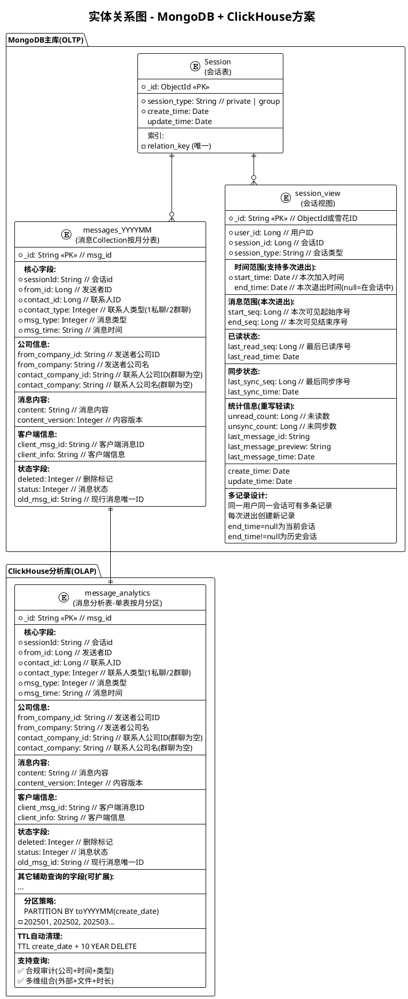

```plantuml
@startuml 实体关系图V4-MongoDB方案
!theme plain
skinparam linetype ortho

title 实体关系图 - MongoDB + ClickHouse方案

' ============ MongoDB实体 ============

package "MongoDB主库(OLTP)" {

  entity "Session\n(会话表)" as Session {
    * _id: ObjectId <<PK>>
    --
    * session_type: String // private | group
    * create_time: Date
    update_time: Date
    ---
    索引:
    - relation_key (唯一)
  }

  entity "messages_YYYYMM\n(消息Collection按月分表)" as Message {
    * _id: String <<PK>> // msg_id
    --
    <b>核心字段:</b>
    * sessionId: String // 会话id
    * from_id: Long // 发送者ID
    * contact_id: Long // 联系人ID
    * contact_type: Integer // 联系人类型(1私聊/2群聊)
    * msg_type: Integer // 消息类型
    * msg_time: String // 消息时间
    --
    <b>公司信息:</b>
    from_company_id: String // 发送者公司ID
    from_company: String // 发送者公司名
    contact_company_id: String // 联系人公司ID(群聊为空)
    contact_company: String // 联系人公司名(群聊为空)
    --
    <b>消息内容:</b>
    content: String // 消息内容
    content_version: Integer // 内容版本
    --
    <b>客户端信息:</b>
    client_msg_id: String // 客户端消息ID
    client_info: String // 客户端信息
    --
    <b>状态字段:</b>
    deleted: Integer // 删除标记
    status: Integer // 消息状态
    old_msg_id: String // 现行消息唯一ID
  }

  entity "session_view\n(会话视图)" as SessionView {
    * _id: String <<PK>> // ObjectId或雪花ID
    --
    * user_id: Long // 用户ID
    * session_id: Long // 会话ID
    * session_type: String // 会话类型
    --
    <b>时间范围(支持多次进出):</b>
    * start_time: Date // 本次加入时间
    end_time: Date // 本次退出时间(null=在会话中)
    --
    <b>消息范围(本次进出):</b>
    start_seq: Long // 本次可见起始序号
    end_seq: Long // 本次可见结束序号
    --
    <b>已读状态:</b>
    last_read_seq: Long // 最后已读序号
    last_read_time: Date
    --
     <b>同步状态:</b>
    last_sync_seq: Long // 最后同步序号
    last_sync_time: Date
    --
    <b>统计信息(重写轻读):</b>
    unread_count: Long // 未读数
    unsync_count: Long // 未同步数
    last_message_id: String
    last_message_preview: String
    last_message_time: Date
    --
    create_time: Date
    update_time: Date
    ---
    <b>多记录设计:</b>
    同一用户同一会话可有多条记录
    每次进出创建新记录
    end_time=null为当前会话
    end_time!=null为历史会话
  }

}

' ============ ClickHouse实体 ============

package "ClickHouse分析库(OLAP)" {

  entity "message_analytics\n(消息分析表-单表按月分区)" as Analytics {
    * _id: String <<PK>> // msg_id
    --
    <b>核心字段:</b>
    * sessionId: String // 会话id
    * from_id: Long // 发送者ID
    * contact_id: Long // 联系人ID
    * contact_type: Integer // 联系人类型(1私聊/2群聊)
    * msg_type: Integer // 消息类型
    * msg_time: String // 消息时间
    --
    <b>公司信息:</b>
    from_company_id: String // 发送者公司ID
    from_company: String // 发送者公司名
    contact_company_id: String // 联系人公司ID(群聊为空)
    contact_company: String // 联系人公司名(群聊为空)
    --
    <b>消息内容:</b>
    content: String // 消息内容
    content_version: Integer // 内容版本
    --
    <b>客户端信息:</b>
    client_msg_id: String // 客户端消息ID
    client_info: String // 客户端信息
    --
    <b>状态字段:</b>
    deleted: Integer // 删除标记
    status: Integer // 消息状态
    old_msg_id: String // 现行消息唯一ID
    ---
    <b>其它辅助查询的字段(可扩展):</b>
    ...
    ---
    <b>分区策略:</b>
    PARTITION BY toYYYYMM(create_date)
    - 202501, 202502, 202503...
    ---
    <b>TTL自动清理:</b>
    TTL create_date + 10 YEAR DELETE
    ---
    <b>支持查询:</b>
    ✅ 合规审计(公司+时间+类型)
    ✅ 多维组合(外部+文件+时长)
  }

}

' ============ 关系 ============

Session ||--o{ Message 


Session ||--o{ SessionView 
Message ||--|| Analytics 

@enduml
```
