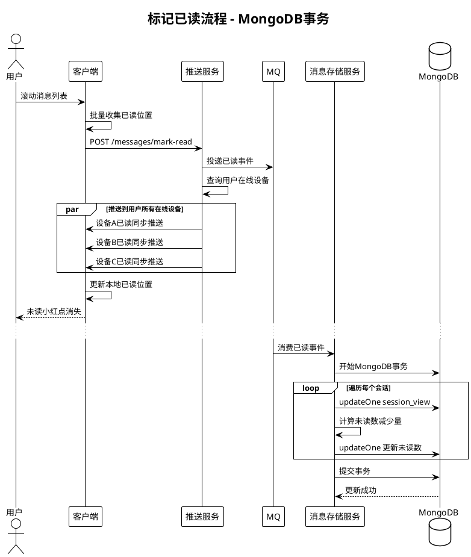

```plantuml
@startuml 标记已读流程V4
!theme plain

title 标记已读流程 - MongoDB事务

actor 用户 as User
participant "客户端" as Client
participant "推送服务" as PushSvc
participant "MQ" as MQ
participant "消息存储服务" as StorageSvc
database "MongoDB" as MongoDB

User -> Client: 滚动消息列表

Client -> Client: 批量收集已读位置

Client -> PushSvc: POST /messages/mark-read

PushSvc -> MQ: 投递已读事件

PushSvc -> PushSvc: 查询用户在线设备

par 推送到用户所有在线设备
    PushSvc -> Client: 设备A已读同步推送
    PushSvc -> Client: 设备B已读同步推送
    PushSvc -> Client: 设备C已读同步推送
end

Client -> Client: 更新本地已读位置

Client --> User: 未读小红点消失

...

MQ -> StorageSvc: 消费已读事件

StorageSvc -> MongoDB: 开始MongoDB事务

loop 遍历每个会话
    StorageSvc -> MongoDB: updateOne session_view
    StorageSvc -> StorageSvc: 计算未读数减少量
    StorageSvc -> MongoDB: updateOne 更新未读数
end

StorageSvc -> MongoDB: 提交事务

MongoDB --> StorageSvc: 更新成功


@enduml

```
