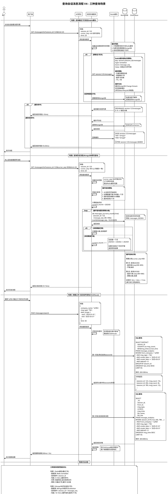

```plantuml
@startuml 查询消息流程V4
!theme plain
skinparam backgroundColor #FFFFFF
skinparam handwritten false
skinparam defaultFontSize 13
skinparam arrowThickness 2

title 查询会话消息流程 V4 - 三种查询场景

actor 用户 as User
participant "客户端" as Client
participant "API网关" as Gateway
participant "消息存储服务" as StorageSvc
participant "Redis缓存" as Redis
database "MongoDB" as MongoDB
database "ClickHouse" as ClickHouse

== 场景1: 查询最近7天消息(Redis缓存) ==

User -> Client: 点击会话查看消息列表

Client -> Gateway: GET /messages/list?session_id=123&limit=20
note right
    参数:
    - session_id: 123
    - cursor_seq: null (首次查询)
    - limit: 20
end note

Gateway -> StorageSvc: 转发查询请求

StorageSvc -> StorageSvc: 判断会话类型和时间范围
note right
    <b>缓存判断:</b>
    1. 只有群聊消息才走Redis缓存
    2. 私聊消息直接查MongoDB
    3. 查询范围在最近7天内
end note

alt 群聊且7天内

    StorageSvc -> Redis: GET session:123:messages
    note right
        <b>Redis缓存结构(仅群聊):</b>
        Key: session:{session_id}:messages
        Type: SortedSet
        Score: message_seq
        Value: 消息JSON字符串

        <b>缓存策略:</b>
        - 仅缓存群聊消息
        - 保留最近7天
        - 最多1000条
        - TTL: 7天

        <b>维护方式:</b>
        通过MongoDB Change Stream
        实时更新缓存
        (详见data-lifecycle流程图)
    end note

else 私聊或超过7天

    StorageSvc -> MongoDB: 直接查询MongoDB
    note right
        私聊消息不缓存
        直接查询MongoDB
    end note

end

alt 缓存命中

    Redis --> StorageSvc: 返回缓存消息列表
    note right
        ZREVRANGE session:123:messages
        0 19  // 取前20条
    end note

    StorageSvc --> Client: 返回消息列表(5-10ms)

else 缓存未命中

    Redis --> StorageSvc: 缓存不存在

    StorageSvc -> MongoDB: 查询MongoDB
    note right
        查询当月collection
    end note

    MongoDB --> StorageSvc: 返回消息

    StorageSvc -> Redis: 回填缓存
    note right
        ZADD session:123:messages
        1001 "{msg1}"
        1002 "{msg2}"
        ...
        EXPIRE session:123:messages 604800
    end note

    StorageSvc --> Client: 返回消息列表(10-20ms)

end

Client --> User: 显示消息

== 场景2: 查询历史消息(MongoDB跨月查询) ==

User -> Client: 向上滚动查看更早消息

Client -> Gateway: GET /messages/list?session_id=123&cursor_seq=900&limit=20
note right
    参数:
    - session_id: 123
    - cursor_seq: 900 (上次最后一条)
    - limit: 20
end note

Gateway -> StorageSvc: 转发查询请求

StorageSvc -> StorageSvc: 判断时间范围
note right
    cursor_seq=900可能对应
    2个月前的消息
    超出Redis缓存范围
end note

StorageSvc -> StorageSvc: 初始化查询
note right
    <b>循环查询策略:</b>

    1. 从当前月开始查询
    2. 如果数量不够,往前推一个月
    3. 循环直到凑够limit数量
    4. 最多查询3个月
end note

StorageSvc -> StorageSvc: 计算起始月份\ncurrent_month = 202503

loop 循环查询直到凑够20条

    StorageSvc -> MongoDB: db.messages_{current_month}.find(\n  {session_id: 123,\n   message_seq: {$lt: 900}}\n).sort({message_seq: -1}).limit(20)
    note right
        查询当前月份的消息
        例如: messages_202503
    end note

    MongoDB --> StorageSvc: 返回消息

    alt 消息数量已够

        StorageSvc -> StorageSvc: 已凑够20条,结束循环

    else 消息数量不够

        StorageSvc -> StorageSvc: current_month -= 1
        note right
            往前推一个月
            202503 → 202502 → 202501

            如果已查询3个月仍不够
            返回现有结果
        end note

    end

end

note right of MongoDB
    <b>循环查询示例:</b>

    需要20条,cursor_seq=900

    第1次: 查询202503
    - 返回5条 (seq 899~895)
    - 不够,继续

    第2次: 查询202502
    - 返回15条 (seq 894~880)
    - 凑够20条,结束

    总耗时: 5ms + 6ms = 11ms
    (串行执行,累加耗时)
end note

StorageSvc --> Client: 返回20条消息(10-15ms)

Client --> User: 显示历史消息

== 场景3: 根据公司+组合条件查询(ClickHouse) ==

User -> Client: 搜索"公司A"最近3个月的文件消息

Client -> Gateway: POST /messages/search
note right
    参数:
    {
      company_name: "公司A",
      msg_type: "file",
      date_range: {
        start: "2025-01-01",
        end: "2025-03-31"
      },
      limit: 50
    }
end note

Gateway -> StorageSvc: 转发搜索请求

StorageSvc -> StorageSvc: 识别复杂查询
note right
    检测到组合条件查询
    路由到ClickHouse
end note

StorageSvc -> ClickHouse: 第一阶段:聚合查询sessionId
note right
    <b>SQL查询:</b>

    SELECT DISTINCT
        session_id,
        COUNT(*) as msg_count,
        MAX(msg_time) as last_time
    FROM message_analytics
    WHERE from_company = '公司A'
      AND msg_type = 'file'
      AND create_date >= '2025-01-01'
      AND create_date <= '2025-03-31'
      AND deleted = 0
    GROUP BY session_id
    ORDER BY last_time DESC
    LIMIT 50;

    耗时: 200-500ms
end note

ClickHouse --> StorageSvc: 返回符合条件的sessionId列表
note right
    示例返回:
    [
      {session_id: 123, msg_count: 15},
      {session_id: 456, msg_count: 8},
      {session_id: 789, msg_count: 12},
      ...
    ]
end note

StorageSvc -> ClickHouse: 第二阶段:查询具体消息
note right
    <b>SQL查询:</b>

    SELECT
        _id,
        session_id,
        from_id,
        msg_type,
        content,
        msg_time,
        file_name,
        file_size
    FROM message_analytics
    WHERE session_id IN (123, 456, 789, ...)
      AND from_company = '公司A'
      AND msg_type = 'file'
      AND create_date >= '2025-01-01'
      AND create_date <= '2025-03-31'
      AND deleted = 0
    ORDER BY msg_time DESC
    LIMIT 50;

    耗时: 300-800ms
end note

ClickHouse --> StorageSvc: 返回消息详情

StorageSvc -> StorageSvc: 格式转换
note right
    将ClickHouse格式转换为
    客户端需要的消息格式
end note

StorageSvc --> Client: 返回搜索结果(500ms-1.5s)

Client --> User: 显示搜索结果

== 性能对比总结 ==

note over User, ClickHouse
<b>三种查询场景性能对比:</b>

场景1: Redis缓存(最近7天)
- 数据源: Redis SortedSet
- 查询条件: session_id
- 性能: 5-10ms (缓存命中)
- 优势: 极速响应,适合高频访问
- 限制: 仅最近7天,最多1000条

场景2: MongoDB历史(超过7天)
- 数据源: MongoDB按月分collection
- 查询条件: session_id + message_seq
- 性能: 10-15ms (循环查询,最多3个月)
- 优势: 支持按会话查询全部历史
- 限制: 必须有session_id
- 说明: 私聊消息也走此流程

场景3: ClickHouse组合查询
- 数据源: ClickHouse分析表
- 查询条件: 公司+类型+时间范围等
- 性能: 500ms-1.5s (两阶段查询)
- 优势: 支持任意维度组合
- 限制: 延迟较高,适合低频复杂查询

<b>路由策略:</b>
1. 群聊 + session_id + 7天内 → Redis
2. 私聊 + session_id → MongoDB (直接查询)
3. 群聊 + session_id + 超7天 → MongoDB (循环查询)
4. 无session_id或组合条件 → ClickHouse
end note

@enduml
```
