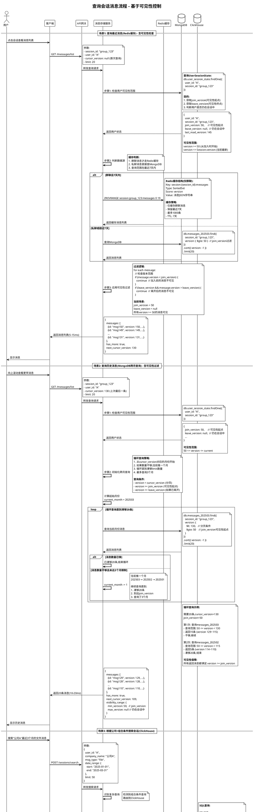

```plantuml
@startuml 查询消息流程
!theme plain
skinparam backgroundColor #FFFFFF
skinparam handwritten false
skinparam defaultFontSize 13
skinparam arrowThickness 2

title 查询会话消息流程 - 基于可见性控制

actor 用户 as User
participant "客户端" as Client
participant "API网关" as Gateway
participant "消息存储服务" as StorageSvc
participant "Redis缓存" as Redis
database "MongoDB" as MongoDB
database "ClickHouse" as ClickHouse

== 场景1: 查询最近消息(Redis缓存) - 含可见性检查 ==

User -> Client: 点击会话查看消息列表

Client -> Gateway: GET /messages/list
note right
    参数:
    - session_id: "group_123"
    - user_id: "A"
    - cursor_version: null (首次查询)
    - limit: 20
end note

Gateway -> StorageSvc: 转发查询请求

StorageSvc -> MongoDB: 步骤1: 检查用户可见性范围
note right
    <b>查询UserSessionState:</b>
    db.user_session_state.findOne({
      user_id: "A",
      session_id: "group_123"
    })

    <b>目的:</b>
    1. 获取join_version(可见性起点)
    2. 获取leave_version(可见性终点)
    3. 判断用户是否仍在会话中
end note

MongoDB --> StorageSvc: 返回用户状态
note right
    {
      user_id: "A",
      session_id: "group_123",
      join_version: 50,     // 可见性起点
      leave_version: null,  // 仍在会话中
      last_read_version: 145
    }

    <b>可见性范围:</b>
    version >= 50 (从加入时开始)
    version <= Session.version (当前最新)
end note

StorageSvc -> StorageSvc: 步骤2: 判断数据源
note right
    <b>缓存判断:</b>
    1. 群聊消息才走Redis缓存
    2. 私聊消息直接查MongoDB
    3. 查询范围在最近7天内
end note

alt 群聊且7天内

    StorageSvc -> Redis: ZREVRANGE session:group_123:messages 0 19
    note right
        <b>Redis缓存结构(仅群聊):</b>
        Key: session:{session_id}:messages
        Type: SortedSet
        Score: version
        Value: 消息JSON字符串

        <b>缓存策略:</b>
        - 仅缓存群聊消息
        - 保留最近7天
        - 最多1000条
        - TTL: 7天
    end note

    Redis --> StorageSvc: 返回缓存消息列表

else 私聊或超过7天

    StorageSvc -> MongoDB: 查询MongoDB
    note right
        db.messages_202503.find({
          session_id: "group_123",
          version: { $gte: 50 }  // join_version过滤
        })
        .sort({ version: -1 })
        .limit(20)
    end note

    MongoDB --> StorageSvc: 返回消息列表

end

StorageSvc -> StorageSvc: 步骤3: 应用可见性过滤
note right
    <b>过滤逻辑:</b>
    for each message:
      // 检查版本范围
      if (message.version < join_version) {
        continue  // 加入前的消息不可见
      }
      if (leave_version && message.version > leave_version) {
        continue  // 离开后的消息不可见
      }

    <b>当前场景:</b>
    join_version = 50
    leave_version = null
    所有version >= 50的消息可见
end note

StorageSvc --> Client: 返回消息列表(5-15ms)
note right
    {
      messages: [
        {id: "msg150", version: 150, ...},
        {id: "msg149", version: 149, ...},
        ...
        {id: "msg131", version: 131, ...}
      ],
      has_more: true,
      next_cursor_version: 130
    }
end note

Client --> User: 显示消息

== 场景2: 查询历史消息(MongoDB跨月查询) - 含可见性过滤 ==

User -> Client: 向上滚动查看更早消息

Client -> Gateway: GET /messages/list
note right
    参数:
    - session_id: "group_123"
    - user_id: "A"
    - cursor_version: 130 (上次最后一条)
    - limit: 20
end note

Gateway -> StorageSvc: 转发查询请求

StorageSvc -> MongoDB: 步骤1: 检查用户可见性范围
note right
    db.user_session_state.findOne({
      user_id: "A",
      session_id: "group_123"
    })
end note

MongoDB --> StorageSvc: 返回用户状态
note right
    {
      join_version: 50,     // 可见性起点
      leave_version: null,  // 仍在会话中
      ...
    }

    <b>可见性范围:</b>
    50 <= version <= current
end note

StorageSvc -> StorageSvc: 步骤2: 初始化跨月查询
note right
    <b>循环查询策略:</b>
    1. 从cursor_version对应的月份开始
    2. 如果数量不够,往前推一个月
    3. 循环直到凑够limit数量
    4. 最多查询3个月

    <b>查询条件:</b>
    - version < cursor_version (分页)
    - version >= join_version (可见性起点)
    - version <= leave_version (如果已离开)
end note

StorageSvc -> StorageSvc: 计算起始月份\ncurrent_month = 202503

loop 循环查询直到凑够20条

    StorageSvc -> MongoDB: 查询当前月份消息
    note right
        db.messages_202503.find({
          session_id: "group_123",
          version: {
            $lt: 130,   // 分页条件
            $gte: 50    // join_version可见性起点
          }
        })
        .sort({ version: -1 })
        .limit(20)
    end note

    MongoDB --> StorageSvc: 返回消息列表

    alt 消息数量已够

        StorageSvc -> StorageSvc: 已凑够20条,结束循环

    else 消息数量不够且未达3个月限制

        StorageSvc -> StorageSvc: current_month -= 1
        note right
            往前推一个月
            202503 → 202502 → 202501

            继续查询直到:
            1. 凑够20条
            2. 到达join_version
            3. 查询了3个月
        end note

    end

end

note right of MongoDB
    <b>循环查询示例:</b>

    需要20条,cursor_version=130
    join_version=50

    第1次: 查询messages_202503
    - 查询范围: 50 <= version < 130
    - 返回15条 (version 129~115)
    - 不够,继续

    第2次: 查询messages_202502
    - 查询范围: 50 <= version < 115
    - 返回5条 (version 114~110)
    - 凑够20条,结束

    <b>可见性保障:</b>
    所有返回消息都满足 version >= join_version
end note

StorageSvc --> Client: 返回20条消息(10-20ms)
note right
    {
      messages: [
        {id: "msg129", version: 129, ...},
        {id: "msg128", version: 128, ...},
        ...
        {id: "msg110", version: 110, ...}
      ],
      has_more: true,
      next_cursor_version: 109,
      visibility_range: {
        min_version: 50,  // join_version
        max_version: null // 仍在会话中
      }
    }
end note

Client --> User: 显示历史消息

== 场景3: 根据公司+组合条件搜索会话(ClickHouse) ==

User -> Client: 搜索"公司A"最近3个月的文件消息

Client -> Gateway: POST /sessions/search
note right
    参数:
    {
      user_id: "A",
      company_name: "公司A",
      msg_type: "file",
      date_range: {
        start: "2025-01-01",
        end: "2025-03-31"
      },
      limit: 50
    }
end note

Gateway -> StorageSvc: 转发搜索请求

StorageSvc -> StorageSvc: 识别复杂查询
note right
    检测到组合条件查询
    路由到ClickHouse
end note

StorageSvc -> ClickHouse: 聚合查询符合条件的会话
note right
    <b>SQL查询:</b>

    SELECT
        session_id,
        COUNT(*) as msg_count,
        MAX(msg_time) as last_msg_time,
        MAX(version) as last_version
    FROM message_analytics
    WHERE from_company = '公司A'
      AND msg_type = 'file'
      AND create_date >= '2025-01-01'
      AND create_date <= '2025-03-31'
      AND deleted = 0
    GROUP BY session_id
    ORDER BY last_msg_time DESC
    LIMIT 50;

    <b>目的:</b>
    聚合出包含符合条件消息的会话列表

    耗时: 200-500ms
end note

ClickHouse --> StorageSvc: 返回会话列表
note right
    返回50个会话:
    [
      {
        session_id: "group_123",
        msg_count: 25,
        last_msg_time: "2025-03-15 10:30:00",
        last_version: 180
      },
      {
        session_id: "s_AB",
        msg_count: 15,
        last_msg_time: "2025-03-10 14:20:00",
        last_version: 95
      },
      ...
    ]
end note

StorageSvc -> StorageSvc: 补充会话元信息
note right
    可选:
    - 查询会话名称/头像
    - 查询最后一条消息摘要
end note

StorageSvc --> Client: 返回会话列表(200-600ms)
note right
    {
      sessions: [
        {
          session_id: "group_123",
          session_name: "技术交流群",
          msg_count: 25,
          last_msg_time: "2025-03-15 10:30:00"
        },
        {
          session_id: "s_AB",
          session_name: "用户B",
          msg_count: 15,
          last_msg_time: "2025-03-10 14:20:00"
        },
        ...
      ],
      total: 50
    }
end note

Client --> User: 显示符合条件的会话列表

...

User -> Client: 点击某个会话查看详细消息

Client -> Gateway: GET /messages/list
note right
    参数:
    {
      session_id: "group_123",
      user_id: "A",
      cursor_version: null,  // 首次查询
      limit: 20
    }
end note

Gateway -> StorageSvc: 转发查询请求

StorageSvc -> MongoDB: 步骤1: 获取用户可见性范围
note right
    <b>查询UserSessionState:</b>
    db.user_session_state.findOne({
      user_id: "A",
      session_id: "group_123"
    })

    <b>目的:</b>
    获取join_version和leave_version
    确定可见性边界
end note

MongoDB --> StorageSvc: 返回用户状态
note right
    {
      session_id: "group_123",
      join_version: 50,     // 可见性起点
      leave_version: 150,   // 可见性终点(已离开)
      last_read_version: 145
    }

    <b>可见性范围:</b>
    50 <= version <= 150
end note

StorageSvc -> MongoDB: 步骤2: 在可见性范围内查询消息
note right
    <b>查询消息(应用可见性过滤):</b>
    db.messages_202503.find({
      session_id: "group_123",
      version: {
        $gte: 50,   // join_version起点
        $lte: 150   // leave_version终点
      }
    })
    .sort({ version: -1 })
    .limit(20)

    <b>关键:</b>
    在数据库层面就过滤不可见消息
    只返回可见范围内的消息
end note

MongoDB --> StorageSvc: 返回消息列表
note right
    返回20条消息:
    version范围: 150~131
    (从leave_version开始往前取)
end note

StorageSvc --> Client: 返回消息列表(10-20ms)
note right
    {
      messages: [
        {id: "msg150", version: 150, ...},
        {id: "msg149", version: 149, ...},
        ...
        {id: "msg131", version: 131, ...}
      ],
      has_more: true,
      next_cursor_version: 130,
      visibility_range: {
        min_version: 50,   // join_version
        max_version: 150   // leave_version(已离开)
      }
    }
end note

Client --> User: 显示会话消息

== 总结 ==

note over User, ClickHouse
<b>三种查询场景总结:</b>

<b>场景1: 查询最近消息(Redis缓存)</b>
- 数据源: Redis SortedSet (仅群聊)
- 可见性检查:
  1. 查询UserSessionState获取join_version和leave_version
  2. 过滤version < join_version的消息
  3. 过滤version > leave_version的消息(如果已离开)
- 性能: 5-15ms
- 适用: 群聊最近7天消息

<b>场景2: 查询历史消息(MongoDB跨月查询)</b>
- 数据源: MongoDB按月分collection
- 可见性检查:
  1. 查询UserSessionState获取join_version和leave_version
  2. 查询条件: join_version <= version <= leave_version
  3. 跨月循环查询,最多3个月
  4. 遇到join_version即停止
- 性能: 10-20ms
- 适用: 私聊/群聊历史消息查询

<b>场景3: 组合条件搜索会话(ClickHouse)</b>
- 阶段1: 聚合查询符合条件的会话
  - 数据源: ClickHouse分析表
  - 查询: 按条件聚合出session_id列表
  - 性能: 200-600ms
  - 返回: 会话列表(不含具体消息)
- 阶段2: 用户点击会话查看消息
  - 数据源: MongoDB
  - 可见性检查:
    1. 查询UserSessionState获取join_version和leave_version
    2. 查询条件: join_version <= version <= leave_version
    3. 在数据库层面应用可见性过滤
  - 性能: 10-20ms
  - 返回: 可见范围内的消息
- 适用: 按公司/类型/时间等组合条件搜索会话

<b>核心设计原则:</b>
✅ 所有查询都必须先检查UserSessionState
✅ join_version控制可见性起点(后加入成员只能看加入后的消息)
✅ leave_version控制可见性终点(离开后的消息不可见)
✅ 可见性范围: join_version <= version <= leave_version
✅ 通过索引过滤,在数据库层面控制可见性
✅ 性能优于应用层后置过滤
end note

@enduml
```
