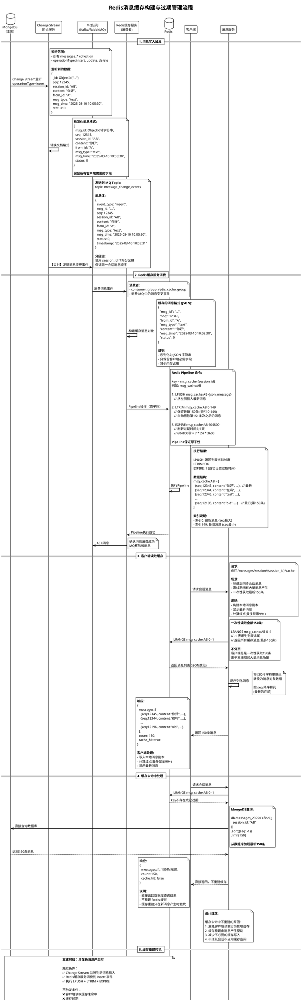

```plantuml
@startuml Redis消息缓存构建流程
!theme plain
skinparam backgroundColor #FFFFFF
skinparam handwritten false
skinparam defaultFontSize 13
skinparam arrowThickness 2

title Redis消息缓存构建与过期管理流程

database "MongoDB\n(主库)" as MongoDB
participant "Change Stream\n同步服务" as ChangeStream
participant "MQ队列\n(Kafka/RabbitMQ)" as MQ
participant "Redis缓存服务\n(消费者)" as CacheSvc
database "Redis" as Redis

== 1. 消息写入触发 ==

MongoDB -> ChangeStream: Change Stream监听\noperationType=insert
note right
  <b>监听范围:</b>
  - 所有 messages_* collection
  - operationType: insert, update, delete

  <b>监听到的数据:</b>
  {
    _id: ObjectId("..."),
    seq: 12345,
    session_id: "AB",
    content: "你好",
    from_id: "A",
    msg_type: "text",
    msg_time: "2025-03-10 10:05:30",
    status: 0
  }
end note

ChangeStream -> ChangeStream: 转换文档格式
note right
  <b>标准化消息格式:</b>
  {
    msg_id: ObjectId转字符串,
    seq: 12345,
    session_id: "AB",
    content: "你好",
    from_id: "A",
    msg_type: "text",
    msg_time: "2025-03-10 10:05:30",
    status: 0
  }

  <b>保留所有客户端需要的字段</b>
end note

ChangeStream -> MQ: 【实时】发送消息变更事件
note right
  <b>增量同步场景:</b>
  - 不批量缓冲
  - 实时发送到 MQ
  - 保证消息及时性

  <b>说明:</b>
  与ClickHouse批量同步不同
  Redis缓存需要实时性
end note
note right
  <b>发送到 MQ Topic:</b>
  topic: message_change_events

  <b>消息体:</b>
  {
    event_type: "insert",
    msg_id: "...",
    seq: 12345,
    session_id: "AB",
    content: "你好",
    from_id: "A",
    msg_type: "text",
    msg_time: "2025-03-10 10:05:30",
    status: 0,
    timestamp: "2025-03-10 10:05:31"
  }

  <b>分区键:</b>
  使用 session_id 作为分区键
  保证同一会话消息顺序
end note

== 2. Redis缓存服务消费 ==

MQ -> CacheSvc: 消费消息事件
note right
  <b>消费者:</b>
  - consumer_group: redis_cache_group
  - 消费 MQ 中的消息变更事件
end note

CacheSvc -> CacheSvc: 构建缓存消息对象
note right
  <b>缓存的消息格式 (JSON):</b>
  {
    "msg_id": "...",
    "seq": 12345,
    "from_id": "A",
    "msg_type": "text",
    "content": "你好",
    "msg_time": "2025-03-10 10:05:30",
    "status": 0
  }

  <b>说明:</b>
  - 序列化为 JSON 字符串
  - 只保留客户端必需字段
  - 减少内存占用
end note

CacheSvc -> Redis: Pipeline操作（原子性）
note right
  <b>Redis Pipeline 命令:</b>

  key = msg_cache:{session_id}
  例如: msg_cache:AB

  1. LPUSH msg_cache:AB {json_message}
     // 从左侧插入最新消息

  2. LTRIM msg_cache:AB 0 149
     // 保留最新150条 (索引 0-149)
     // 自动删除第151条及之后的消息

  3. EXPIRE msg_cache:AB 604800
     // 刷新过期时间为7天
     // 604800秒 = 7 * 24 * 3600

  <b>Pipeline保证原子性</b>
end note

Redis -> Redis: 执行Pipeline
note right
  <b>执行结果:</b>

  LPUSH: 返回列表当前长度
  LTRIM: OK
  EXPIRE: 1 (成功设置过期时间)

  <b>数据结构:</b>
  msg_cache:AB = [
    {seq:12345, content:"你好", ...},  // 最新
    {seq:12344, content:"在吗", ...},
    {seq:12343, content:"test", ...},
    ...
    {seq:12196, content:"old", ...}    // 最旧(第150条)
  ]

  <b>索引说明:</b>
  - 索引0: 最新消息 (seq最大)
  - 索引149: 最旧消息 (seq最小)
end note

Redis --> CacheSvc: Pipeline执行成功

CacheSvc -> MQ: ACK消息
note right
  确认消息消费成功
  MQ移除该消息
end note

== 3. 客户端读取缓存 ==

participant "客户端" as Client
participant "消息服务" as MsgSvc

Client -> MsgSvc: 请求会话消息
note right
  <b>请求:</b>
  GET /messages/session/{session_id}/cache

  <b>场景:</b>
  - 登录后同步会话消息
  - 离线期间有大量消息产生
  - 一次性获取最新150条

  <b>用途:</b>
  - 构建本地消息副本
  - 显示最新消息
  - 计算红点(最多显示99+)
end note

MsgSvc -> Redis: LRANGE msg_cache:AB 0 -1
note right
  <b>一次性读取全部150条:</b>

  LRANGE msg_cache:AB 0 -1
  // -1 表示到列表末尾
  // 返回所有缓存消息(最多150条)

  <b>不分页:</b>
  客户端总是一次性获取150条
  用于离线期间大量消息场景
end note

Redis --> MsgSvc: 返回消息列表 (JSON数组)

MsgSvc -> MsgSvc: 反序列化消息
note right
  将 JSON 字符串数组
  转换为消息对象数组

  按 seq 降序排列
  (最新的在前)
end note

MsgSvc --> Client: 返回150条消息
note left
  <b>响应:</b>
  {
    messages: [
      {seq:12345, content:"你好", ...},
      {seq:12344, content:"在吗", ...},
      ...
      {seq:12196, content:"old", ...}
    ],
    count: 150,
    cache_hit: true
  }

  <b>客户端处理:</b>
  - 写入本地消息副本
  - 计算红点(最多显示99+)
  - 显示最新消息
end note

== 4. 缓存未命中处理 ==

Client -> MsgSvc: 请求会话消息

MsgSvc -> Redis: LRANGE msg_cache:AB 0 -1

Redis --> MsgSvc: key不存在或已过期

MsgSvc -> MongoDB: 直接查询数据库
note right
  <b>MongoDB查询:</b>

  db.messages_202503.find({
    session_id: "AB"
  })
  .sort({seq: -1})
  .limit(150)

  <b>从数据库加载最新150条</b>
end note

MongoDB --> MsgSvc: 返回150条消息

MsgSvc --> Client: 直接返回，不重建缓存
note left
  <b>响应:</b>
  {
    messages: [...150条消息],
    count: 150,
    cache_hit: false
  }

  <b>说明:</b>
  - 直接返回数据库查询结果
  - 不重建 Redis 缓存
  - 缓存重建只在新消息产生时触发
end note

note over MsgSvc
  <b>设计理念:</b>

  缓存未命中不重建的原因:
  1. 避免客户端读取行为影响缓存
  2. 缓存重建由消息产生驱动
  3. 减少不必要的缓存写入
  4. 不活跃会话不占用缓存空间
end note

== 5. 缓存重建时机 ==

note over MongoDB, Redis
  <b>重建时机：只在新消息产生时</b>

  触发条件：
  ✅ Change Stream 监听到新消息插入
  ✅ Redis缓存服务消费到 insert 事件
  ✅ 执行 LPUSH + LTRIM + EXPIRE

  不触发条件：
  ❌ 客户端读取缓存未命中
  ❌ 缓存过期
  ❌ 撤回消息更新

  <b>设计理念：</b>
  缓存随消息产生自动维护
  与客户端读取行为解耦
end note

MongoDB -> ChangeStream: 新消息产生
note right
  operationType: insert

  新消息写入触发缓存更新
end note

ChangeStream -> MQ: 发送 insert 事件

MQ -> CacheSvc: 消费消息事件

CacheSvc -> Redis: LPUSH + LTRIM + EXPIRE
note right
  <b>缓存自动重建/更新:</b>

  无论缓存是否存在:
  1. LPUSH 插入最新消息
  2. LTRIM 保持150条
  3. EXPIRE 刷新7天

  <b>效果:</b>
  - 缓存不存在: 自动创建
  - 缓存存在: 追加消息
  - 缓存过期: 重新激活
end note

== 6. 撤回消息处理 ==

MongoDB -> ChangeStream: 监听到消息更新
note right
  <b>Change Stream事件:</b>
  operationType: update

  <b>更新内容:</b>
  {
    documentKey: {_id: ObjectId("...")},
    updateDescription: {
      updatedFields: {
        status: 1
      }
    }
  }

  <b>消息被撤回</b>
end note

ChangeStream -> MQ: 发送撤回通知消息
note right
  <b>撤回处理策略:</b>

  不更新缓存中的旧消息
  而是发送一条新的撤回通知消息

  <b>新消息内容:</b>
  {
    msg_type: "recall",
    seq: 新seq,
    recalled_seq: 被撤回的seq,
    session_id: "AB"
  }
end note

MQ -> CacheSvc: 消费撤回通知消息

CacheSvc -> Redis: 正常插入缓存
note right
  <b>撤回消息也是普通消息:</b>

  LPUSH msg_cache:AB {recall_message}
  LTRIM msg_cache:AB 0 149
  EXPIRE msg_cache:AB 604800

  <b>缓存只是镜像:</b>
  - 不维护消息状态
  - 撤回通知作为新消息缓存
  - 客户端本地处理撤回逻辑
end note

note over Client
  <b>客户端本地处理撤回:</b>

  1. 接收缓存中的所有消息
  2. 识别 msg_type="recall"
  3. 根据 recalled_seq 更新本地副本
  4. 将被撤回消息 status 改为 1
  5. 显示 [已撤回] 或系统提示

  <b>缓存只负责镜像传输</b>
  <b>客户端负责构建正确副本</b>
end note

== 7. Redis过期与清理 ==

Redis -> Redis: TTL倒计时
note right
  <b>过期机制:</b>

  每次 EXPIRE 命令刷新 TTL
  如果7天内没有新消息:
  - TTL 倒计时到 0
  - Redis 自动删除 key

  <b>内存回收:</b>
  - 惰性删除: 读取时检查过期
  - 定期删除: 后台随机抽查过期key
end note

note over Redis
  <b>过期后的效果:</b>

  msg_cache:AB 被删除
  下次读取直接查MongoDB
  不会触发缓存重建

  <b>适用场景:</b>
  - 不活跃的会话自动清理
  - 节省内存空间

  <b>重新激活:</b>
  当会话再次有新消息产生时
  Change Stream 触发缓存重建
end note

== 关键设计总结 ==

note over MongoDB, Redis
  <b>1. Redis List 数据结构</b>
  - LPUSH: 从左侧插入最新消息
  - LTRIM: 保持最新150条
  - LRANGE key 0 -1: 一次性读取全部150条
  - 索引0始终是最新消息

  <b>2. 容量控制</b>
  - 每次插入后 LTRIM 0 149
  - 自动淘汰第151条及之后的消息
  - 始终保持150条

  <b>3. 过期时间管理</b>
  - 每次插入消息: EXPIRE key 604800
  - 7天内有新消息: TTL刷新为7天
  - 7天无新消息: 自动过期删除
  - 每次新消息都刷新过期时间

  <b>4. Pipeline原子操作</b>
  - LPUSH + LTRIM + EXPIRE 一次性执行
  - 避免并发问题
  - 保证数据一致性

  <b>5. 缓存命中策略（重点变更）</b>
  - 命中: 直接返回Redis全部150条
  - 未命中: 查MongoDB，不重建缓存 ✅
  - 延迟: 命中<5ms, 未命中<50ms

  <b>6. 缓存重建时机（核心设计）</b>
  ✅ 只在新消息产生时重建/更新
  ✅ Change Stream → MQ → Redis缓存服务
  ❌ 不在客户端读取时重建
  ❌ 不在缓存过期时重建
  ❌ 不在撤回消息时重建

  <b>7. 客户端读取行为</b>
  - 总是一次性获取150条消息
  - 不分页查询
  - 用于离线期间大量消息场景
  - 构建本地消息副本
  - 计算红点(最多显示99+)

  <b>8. 撤回消息处理（重要变更）</b>
  - 缓存不维护消息状态 ✅
  - 撤回通知作为新消息插入缓存 ✅
  - 客户端本地处理撤回逻辑 ✅
  - 缓存只是消息镜像，不实时更新 ✅

  <b>9. 消息消费流程</b>
  MongoDB → Change Stream → MQ → Redis缓存服务 → Redis

  <b>增量同步特点:</b>
  - 不批量缓冲
  - 实时发送到MQ
  - 保证消息及时性

  <b>10. 内存优化</b>
  - 只缓存必需字段
  - JSON序列化存储
  - 150条约15-30KB/会话
  - 100万会话约15-30GB

  <b>11. 设计理念</b>
  - 缓存随消息产生自动维护 ✅
  - 与客户端读取行为解耦 ✅
  - 不活跃会话不占用缓存空间 ✅
  - 客户端本地构建正确消息副本 ✅
end note

@enduml
```
