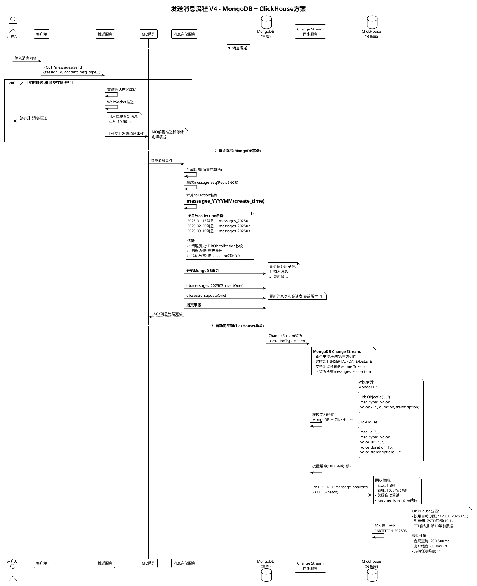

```plantuml
@startuml 发送消息流程V4-MongoDB方案
!theme plain
skinparam backgroundColor #FFFFFF
skinparam handwritten false
skinparam defaultFontSize 13
skinparam arrowThickness 2

title 发送消息流程 V4 - MongoDB + ClickHouse方案

actor 用户A as Client
participant "客户端" as ClientApp
participant "推送服务" as PushSvc
participant "MQ队列" as MQ
participant "消息存储服务" as StorageSvc
database "MongoDB\n(主库)" as MongoDB
participant "Change Stream\n同步服务" as ChangeStream
database "ClickHouse\n(分析库)" as ClickHouse

== 1. 消息发送 ==

Client -> ClientApp: 输入消息内容
ClientApp -> PushSvc: POST /messages/send\n{session_id, content, msg_type...}

par 实时推送 和 异步存储 并行
    PushSvc -> PushSvc: 查询会话在线成员
    PushSvc -> PushSvc: WebSocket推送
    PushSvc --> Client: 【实时】消息推送
    note right
        用户立即看到消息
        延迟: 10-50ms
    end note

    PushSvc -> MQ: 【异步】发送消息事件
    note right
        MQ解耦推送和存储
        削峰填谷
    end note
end

== 2. 异步存储(MongoDB事务) ==

MQ -> StorageSvc: 消费消息事件

StorageSvc -> StorageSvc: 生成消息ID(雪花算法)
StorageSvc -> StorageSvc: 生成message_seq(Redis INCR)
StorageSvc -> StorageSvc: 计算collection名称\n= messages_YYYYMM(create_time)

note right of StorageSvc
  <b>按月分collection示例:</b>
  2025-01-15消息 → messages_202501
  2025-02-20消息 → messages_202502
  2025-03-10消息 → messages_202503

  **优势:**
  ✅ 清理历史: DROP collection秒级
  ✅ 归档方便: 整表导出
  ✅ 冷热分离: 旧collection移HDD
end note

StorageSvc -> MongoDB: **开始MongoDB事务**
note right
    事务保证原子性:
    1. 插入消息
    2. 更新会话
end note

StorageSvc -> MongoDB: db.messages_202503.insertOne()
StorageSvc -> MongoDB: db.session.updateOne()
note right: 更新消息表和会话表 会话版本+1

StorageSvc -> MongoDB: **提交事务**

StorageSvc --> MQ: ACK消息处理完成

== 3. 自动同步到ClickHouse(异步) ==

MongoDB -> ChangeStream: Change Stream监听\noperationType=insert

note right of ChangeStream
  <b>MongoDB Change Stream:</b>
  - 原生支持,无需第三方组件
  - 实时监听INSERT/UPDATE/DELETE
  - 支持断点续传(Resume Token)
  - 可监听所有messages_*collection
end note

ChangeStream -> ChangeStream: 转换文档格式\nMongoDB → ClickHouse

note right
  转换示例:
  MongoDB:
  {
    _id: ObjectId("..."),
    msg_type: "voice",
    voice: {url, duration, transcription}
  }

  ClickHouse:
  {
    msg_id: "...",
    msg_type: "voice",
    voice_url: "...",
    voice_duration: 15,
    voice_transcription: "..."
  }
end note

ChangeStream -> ChangeStream: 批量缓冲(1000条或1秒)

ChangeStream -> ClickHouse: INSERT INTO message_analytics\nVALUES (batch)

note right
  同步性能:
  - 延迟: 1-3秒
  - 吞吐: 10万条/分钟
  - 失败自动重试
  - Resume Token断点续传
end note

ClickHouse -> ClickHouse: 写入按月分区\nPARTITION 202503

note right
  ClickHouse分区:
  - 按月自动分区(202501, 202502...)
  - 列存储+ZSTD压缩(10:1)
  - TTL自动删除10年前数据

  查询性能:
  - 合规查询: 200-500ms
  - 复杂组合: 800ms-2s
  - 支持任意维度 ✅
end note

@enduml
```
