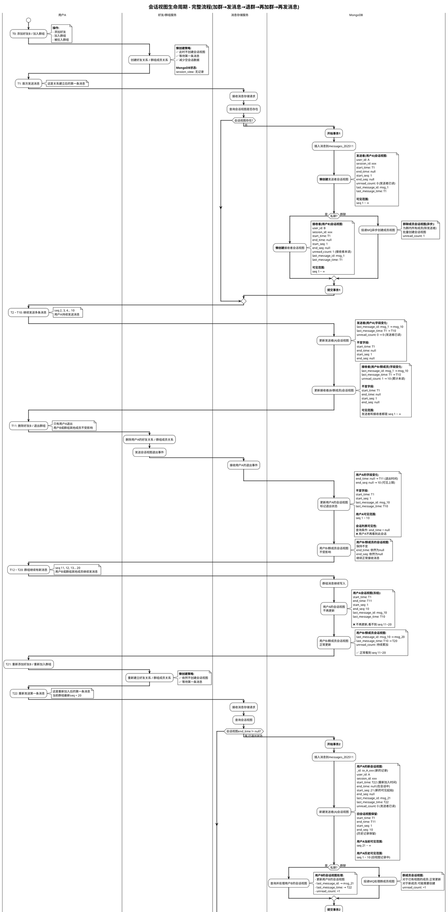

```plantuml
@startuml 会话视图可见性管理-MongoDB方案
!theme plain
skinparam backgroundColor #FFFFFF
skinparam handwritten false
skinparam defaultFontSize 13
skinparam arrowThickness 2

title 会话视图生命周期 - 完整流程(加群→发消息→退群→再加群→再发消息)

|用户A|

start

:T0: 添加好友B / 加入群组;
note right
    <b>操作:</b>
    - 添加好友
    - 加入群组
    - 被拉入群组
end note

|好友/群组服务|

:创建好友关系 / 群组成员关系;
note right
    <b>懒创建策略:</b>
    ✅ 此时不创建会话视图
    ✅ 等待第一条消息
    ✅ 减少空会话数据

    <b>MongoDB状态:</b>
    session_view: 无记录
end note

|用户A|

:T1: 首次发送消息;
note right
    这是关系建立后的第一条消息
end note

|消息存储服务|

:接收消息存储请求;

:查询会话视图是否存在;

if (会话视图存在?) then (否)

|MongoDB|

:**开始事务1**;

:插入消息到messages_202511;

:**懒创建**发送者会话视图;
note right
    <b>发送者(用户A)会话视图:</b>
    user_id: A
    session_id: xxx
    start_time: T1
    end_time: null
    start_seq: 1
    end_seq: null
    unread_count: 0 (发送者已读)
    last_message_id: msg_1
    last_message_time: T1

    <b>可见范围:</b>
    seq 1 ~ ∞
end note

if (私聊?) then (是)
    :**懒创建**接收者会话视图;
    note right
        <b>接收者(用户B)会话视图:</b>
        user_id: B
        session_id: xxx
        start_time: T1
        end_time: null
        start_seq: 1
        end_seq: null
        unread_count: 1 (接收者未读)
        last_message_id: msg_1
        last_message_time: T1

        <b>可见范围:</b>
        seq 1 ~ ∞
    end note
else (群聊)
    :投递MQ异步创建成员视图;
    note right
        <b>群聊成员会话视图(异步):</b>
        为群内所有成员(除发送者)
        批量创建会话视图
        unread_count: 1
    end note
endif

:**提交事务1**;

endif

|用户A|

:T2 ~ T10: 继续发送多条消息;
note right
    seq 2, 3, 4... 10
    用户A持续发送消息
end note

|MongoDB|

:更新发送者(A)会话视图;
note right
    <b>发送者(用户A)字段变化:</b>
    last_message_id: msg_1 → msg_10
    last_message_time: T1 → T10
    unread_count: 0 → 0 (发送者已读)

    <b>不变字段:</b>
    start_time: T1
    end_time: null
    start_seq: 1
    end_seq: null
end note

:更新接收者(B/群成员)会话视图;
note right
    <b>接收者(用户B/群成员)字段变化:</b>
    last_message_id: msg_1 → msg_10
    last_message_time: T1 → T10
    unread_count: 1 → 10 (累计未读)

    <b>不变字段:</b>
    start_time: T1
    end_time: null
    start_seq: 1
    end_seq: null

    <b>可见范围:</b>
    发送者和接收者都是 seq 1 ~ ∞
end note

|用户A|

:T11: 删除好友B / 退出群组;
note right
    只有用户A退出
    用户B或群组其他成员不受影响
end note

|好友/群组服务|

:删除用户A的好友关系 / 群组成员关系;

:发送会话视图退出事件;

|消息存储服务|

:接收用户A的退出事件;

|MongoDB|

:更新用户A的会话视图\n标记退出状态;
note right
    <b>用户A的字段变化:</b>
    end_time: null → T11 (退出时间)
    end_seq: null → 10 (可见上限)

    <b>不变字段:</b>
    start_time: T1
    start_seq: 1
    last_message_id: msg_10
    last_message_time: T10

    <b>用户A可见范围:</b>
    seq 1 ~ 10

    <b>会话列表可见性:</b>
    查询条件: end_time = null
    ❌ 用户A不再看到此会话
end note

:用户B/群成员会话视图\n不受影响;
note right
    <b>用户B/群成员的会话视图:</b>
    保持不变
    end_time: 依然为null
    end_seq: 依然为null
    继续正常接收消息
end note

|用户A|

:T12 ~ T20: 群组继续有新消息;
note right
    seq 11, 12, 13... 20
    用户B或群组其他成员继续发消息
end note

|MongoDB|

:群组消息继续写入;

:用户A的会话视图\n不再更新;
note right
    <b>用户A会话视图(冻结):</b>
    start_time: T1
    end_time: T11
    start_seq: 1
    end_seq: 10
    last_message_id: msg_10
    last_message_time: T10

    ❌ 不再更新,看不到 seq 11~20
end note

:用户B/群成员会话视图\n正常更新;
note right
    <b>用户B/群成员会话视图:</b>
    last_message_id: msg_10 → msg_20
    last_message_time: T10 → T20
    unread_count: 持续累加

    ✅ 正常看到 seq 11~20
end note

|用户A|

:T21: 重新添加好友B / 重新加入群组;

|好友/群组服务|

:重新建立好友关系 / 群组成员关系;
note right
    <b>懒创建策略:</b>
    ✅ 依然不创建会话视图
    ✅ 等待第一条消息
end note

|用户A|

:T22: 重新发送第一条消息;
note right
    这是重新加入后的第一条消息
    当前群组最新seq = 20
end note

|消息存储服务|

:接收消息存储请求;

:查询会话视图;

if (会话视图end_time != null?) then (是,已退出状态)

|MongoDB|

:**开始事务2**;

:插入消息到messages_202511;

:新建发送者(A)会话视图;
note right
    <b>用户A的新会话视图:</b>
    _id: sv_A_xxx (新的记录)
    user_id: A
    session_id: xxx
    start_time: T22 (重新加入时间)
    end_time: null (在会话中)
    start_seq: 21 (新的可见起始)
    end_seq: null
    last_message_id: msg_21
    last_message_time: T22
    unread_count: 0 (发送者已读)

    <b>旧会话视图保留:</b>
    start_time: T1
    end_time: T11
    start_seq: 1
    end_seq: 10
    (历史记录保留)

    <b>用户A当前可见范围:</b>
    seq 21 ~ ∞

    <b>用户A历史可见范围:</b>
    seq 1 ~ 10 (旧视图记录中)
end note

if (私聊?) then (是)
    :查询并处理用户B的会话视图;
    note right
        <b>用户B的会话视图处理:</b>
        - 更新用户B的会话视图
        - last_message_id: → msg_21
        - last_message_time: → T22
        - unread_count: +1
    end note
else (群聊)
    :投递MQ处理群成员视图;
    note right
        <b>群成员会话视图:</b>
        对于已有视图的成员:正常更新
        对于新成员:可能需要创建
        unread_count: +1
    end note
endif

:**提交事务2**;

endif

|用户A|

:T23 ~ T30: 继续发送消息;
note right
    seq 22, 23... 30
    用户A继续发送消息
end note

|MongoDB|

:更新发送者(A)会话视图;
note right
    <b>用户A的字段变化:</b>
    last_message_id: msg_21 → msg_30
    last_message_time: T22 → T30
    unread_count: 0 → 0 (发送者已读)

    <b>不变字段:</b>
    start_time: T22
    end_time: null
    start_seq: 21
    end_seq: null

    <b>用户A最终可见范围:</b>
    seq 21 ~ ∞
end note

:更新接收者(B/群成员)会话视图;
note right
    <b>用户B/群成员的字段变化:</b>
    last_message_id: → msg_30
    last_message_time: → T30
    unread_count: 持续累加

    <b>用户B/群成员可见范围:</b>
    如一直在会话:seq 1 ~ ∞
    如重新加入:seq 21 ~ ∞

    <b>关键差异:</b>
    用户A: seq 21~∞ (看不到11~20)
    用户B(一直在): seq 1~∞ (全部可见)
end note

|用户A|

stop

note right
<b>完整生命周期总结:</b>

**时间线:**
T0:  加入群组
T1:  首次发消息 → 懒创建视图(seq 1~∞)
T10: 发到第10条消息
T11: 退出群组 → 设置end_time(seq 1~10)
T20: 群组消息到第20条(用户A看不到)
T21: 重新加入群组
T22: 重新发消息 → 激活视图(seq 21~∞)
T30: 发到第30条消息

**可见性变化:**
第一阶段(T1~T11):  可见 seq 1~10
退出后(T11~T22):   可见 seq 1~10(但不在列表)
第二阶段(T22~):    可见 seq 21~∞

**数据结构演变:**
1. T0:  无会话视图
2. T1:  创建视图1{_id:sv_A_xxx_1, start_seq:1, end_seq:null}
3. T11: 更新视图1{start_seq:1, end_seq:10, end_time:T11}
4. T22: 创建视图2{_id:sv_A_xxx_2, start_seq:21, end_seq:null}
5. 最终: 两条会话视图记录共存

**关键设计:**
✅ 懒创建:首次发消息才创建视图
✅ 不删除:退出时只设置end_time
✅ 新建视图:重新加入后新建会话视图,保留历史
✅ 多记录:同一用户同一会话可有多条视图记录
✅ 查询当前会话:WHERE end_time = null
✅ 查询历史会话:WHERE end_time != null
end note

@enduml

```
