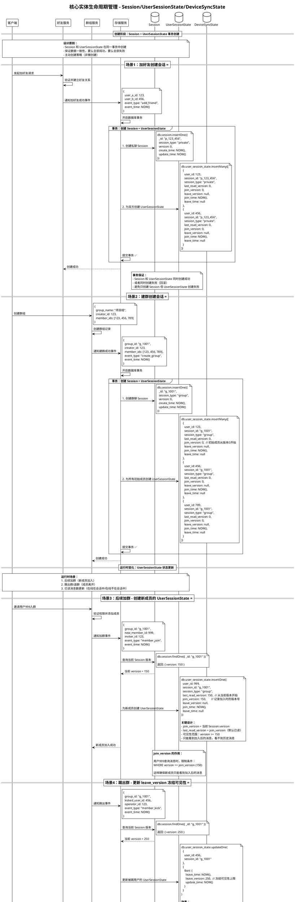

```plantuml
@startuml 核心实体生命周期管理
!theme plain

title 核心实体生命周期管理 - Session/UserSessionState/DeviceSyncState

participant "客户端" as Client
participant "好友服务" as FriendSvc
participant "群组服务" as GroupSvc
participant "存储服务" as StorageSvc
database "Session" as SessionDB
database "UserSessionState" as UserSessionStateDB
database "DeviceSyncState" as DeviceSyncStateDB

== 创建阶段：Session + UserSessionState 事务创建 ==

note over Client, UserSessionStateDB
  <b>设计原则：</b>
  - Session 和 UserSessionState 在同一事务中创建
  - 保证数据一致性，要么全部成功，要么全部失败
  - 主动创建策略（非懒创建）
end note

=== 场景1：加好友创建会话 ===

Client -> FriendSvc: 发起加好友请求
FriendSvc -> FriendSvc: 验证并建立好友关系

FriendSvc -> StorageSvc: 通知加好友成功事件
note right
  {
    user_a_id: 123,
    user_b_id: 456,
    event_type: "add_friend",
    event_time: NOW()
  }
end note

StorageSvc -> StorageSvc: 开启数据库事务

group 事务：创建 Session + UserSessionState

    StorageSvc -> SessionDB: 1. 创建私聊 Session
    note right
      db.session.insertOne({
        _id: "p_123_456",
        session_type: "private",
        version: 0,
        create_time: NOW(),
        update_time: NOW()
      })
    end note

    StorageSvc -> UserSessionStateDB: 2. 为双方创建 UserSessionState
    note right
      db.user_session_state.insertMany([
        {
          user_id: 123,
          session_id: "p_123_456",
          session_type: "private",
          last_read_version: 0,
          join_version: 0,
          leave_version: null,
          join_time: NOW(),
          leave_time: null
        },
        {
          user_id: 456,
          session_id: "p_123_456",
          session_type: "private",
          last_read_version: 0,
          join_version: 0,
          leave_version: null,
          join_time: NOW(),
          leave_time: null
        }
      ])
    end note

    StorageSvc -> StorageSvc: 提交事务 ✅

end

StorageSvc --> FriendSvc: 创建成功

note over SessionDB, UserSessionStateDB
  <b>事务保证：</b>
  - Session 和 UserSessionState 同时创建成功
  - 或者同时创建失败（回滚）
  - 避免只创建 Session 但 UserSessionState 创建失败
end note

=== 场景2：建群创建会话 ===

Client -> GroupSvc: 创建群组
note right
  {
    group_name: "项目组",
    creator_id: 123,
    member_ids: [123, 456, 789]
  }
end note

GroupSvc -> GroupSvc: 创建群组记录

GroupSvc -> StorageSvc: 通知建群成功事件
note right
  {
    group_id: "g_1001",
    creator_id: 123,
    member_ids: [123, 456, 789],
    event_type: "create_group",
    event_time: NOW()
  }
end note

StorageSvc -> StorageSvc: 开启数据库事务

group 事务：创建 Session + UserSessionState

    StorageSvc -> SessionDB: 1. 创建群聊 Session
    note right
      db.session.insertOne({
        _id: "g_1001",
        session_type: "group",
        version: 0,
        create_time: NOW(),
        update_time: NOW()
      })
    end note

    StorageSvc -> UserSessionStateDB: 2. 为所有初始成员创建 UserSessionState
    note right
      db.user_session_state.insertMany([
        {
          user_id: 123,
          session_id: "g_1001",
          session_type: "group",
          last_read_version: 0,
          join_version: 0,  // 初始成员从版本0开始
          leave_version: null,
          join_time: NOW(),
          leave_time: null
        },
        {
          user_id: 456,
          session_id: "g_1001",
          session_type: "group",
          last_read_version: 0,
          join_version: 0,
          leave_version: null,
          join_time: NOW(),
          leave_time: null
        },
        {
          user_id: 789,
          session_id: "g_1001",
          session_type: "group",
          last_read_version: 0,
          join_version: 0,
          leave_version: null,
          join_time: NOW(),
          leave_time: null
        }
      ])
    end note

    StorageSvc -> StorageSvc: 提交事务 ✅

end

StorageSvc --> GroupSvc: 创建成功

== 运行时变化：UserSessionState 状态更新 ==

note over Client, UserSessionStateDB
  <b>运行时场景：</b>
  1. 后续加群（新成员加入）
  2. 踢出群/退群（成员离开）
  3. 已读消息数更新（在线在会话中/在线不在会话中）
end note

=== 场景3：后续加群 - 创建新成员的 UserSessionState ===

Client -> GroupSvc: 邀请用户999入群

GroupSvc -> GroupSvc: 验证权限并添加成员

GroupSvc -> StorageSvc: 通知加群事件
note right
  {
    group_id: "g_1001",
    new_member_id: 999,
    inviter_id: 123,
    event_type: "member_join",
    event_time: NOW()
  }
end note

StorageSvc -> SessionDB: 查询当前 Session 版本
note right
  db.session.findOne({ _id: "g_1001" })

  返回: { version: 150 }
end note

SessionDB --> StorageSvc: 当前 version = 150

StorageSvc -> UserSessionStateDB: 为新成员创建 UserSessionState
note right
  db.user_session_state.insertOne({
    user_id: 999,
    session_id: "g_1001",
    session_type: "group",
    last_read_version: 150,  // 从当前版本开始
    join_version: 150,       // 记录加入时的版本号
    leave_version: null,
    join_time: NOW(),
    leave_time: null
  })

  <b>关键设计：</b>
  - join_version = 当前 Session.version
  - last_read_version = join_version（默认已读）
  - 可见性范围：version >= 150
  - 只能看到加入后的消息，看不到历史消息
end note

StorageSvc --> GroupSvc: 新成员加入成功

note over UserSessionStateDB
  <b>join_version 的作用：</b>

  用户999查询消息时，限制条件：
  WHERE version >= join_version (150)

  这样确保新成员只能看到加入后的消息
end note

=== 场景4：踢出群 - 更新 leave_version 冻结可见性 ===

GroupSvc -> StorageSvc: 通知踢出事件
note right
  {
    group_id: "g_1001",
    kicked_user_id: 456,
    operator_id: 123,
    event_type: "member_kick",
    event_time: NOW()
  }
end note

StorageSvc -> SessionDB: 查询当前 Session 版本
note right
  db.session.findOne({ _id: "g_1001" })

  返回: { version: 250 }
end note

SessionDB --> StorageSvc: 当前 version = 250

StorageSvc -> UserSessionStateDB: 更新被踢用户的 UserSessionState
note right
  db.user_session_state.updateOne(
    {
      user_id: 456,
      session_id: "g_1001"
    },
    {
      $set: {
        leave_time: NOW(),
        leave_version: 250,  // 冻结可见性上限
        update_time: NOW()
      }
    }
  )

  <b>效果：</b>
  - 用户456的可见性范围：0 <= version <= 250
  - 未读数冻结：250 - last_read_version
  - version > 250 的消息完全不可见
end note

StorageSvc -> DeviceSyncStateDB: 批量更新用户456的所有设备
note right
  db.device_sync_state.updateMany(
    {
      user_id: 456,
      session_id: "g_1001"
    },
    {
      $set: {
        leave_time: NOW(),
        leave_version: 250,  // 冻结同步上限
        update_time: NOW()
      }
    }
  )

  <b>同步冻结所有设备：</b>
  - 所有设备只能同步到 version <= 250
  - 未同步数冻结
end note

StorageSvc --> GroupSvc: 踢出成功

note over UserSessionStateDB, DeviceSyncStateDB
  <b>leave_version 的作用：</b>

  UserSessionState.leave_version: 控制可见性和未读数
  DeviceSyncState.leave_version: 控制同步范围和未同步数

  两者版本号相同（都是250），分别控制用户级和设备级
end note

=== 场景5：已读更新 - 在线且在会话中 ===

note over Client, UserSessionStateDB
  <b>场景：</b>用户正在查看会话，滚动消息列表
  <b>触发时机：</b>
  - 滚动到最新消息
  - 5秒定时器
  - 切换到其他会话
end note

Client -> Client: 检测到需要上报已读
note right
  本地判断：
  - 会话在前台显示
  - 滚动到了version=200的消息
  - 距离上次上报超过5秒
end note

Client -> StorageSvc: 上报已读版本
note right
  POST /api/session/read
  {
    user_id: 123,
    session_id: "g_1001",
    read_version: 200
  }
end note

StorageSvc -> UserSessionStateDB: 更新已读版本
note right
  db.user_session_state.updateOne(
    {
      user_id: 123,
      session_id: "g_1001"
    },
    {
      $set: {
        last_read_version: 200,
        update_time: NOW()
      }
    }
  )

  <b>未读数更新：</b>
  更新前：Session.version(250) - last_read_version(150) = 100
  更新后：Session.version(250) - last_read_version(200) = 50
end note

StorageSvc --> Client: 更新成功

Client -> Client: 通过 WebSocket 推送到其他在线设备
note right
  已读同步消息：
  {
    session_id: "g_1001",
    read_version: 200,
    device_id: "device_abc"
  }

  其他设备收到后也更新本地未读数
end note

=== 场景6：已读更新 - 在线但不在会话中 ===

note over Client, UserSessionStateDB
  <b>场景：</b>用户在其他页面，点击会话进入
  <b>特点：</b>一次性清零未读数
end note

Client -> Client: 用户点击会话列表中的会话
note right
  会话列表显示：
  - 会话名称
  - 最后一条消息
  - 未读数：50条
end note

Client -> StorageSvc: 打开会话，查询消息
note right
  GET /api/messages/list?session_id=g_1001
end note

StorageSvc -> SessionDB: 查询当前版本
note right
  db.session.findOne({ _id: "g_1001" })

  返回: { version: 250 }
end note

StorageSvc -> Client: 返回消息列表

Client -> StorageSvc: 立即上报已读（清零未读数）
note right
  POST /api/session/read
  {
    user_id: 123,
    session_id: "g_1001",
    read_version: 250  // 直接读到最新
  }
end note

StorageSvc -> UserSessionStateDB: 更新已读版本
note right
  db.user_session_state.updateOne(
    {
      user_id: 123,
      session_id: "g_1001"
    },
    {
      $set: {
        last_read_version: 250,
        update_time: NOW()
      }
    }
  )

  <b>未读数清零：</b>
  更新前：250 - 200 = 50
  更新后：250 - 250 = 0
end note

StorageSvc --> Client: 更新成功

== 运行时变化：DeviceSyncState 生命周期 ==

note over Client, DeviceSyncStateDB
  <b>DeviceSyncState 特点：</b>
  - 懒创建策略（设备登录时才创建）
  - 定期清理（7天未活跃即删除）
  - 可重建（下次登录重新创建）
end note

=== 场景7：设备登录 - 懒创建 DeviceSyncState ===

Client -> StorageSvc: 设备登录
note right
  POST /device/login
  {
    user_id: 123,
    device_id: "device_abc",
    device_type: "iOS"
  }
end note

StorageSvc -> StorageSvc: 查询用户的所有会话
note right
  db.user_session_state.find({
    user_id: 123,
    leave_time: null  // 只查活跃会话
  })

  返回: [
    { session_id: "p_123_456", ... },
    { session_id: "g_1001", ... }
  ]
end note

loop 遍历每个会话

    StorageSvc -> DeviceSyncStateDB: 检查 DeviceSyncState 是否存在
    note right
      db.device_sync_state.findOne({
        device_id: "device_abc",
        session_id: "g_1001"
      })
    end note

    alt DeviceSyncState 不存在

        StorageSvc -> DeviceSyncStateDB: 创建 DeviceSyncState
        note right
          db.device_sync_state.insertOne({
            device_id: "device_abc",
            user_id: 123,
            session_id: "g_1001",
            last_sync_version: 0,  // 从头同步
            leave_version: null,
            leave_time: null,
            create_time: NOW(),
            update_time: NOW()
          })

          <b>首次登录该会话：</b>
          需要同步所有历史消息
        end note

    else DeviceSyncState 已存在

        note right of DeviceSyncStateDB
          使用现有记录
          计算未同步数
        end note

    end

end

StorageSvc --> Client: 返回需要同步的会话列表

=== 场景8：设备同步 - 更新 last_sync_version ===

Client -> StorageSvc: 拉取未同步消息
note right
  GET /api/messages/sync
  {
    device_id: "device_abc",
    session_id: "g_1001",
    last_sync_version: 0
  }
end note

StorageSvc -> Client: 返回消息（批量100条）

Client -> Client: 保存到本地数据库

Client -> StorageSvc: 发送 ACK 确认
note right
  POST /api/message/ack
  {
    device_id: "device_abc",
    session_id: "g_1001",
    sync_version: 100  // 已同步到版本100
  }

  <b>批量 ACK 策略：</b>
  - 缓冲100毫秒或10条消息
  - 减少数据库更新频率
end note

StorageSvc -> DeviceSyncStateDB: 更新同步版本
note right
  db.device_sync_state.updateOne(
    {
      device_id: "device_abc",
      session_id: "g_1001"
    },
    {
      $set: {
        last_sync_version: 100,
        update_time: NOW()
      }
    }
  )

  <b>未同步数更新：</b>
  更新前：Session.version(250) - last_sync_version(0) = 250
  更新后：Session.version(250) - last_sync_version(100) = 150
end note

StorageSvc --> Client: ACK 成功

=== 场景9：定时清理 - 删除长期未活跃的设备 ===

note over StorageSvc, DeviceSyncStateDB
  <b>清理策略：</b>
  - 定时任务每天凌晨3点执行
  - 删除 update_time 超过7天的记录
  - 节省存储空间
end note

StorageSvc -> DeviceSyncStateDB: 定时清理任务
note right
  db.device_sync_state.deleteMany({
    update_time: {
      $lt: new Date(Date.now() - 7*24*60*60*1000)
    }
  })

  <b>清理逻辑：</b>
  - 7天未登录的设备大概率不再使用
  - 用户可能换设备或卸载应用
  - DeviceSyncState 可重建，删除无影响
  - 下次登录时重新创建，从头同步
end note

DeviceSyncStateDB --> StorageSvc: 清理完成
note right
  删除了 1523 条记录
end note

note over DeviceSyncStateDB
  <b>为什么可以删除：</b>

  1. DeviceSyncState 是可重建的状态数据
  2. 删除后不影响消息本身
  3. 设备下次登录时重新创建
  4. last_sync_version = 0，重新同步所有消息
  5. 用户体验：首次登录需要加载历史
end note

@enduml
```

