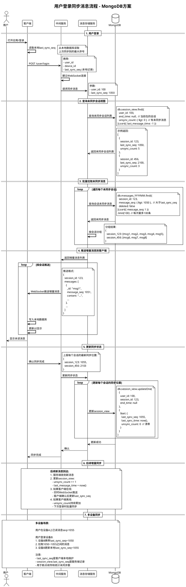

```plantuml
@startuml 用户登录同步消息流程
!theme plain
skinparam backgroundColor #FFFFFF
skinparam handwritten false
skinparam defaultFontSize 13
skinparam arrowThickness 2

title 用户登录同步消息流程 - MongoDB方案

actor 用户 as User
participant "客户端" as Client
participant "中间服务" as PushSvc
participant "消息存储服务" as StorageSvc
database "MongoDB" as MongoDB

== 1. 用户登录 ==

User -> Client: 打开应用/登录

Client -> Client: 读取本地last_sync_seq
note right
    从本地数据库读取
    上次同步到的最大序号
end note

Client -> PushSvc: POST /user/login
note right
    携带:
    - user_id
    - device_id
    - last_sync_seq (本地记录)
end note

PushSvc -> PushSvc: 建立WebSocket连接

PushSvc -> StorageSvc: 请求同步消息
note right
    参数:
    - user_id: 100
    - last_sync_seq: 1050
end note

== 2. 查询未同步会话视图 ==

StorageSvc -> MongoDB: 查询未同步会话列表
note right
    db.session_view.find({
      user_id: 100,
      end_time: null,  // 当前在的会话
      unsync_count: { $gt: 0 }  // 有未同步消息
    }).sort({ last_message_time: -1 })
end note

MongoDB --> StorageSvc: 返回未同步会话列表
note right
    示例返回:
    [
      {
        session_id: 123,
        last_sync_seq: 1050,
        unsync_count: 5
      },
      {
        session_id: 456,
        last_sync_seq: 2100,
        unsync_count: 3
      }
    ]
end note

== 3. 批量拉取未同步消息 ==

loop 遍历每个未同步会话

    StorageSvc -> MongoDB: 查询会话未同步消息
    note right
        db.messages_YYYYMM.find({
          session_id: 123,
          message_seq: { $gt: 1050 },  // 大于last_sync_seq
          deleted: false
        }).sort({ message_seq: 1 })
        .limit(100)  // 每次最多100条
    end note

    MongoDB --> StorageSvc: 返回未同步消息

    StorageSvc -> StorageSvc: 按会话分组
    note right
        分组结果:
        {
          session_123: [msg1, msg2, msg3, msg4, msg5],
          session_456: [msg6, msg7, msg8]
        }
    end note

end

== 4. 推送增量消息到客户端 ==

StorageSvc -> PushSvc: 返回增量消息列表

loop 按会话推送

    PushSvc -> Client: WebSocket推送增量消息
    note right
        推送格式:
        {
          session_id: 123,
          messages: [
            {
              _id: "msg1",
              message_seq: 1051,
              content: "...",
              ...
            },
            ...
          ]
        }
    end note

    Client -> Client: 写入本地数据库

    Client -> Client: 更新UI显示

end

Client --> User: 显示未读消息

== 5. 更新同步状态 ==

Client -> PushSvc: 确认同步完成
note right
    上报每个会话的最新同步位置:
    {
      session_123: 1055,
      session_456: 2103
    }
end note

PushSvc -> StorageSvc: 更新同步状态

loop 更新每个会话的同步位置

    StorageSvc -> MongoDB: 更新session_view
    note right
        db.session_view.updateOne(
          {
            user_id: 100,
            session_id: 123,
            end_time: null
          },
          {
            $set: {
              last_sync_seq: 1055,
              last_sync_time: now(),
              unsync_count: 0  // 清零
            }
          }
        )
    end note

end

MongoDB --> StorageSvc: 更新成功

StorageSvc --> PushSvc: 确认

PushSvc --> Client: 同步完成

== 6. 后续增量同步 ==

note over Client, MongoDB
    <b>后续新消息到达:</b>
    1. 服务端收到新消息
    2. 更新session_view:
       - unsync_count += 1
       - last_message_time = now()
    3. 如果客户端在线:
       - 实时WebSocket推送
       - 客户端确认后更新last_sync_seq
    4. 如果客户端离线:
       - unsync_count持续累加
       - 下次登录时批量同步
end note

== 7. 多设备同步 ==

note over User, MongoDB
    <b>多设备场景:</b>

    用户在设备A上已读消息seq=1055

    用户登录设备B:
    1. 设备B携带last_sync_seq=1050
    2. 拉取1050~1055之间的消息
    3. 设备B更新本地last_sync_seq=1055

    注意:
    - last_sync_seq是客户端本地维护
    - session_view.last_sync_seq是服务端记录
    - 用于断点续传和统计未同步数
end note

@enduml

```
