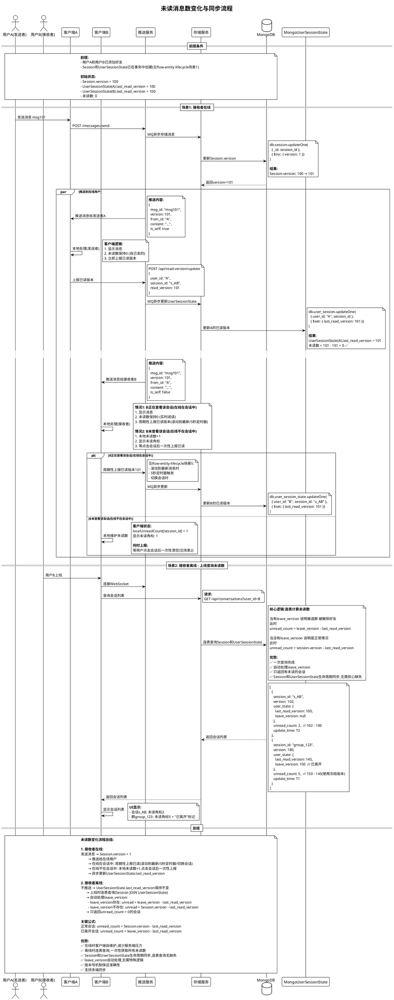

```plantuml
@startuml 未读消息数变化与同步流程
!theme plain

title 未读消息数变化与同步流程

actor "用户A(发送者)" as UserA
actor "用户B(接收者)" as UserB
participant "客户端A" as ClientA
participant "客户端B" as ClientB
participant "推送服务" as PushSvc
participant "存储服务" as StorageSvc
database "MongoDB" as MongoDB

== 前提条件 ==

note over UserA, MongoDB
  <b>前提:</b>
  - 用户A和用户B已添加好友
  - Session和UserSessionState已在事务中创建(见flow-entity-lifecycle场景1)

  <b>初始状态:</b>
  - Session.version = 100
  - UserSessionState(A).last_read_version = 100
  - UserSessionState(B).last_read_version = 100
  - 未读数: 0
end note

== 场景1: 接收者在线 ==

UserA -> ClientA: 发送消息 msg101

ClientA -> PushSvc: POST /messages/send

PushSvc -> StorageSvc: MQ异步存储消息

StorageSvc -> MongoDB: 更新Session.version
note right
  db.session.updateOne(
    { _id: session_id },
    { $inc: { version: 1 }}
  )

  <b>结果:</b>
  Session.version: 100 → 101
end note

MongoDB --> StorageSvc: 返回version=101

par 推送到在线用户

    PushSvc -> ClientA: 推送消息给发送者A
    note right
      <b>推送内容:</b>
      {
        msg_id: "msg101",
        version: 101,
        from_id: "A",
        content: "...",
        is_self: true
      }
    end note

    ClientA -> ClientA: 本地处理(发送者)
    note right
      <b>客户端逻辑:</b>
      1. 显示消息
      2. 未读数保持0 (自己发的)
      3. 立即上报已读版本
    end note

    ClientA -> PushSvc: 上报已读版本
    note right
      POST /api/read-version/update
      {
        user_id: "A",
        session_id: "s_AB",
        read_version: 101
      }
    end note

    PushSvc -> StorageSvc: MQ异步更新UserSessionState

    StorageSvc -> MongoUserSessionState: 更新A的已读版本
    note right
      db.user_session.updateOne(
        { user_id: "A", session_id },
        { $set: { last_read_version: 101 }}
      )

      <b>结果:</b>
      UserSessionState(A).last_read_version = 101
      未读数 = 101 - 101 = 0 ✅
    end note

    ...

    PushSvc -> ClientB: 推送消息给接收者B
    note right
      <b>推送内容:</b>
      {
        msg_id: "msg101",
        version: 101,
        from_id: "A",
        content: "...",
        is_self: false
      }
    end note

    ClientB -> ClientB: 本地处理(接收者)
    note right
      <b>情况1: B正在查看该会话(在线在会话中)</b>
      1. 显示消息
      2. 未读数保持0 (实时阅读)
      3. 周期性上报已读版本(滚动到最新/5秒定时器)

      <b>情况2: B未查看该会话(在线不在会话中)</b>
      1. 本地未读数+1
      2. 显示未读角标
      3. 等点击会话后一次性上报已读
    end note

    alt B正在查看该会话(在线在会话中)

        ClientB -> PushSvc: 周期性上报已读版本101
        note right
          见flow-entity-lifecycle场景5:
          - 滚动到最新消息时
          - 5秒定时器触发
          - 切换会话时
        end note
        PushSvc -> StorageSvc: MQ异步更新
        StorageSvc -> MongoDB: 更新B的已读版本
        note right
          db.user_session_state.updateOne(
            { user_id: "B", session_id: "s_AB" },
            { $set: { last_read_version: 101 }}
          )
        end note

    else B未查看该会话(在线不在会话中)

        ClientB -> ClientB: 本地维护未读数
        note right
          <b>客户端状态:</b>
          localUnreadCount[session_id] = 1
          显示未读角标: 1

          <b>何时上报:</b>
          等用户点击会话后一次性清空(见场景2)
        end note

    end

end

== 场景2: 接收者离线 - 上线查询未读数 ==

UserB -> ClientB: 用户B上线

ClientB -> PushSvc: 连接WebSocket

ClientB -> StorageSvc: 查询会话列表
note right
  <b>请求:</b>
  GET /api/conversations?user_id=B
end note

StorageSvc -> MongoDB: 连表查询Session和UserSessionState
note right
  <b>核心逻辑:连表计算未读数</b>

  当有leave_version 说明被退群 被解除好友
  此时
  unread_count = leave_version - last_read_version

  当没有leave_version 说明是正常情况
  此时
  unread_count = session.version - last_read_version

  <b>优势:</b>
  ✅ 一次查询完成
  ✅ 自动处理leave_version
  ✅ 只返回有未读的会话
  ✅ Session和UserSessionState生命周期同步,无需担心缺失
end note

MongoDB --> StorageSvc: 返回会话列表
note right
  [
    {
      session_id: "s_AB",
      version: 102,
      user_state: {
        last_read_version: 100,
        leave_version: null
      },
      unread_count: 2,  // 102 - 100
      update_time: T2
    },
    {
      session_id: "group_123",
      version: 180,
      user_state: {
        last_read_version: 145,
        leave_version: 150  // 已离开
      },
      unread_count: 5,  // 150 - 145(使用冻结版本)
      update_time: T1
    }
  ]
end note

StorageSvc --> ClientB: 返回会话列表

ClientB -> ClientB: 显示会话列表
note right
  <b>UI显示:</b>
  - 会话s_AB: 未读角标2
  - 群group_123: 未读角标5 + "已离开"标记
end note

== 总结 ==

note over UserA, MongoDB
<b>未读数变化流程总结:</b>

<b>1. 接收者在线:</b>
发送消息 → Session.version + 1
        → 推送给在线用户
        → 在线在会话中: 周期性上报已读(滚动到最新/5秒定时器/切换会话)
        → 在线不在会话中: 本地未读数+1,点击会话后一次性上报
        → 异步更新UserSessionState.last_read_version

<b>2. 接收者离线:</b>
不推送 → UserSessionState.last_read_version保持不变
      → 上线时连表查询(Session JOIN UserSessionState)
      → 自动处理leave_version:
        - leave_version存在: unread = leave_version - last_read_version
        - leave_version不存在: unread = Session.version - last_read_version
      → 只返回unread_count > 0的会话

<b>关键公式:</b>
正常会话: unread_count = Session.version - last_read_version
已离开会话: unread_count = leave_version - last_read_version

<b>优势:</b>
✅ 在线时客户端自维护,减少服务端压力
✅ 离线时连表查询,一次性获取所有未读数
✅ Session和UserSessionState生命周期同步,连表查询无缺失
✅ leave_version自动处理,无需特殊逻辑
✅ 版本号机制保证准确性
✅ 支持多端同步
end note

@enduml
```
