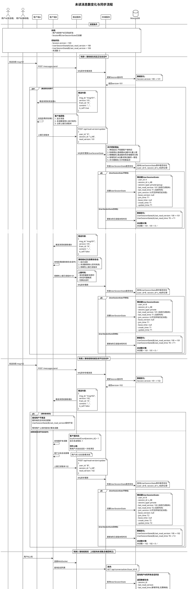

```plantuml
@startuml 未读消息数变化与同步流程
!theme plain

title 未读消息数变化与同步流程

actor "用户A(发送者)" as UserA
actor "用户B(接收者)" as UserB
participant "客户端A" as ClientA
participant "客户端B" as ClientB
participant "推送服务" as PushSvc
participant "存储服务" as StorageSvc
database "MongoDB" as MongoDB

== 前提条件 ==

note over UserA, MongoDB
  <b>前提:</b>
  - 用户A和用户B已添加好友
  - Session和UserSessionState已创建

  <b>初始状态:</b>
  - Session.version = 100
  - UserSessionState(A).last_read_version = 100
  - UserSessionState(B).last_read_version = 100
  - 未读数: 0
end note

== 场景1: 接收者在线且正在会话中 ==

UserA -> ClientA: 发送消息 msg101

ClientA -> PushSvc: POST /messages/send

PushSvc -> StorageSvc: MQ异步存储消息

StorageSvc -> MongoDB: 更新Session版本号
note right
  <b>数据变化:</b>
  Session.version: 100 → 101
end note

MongoDB --> StorageSvc: 返回version=101

par 推送到在线用户

    PushSvc -> ClientA: 推送消息给发送者A
    note right
      <b>推送内容:</b>
      {
        msg_id: "msg101",
        version: 101,
        from_id: "A",
        content: "...",
        is_self: true
      }
    end note

    ClientA -> ClientA: 本地处理(发送者)
    note right
      <b>客户端逻辑:</b>
      1. 显示消息
      2. 未读数保持0 (自己发的)
      3. 立即上报已读版本
    end note

    ClientA -> PushSvc: 上报已读版本
    note right
      POST /api/read-version/update
      {
        user_id: "A",
        session_id: "s_AB",
        read_version: 101
      }
    end note

    PushSvc -> StorageSvc: MQ异步更新UserSessionState
    note right
      <b>异步更新理由:</b>
      1. 降低延迟,不阻塞客户端响应
      2. 削峰填谷,高峰期MQ缓冲大量上报
      3. 解耦服务,推送服务和存储服务分离
      4. 容错性好,MQ重试保证最终一致性
      5. 非关键路径,允许短暂延迟
    end note

    StorageSvc -> MongoDB: 检查UserSessionState是否存在
    note right
      查询UserSessionState表中是否存在
      (user_id=A, session_id=s_AB)的记录
    end note

    alt UserSessionState不存在

        StorageSvc -> MongoDB: 创建UserSessionState
        note right
          <b>懒创建UserSessionState:</b>
          - user_id: A
          - session_id: s_AB
          - session_type: private/group
          - last_read_version: 101 (当前已读版本)
          - last_read_time: T1 (当前时间)
          - join_version: 0 (可见所有历史消息)
          - leave_version: null
          - join_time: T1
          - leave_time: null
          - create_time: T1
          - update_time: T1
        end note

    else UserSessionState已存在

        StorageSvc -> MongoDB: 更新A的已读版本和时间
        note right
          <b>数据变化:</b>
          UserSessionState(A).last_read_version: 100 → 101
          UserSessionState(A).last_read_time: T0 → T1

          <b>未读数计算:</b>
          未读数 = 101 - 101 = 0 ✅
        end note

    end

    ...

    PushSvc -> ClientB: 推送消息给接收者B
    note right
      <b>推送内容:</b>
      {
        msg_id: "msg101",
        version: 101,
        from_id: "A",
        content: "...",
        is_self: false
      }
    end note

    ClientB -> ClientB: 本地处理(接收者在会话中)
    note right
      <b>接收者B正在查看该会话:</b>
      1. 显示消息
      2. 未读数保持0 (实时阅读)
      3. 周期性上报已读版本
    end note

    ClientB -> PushSvc: 周期性上报已读版本101
    note right
      <b>上报时机:</b>
      - 滚动到最新消息时
      - 5秒定时器触发
      - 切换会话时
    end note

    PushSvc -> StorageSvc: MQ异步更新

    StorageSvc -> MongoDB: 检查UserSessionState是否存在
    note right
      查询UserSessionState表中是否存在
      (user_id=B, session_id=s_AB)的记录
    end note

    alt UserSessionState不存在

        StorageSvc -> MongoDB: 创建UserSessionState
        note right
          <b>懒创建UserSessionState:</b>
          - user_id: B
          - session_id: s_AB
          - session_type: private
          - last_read_version: 101 (当前已读版本)
          - last_read_time: T1 (当前时间)
          - join_version: 0 (可见所有历史消息)
          - leave_version: null
          - join_time: T1
          - leave_time: null
          - create_time: T1
          - update_time: T1
        end note

    else UserSessionState已存在

        StorageSvc -> MongoDB: 更新B的已读版本和时间
        note right
          <b>数据变化:</b>
          UserSessionState(B).last_read_version: 100 → 101
          UserSessionState(B).last_read_time: T0 → T1

          <b>未读数计算:</b>
          未读数 = 101 - 101 = 0 ✅
        end note

    end

end

== 场景2: 接收者离线或在线不在会话中 ==

UserA -> ClientA: 发送消息 msg102

ClientA -> PushSvc: POST /messages/send

PushSvc -> StorageSvc: MQ异步存储消息

StorageSvc -> MongoDB: 更新Session版本号
note right
  <b>数据变化:</b>
  Session.version: 101 → 102
end note

MongoDB --> StorageSvc: 返回version=102

PushSvc -> ClientB: 推送消息给接收者B
note right
  <b>推送内容:</b>
  {
    msg_id: "msg102",
    version: 102,
    from_id: "A",
    content: "...",
    is_self: false
  }
end note

alt 接收者B离线

    note over ClientB
      <b>离线用户不推送</b>
      服务端无任何状态更新
      UserSessionState(B).last_read_version保持不变

      等待用户上线时查询计算未读数
    end note

else 接收者B在线不在会话中

    ClientB -> ClientB: 本地维护未读数
    note right
      <b>客户端状态:</b>
      localUnreadCount[session_id] = 1
      显示未读角标: 1

      <b>何时上报:</b>
      等用户点击会话后一次性清空
    end note

    ClientB -> ClientB: 用户点击会话查看
    note right
      用户进入会话查看消息
    end note

    ClientB -> PushSvc: 上报已读版本102
    note right
      POST /api/read-version/update
      {
        user_id: "B",
        session_id: "s_AB",
        read_version: 102
      }
    end note

    PushSvc -> StorageSvc: MQ异步更新

    StorageSvc -> MongoDB: 检查UserSessionState是否存在
    note right
      查询UserSessionState表中是否存在
      (user_id=B, session_id=s_AB)的记录
    end note

    alt UserSessionState不存在

        StorageSvc -> MongoDB: 创建UserSessionState
        note right
          <b>懒创建UserSessionState:</b>
          - user_id: B
          - session_id: s_AB
          - session_type: private
          - last_read_version: 102 (当前已读版本)
          - last_read_time: T2 (当前时间)
          - join_version: 0 (可见所有历史消息)
          - leave_version: null
          - join_time: T2
          - leave_time: null
          - create_time: T2
          - update_time: T2
        end note

    else UserSessionState已存在

        StorageSvc -> MongoDB: 更新B的已读版本和时间
        note right
          <b>数据变化:</b>
          UserSessionState(B).last_read_version: 100 → 102
          UserSessionState(B).last_read_time: T0 → T2

          <b>未读数计算:</b>
          未读数 = 102 - 102 = 0 ✅
        end note

    end

end

== 场景3: 接收者离线 - 上线查询未读数(含撤回修正) ==

UserB -> ClientB: 用户B上线

ClientB -> PushSvc: 连接WebSocket

ClientB -> StorageSvc: 查询会话列表
note right
  <b>请求:</b>
  GET /api/conversations?user_id=B
end note

StorageSvc -> MongoDB: 查询UserSessionState
note right
  <b>查询用户B的所有会话状态</b>

  <b>返回数据包含:</b>
  - session_id
  - last_read_version
  - last_read_time (新增字段,无需映射)
  - leave_version
end note

StorageSvc -> MongoDB: 查询Session版本号
note right
  <b>查询每个会话的当前版本</b>

  <b>返回数据:</b>
  - Session.version
end note

StorageSvc -> MongoDB: 查询撤回消息数(关键步骤)
note right
  <b>通过时间窗口查询撤回数</b>

  对每个会话:

  <b>查询条件:</b>
  - session_id匹配
  - msg_time > last_read_time (直接使用,无需映射)
  - status = 撤回

  统计撤回消息数量

  <b>计算精确未读数:</b>
  raw_unread = leave_version存在 ?
    (leave_version - last_read_version) :
    (Session.version - last_read_version)

  unread_count = raw_unread - recalled_count

  <b>撤回消息设计:</b>
  ✅ 撤回是操作,不是消息
  ✅ 撤回不占用seq号
  ✅ 撤回不让Session.version增加
  ✅ 只标记被撤回消息的status字段
  ✅ 未读数公式自动修正(扣除被撤回的消息)

  <b>关键优势:</b>
  ✅ 无需连表查询
  ✅ last_read_time直接使用
  ✅ 实时查询,精确计算
  ✅ 静默数据不被唤醒
end note

MongoDB --> StorageSvc: 返回会话列表
note right
  [
    {
      session_id: "s_AB",
      Session.version: 106,
      UserSessionState.last_read_version: 100,
      UserSessionState.leave_version: null,
      recalled_count: 1,  // 查询得到(msg105被撤回)
      unread_count: 5,    // (106 - 100) - 1 = 5 ✅精确
      update_time: T1
    },
    {
      session_id: "group_123",
      Session.version: 180,
      UserSessionState.last_read_version: 145,
      UserSessionState.leave_version: 150,
      recalled_count: 3,  // 时间窗口查询得到
      unread_count: 2,    // (150 - 145) - 3 = 2 ✅精确
      update_time: T2
    }
  ]
end note

StorageSvc --> ClientB: 返回会话列表

ClientB -> ClientB: 显示会话列表
note right
  <b>UI显示:</b>
  - 会话s_AB: 未读角标5
    (已扣除1条撤回消息)
  - 群group_123: 未读角标2 + "已离开"标记
    (已扣除3条撤回消息)
end note

StorageSvc -> StorageSvc: 性能优化
note right
  <b>性能优势:</b>

  <b>查询次数:</b>
  1. 查询UserSessionState (含last_read_time)
  2. 查询Session版本号
  3. 统计撤回数

  <b>优化方案: 批量查询</b>
  - 批量查询所有会话的Session版本
  - 批量统计所有会话的撤回数

  <b>对比传统方案:</b>
  ❌ 传统: 需要先查消息映射last_read_time
  ✅ 新方案: last_read_time直接存储,无需映射
end note

== 总结 ==

note over UserA, MongoDB
<b>未读数变化流程总结:</b>

<b>场景1: 接收者在线且正在会话中</b>
发送消息 → Session.version + 1
        → 推送给在线用户
        → 周期性上报已读(滚动到最新/5秒定时器/切换会话)
        → MQ异步更新UserSessionState.last_read_version和last_read_time

<b>场景2: 接收者离线或在线不在会话中</b>
发送消息 → Session.version + 1
        → 推送给在线用户(离线则不推送)
        → 在线不在会话中: 本地未读数+1,点击会话后一次性上报
        → 离线: UserSessionState保持不变

<b>场景3: 上线查询未读数(含撤回修正)</b>
用户上线 → 查询UserSessionState (含last_read_time字段)
       → 查询Session版本号
       → 查询last_read_time之后的撤回消息数
       → 计算未读数: (version - last_read_version) - recalled_count
       → 只返回unread_count > 0的会话

<b>撤回消息处理:</b>
撤回消息 → 标记Message.status = 撤回
        → Session.version 保持不变 ✅
        → 撤回不占用seq号 ✅
        → 不更新任何UserSessionState ✅
        → 推送撤回事件给在线用户
        → 在线用户: 本地未读数-1,客户端自维护
        → 离线用户: 无任何状态更新,上线时查询修正

<b>关键公式:</b>
正常会话: unread_count = (Session.version - last_read_version) - recalled_count
已离开会话: unread_count = (leave_version - last_read_version) - recalled_count

recalled_count = 查询msg_time > last_read_time且status=撤回的消息数

<b>撤回消息设计:</b>
✅ 撤回是操作,不是消息
✅ 撤回不占用seq号
✅ 撤回不让Session.version增加
✅ 只标记被撤回消息的status字段

<b>核心优势:</b>
✅ 撤回消息零写扩散,只标记消息表
✅ UserSessionState新增last_read_time字段,无需映射查询
✅ 不需要连表查询,性能更好
✅ 静默数据不被唤醒,无维护成本
✅ 撤回消息精确修正未读数
✅ 在线时客户端自维护,减少服务端压力
✅ 离线时通过时间窗口实时查询计算
✅ MQ异步更新,降低延迟,削峰填谷
✅ leave_version自动处理,无需特殊逻辑
✅ 版本号机制保证准确性
✅ 支持多端同步

<b>性能优化:</b>
批量查询: 批量查询Session版本和撤回数,减少往返次数
end note

@enduml
```
