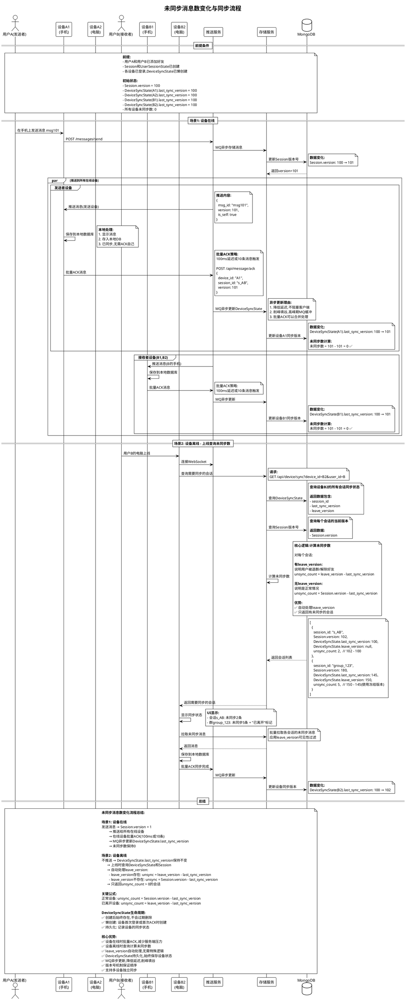

```plantuml
@startuml 未同步消息数变化与同步流程
!theme plain

title 未同步消息数变化与同步流程

actor "用户A(发送者)" as UserA
participant "设备A1\n(手机)" as DeviceA1
participant "设备A2\n(电脑)" as DeviceA2
actor "用户B(接收者)" as UserB
participant "设备B1\n(手机)" as DeviceB1
participant "设备B2\n(电脑)" as DeviceB2
participant "推送服务" as PushSvc
participant "存储服务" as StorageSvc
database "MongoDB" as MongoDB

== 前提条件 ==

note over UserA, MongoDB
  <b>前提:</b>
  - 用户A和用户B已添加好友
  - Session和UserSessionState已创建
  - 各设备已登录,DeviceSyncState已懒创建

  <b>初始状态:</b>
  - Session.version = 100
  - DeviceSyncState(A1).last_sync_version = 100
  - DeviceSyncState(A2).last_sync_version = 100
  - DeviceSyncState(B1).last_sync_version = 100
  - DeviceSyncState(B2).last_sync_version = 100
  - 所有设备未同步数: 0
end note

== 场景1: 设备在线 ==

UserA -> DeviceA1: 在手机上发送消息 msg101

DeviceA1 -> PushSvc: POST /messages/send

PushSvc -> StorageSvc: MQ异步存储消息

StorageSvc -> MongoDB: 更新Session版本号
note right
  <b>数据变化:</b>
  Session.version: 100 → 101
end note

MongoDB --> StorageSvc: 返回version=101

par 推送到所有在线设备

    group 发送者设备

        PushSvc -> DeviceA1: 推送消息(发送设备)
        note right
          <b>推送内容:</b>
          {
            msg_id: "msg101",
            version: 101,
            is_self: true
          }
        end note

        DeviceA1 -> DeviceA1: 保存到本地数据库
        note right
          <b>本地处理:</b>
          1. 显示消息
          2. 存入本地DB
          3. 已同步,无需ACK自己
        end note

        DeviceA1 -> PushSvc: 批量ACK消息
        note right
          <b>批量ACK策略:</b>
          100ms延迟或10条消息触发

          POST /api/message/ack
          {
            device_id: "A1",
            session_id: "s_AB",
            version: 101
          }
        end note

        PushSvc -> StorageSvc: MQ异步更新DeviceSyncState
        note right
          <b>异步更新理由:</b>
          1. 降低延迟,不阻塞客户端
          2. 削峰填谷,高峰期MQ缓冲
          3. 批量ACK可以合并处理
        end note

        StorageSvc -> MongoDB: 更新设备A1同步版本
        note right
          <b>数据变化:</b>
          DeviceSyncState(A1).last_sync_version: 100 → 101

          <b>未同步数计算:</b>
          未同步数 = 101 - 101 = 0 ✅
        end note

    end

    group 接收者设备(B1,B2)

        PushSvc -> DeviceB1: 推送消息(B的手机)
        DeviceB1 -> DeviceB1: 保存到本地数据库
        DeviceB1 -> PushSvc: 批量ACK消息
        note right
          批量ACK策略:
          100ms延迟或10条消息触发
        end note
        PushSvc -> StorageSvc: MQ异步更新
        StorageSvc -> MongoDB: 更新设备B1同步版本
        note right
          <b>数据变化:</b>
          DeviceSyncState(B1).last_sync_version: 100 → 101

          <b>未同步数计算:</b>
          未同步数 = 101 - 101 = 0 ✅
        end note

    end

end

== 场景2: 设备离线 - 上线查询未同步数 ==

UserB -> DeviceB2: 用户B的电脑上线

DeviceB2 -> PushSvc: 连接WebSocket

DeviceB2 -> StorageSvc: 查询需要同步的会话
note right
  <b>请求:</b>
  GET /api/device/sync?device_id=B2&user_id=B
end note

StorageSvc -> MongoDB: 查询DeviceSyncState
note right
  <b>查询设备B2的所有会话同步状态</b>

  <b>返回数据包含:</b>
  - session_id
  - last_sync_version
  - leave_version
end note

StorageSvc -> MongoDB: 查询Session版本号
note right
  <b>查询每个会话的当前版本</b>

  <b>返回数据:</b>
  - Session.version
end note

StorageSvc -> StorageSvc: 计算未同步数
note right
  <b>核心逻辑:计算未同步数</b>

  对每个会话:

  <b>有leave_version:</b>
  说明用户被退群/解除好友
  unsync_count = leave_version - last_sync_version

  <b>无leave_version:</b>
  说明是正常情况
  unsync_count = Session.version - last_sync_version

  <b>优势:</b>
  ✅ 自动处理leave_version
  ✅ 只返回有未同步的会话
end note

MongoDB --> StorageSvc: 返回会话列表
note right
  [
    {
      session_id: "s_AB",
      Session.version: 102,
      DeviceSyncState.last_sync_version: 100,
      DeviceSyncState.leave_version: null,
      unsync_count: 2,  // 102 - 100
    },
    {
      session_id: "group_123",
      Session.version: 180,
      DeviceSyncState.last_sync_version: 145,
      DeviceSyncState.leave_version: 150,
      unsync_count: 5,  // 150 - 145(使用冻结版本)
    }
  ]
end note

StorageSvc --> DeviceB2: 返回需要同步的会话

DeviceB2 -> DeviceB2: 显示同步状态
note right
  <b>UI显示:</b>
  - 会话s_AB: 未同步2条
  - 群group_123: 未同步5条 + "已离开"标记
end note

DeviceB2 -> StorageSvc: 拉取未同步消息
note right
  批量拉取各会话的未同步消息
  应用leave_version可见性过滤
end note

StorageSvc --> DeviceB2: 返回消息

DeviceB2 -> DeviceB2: 保存到本地数据库

DeviceB2 -> PushSvc: 批量ACK同步完成

PushSvc -> StorageSvc: MQ异步更新

StorageSvc -> MongoDB: 更新设备同步版本
note right
  <b>数据变化:</b>
  DeviceSyncState(B2).last_sync_version: 100 → 102
end note

== 总结 ==

note over UserA, MongoDB
<b>未同步消息数变化流程总结:</b>

<b>场景1: 设备在线</b>
发送消息 → Session.version + 1
        → 推送给所有在线设备
        → 在线设备批量ACK(100ms或10条)
        → MQ异步更新DeviceSyncState.last_sync_version
        → 未同步数保持0

<b>场景2: 设备离线</b>
不推送 → DeviceSyncState.last_sync_version保持不变
      → 上线时查询DeviceSyncState和Session
      → 自动处理leave_version:
        - leave_version存在: unsync = leave_version - last_sync_version
        - leave_version不存在: unsync = Session.version - last_sync_version
      → 只返回unsync_count > 0的会话

<b>关键公式:</b>
正常设备: unsync_count = Session.version - last_sync_version
已离开设备: unsync_count = leave_version - last_sync_version

<b>DeviceSyncState生命周期:</b>
✅ 创建后始终存在,不会过期删除
✅ 懒创建: 设备首次登录或首次ACK时创建
✅ 持久化: 记录设备的同步状态

<b>核心优势:</b>
✅ 设备在线时批量ACK,减少服务端压力
✅ 设备离线时查询计算未同步数
✅ leave_version自动处理,无需特殊逻辑
✅ DeviceSyncState持久化,始终保存设备状态
✅ MQ异步更新,降低延迟,削峰填谷
✅ 版本号机制保证顺序
✅ 支持多设备独立同步
end note

@enduml
```
