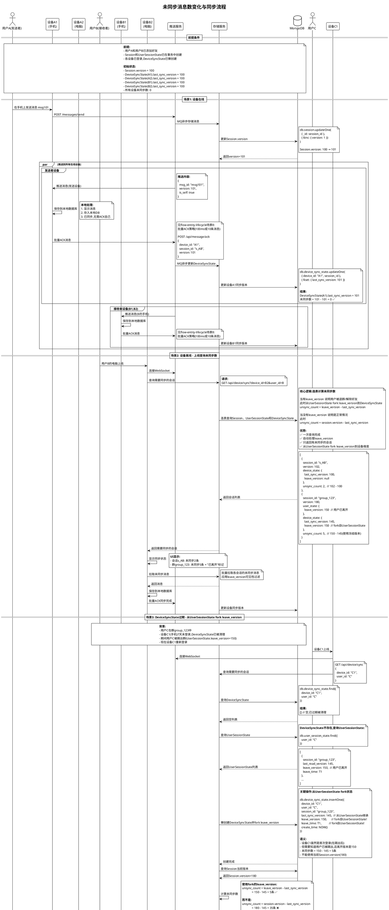

```plantuml
@startuml 未同步消息数变化与同步流程
!theme plain

title 未同步消息数变化与同步流程

actor "用户A(发送者)" as UserA
participant "设备A1\n(手机)" as DeviceA1
participant "设备A2\n(电脑)" as DeviceA2
actor "用户B(接收者)" as UserB
participant "设备B1\n(手机)" as DeviceB1
participant "设备B2\n(电脑)" as DeviceB2
participant "推送服务" as PushSvc
participant "存储服务" as StorageSvc
database "MongoDB" as MongoDB

== 前提条件 ==

note over UserA, MongoDB
  <b>前提:</b>
  - 用户A和用户B已添加好友
  - Session和UserSessionState已在事务中创建
  - 各设备已登录,DeviceSyncState已懒创建

  <b>初始状态:</b>
  - Session.version = 100
  - DeviceSyncState(A1).last_sync_version = 100
  - DeviceSyncState(A2).last_sync_version = 100
  - DeviceSyncState(B1).last_sync_version = 100
  - DeviceSyncState(B2).last_sync_version = 100
  - 所有设备未同步数: 0
end note

== 场景1: 设备在线 ==

UserA -> DeviceA1: 在手机上发送消息 msg101

DeviceA1 -> PushSvc: POST /messages/send

PushSvc -> StorageSvc: MQ异步存储消息

StorageSvc -> MongoDB: 更新Session.version
note right
  db.session.updateOne(
    { _id: session_id },
    { $inc: { version: 1 }}
  )

  Session.version: 100 → 101
end note

MongoDB --> StorageSvc: 返回version=101

par 推送到所有在线设备

    group 发送者设备

        PushSvc -> DeviceA1: 推送消息(发送设备)
        note right
          <b>推送内容:</b>
          {
            msg_id: "msg101",
            version: 101,
            is_self: true
          }
        end note

        DeviceA1 -> DeviceA1: 保存到本地数据库
        note right
          <b>本地处理:</b>
          1. 显示消息
          2. 存入本地DB
          3. 已同步,无需ACK自己
        end note

        DeviceA1 -> PushSvc: 批量ACK消息
        note right
          见flow-entity-lifecycle场景8:
          批量ACK策略(100ms或10条消息)

          POST /api/message/ack
          {
            device_id: "A1",
            session_id: "s_AB",
            version: 101
          }
        end note

        PushSvc -> StorageSvc: MQ异步更新DeviceSyncState

        StorageSvc -> MongoDB: 更新设备A1同步版本
        note right
          db.device_sync_state.updateOne(
            { device_id: "A1", session_id },
            { $set: { last_sync_version: 101 }}
          )

          <b>结果:</b>
          DeviceSyncState(A1).last_sync_version = 101
          未同步数 = 101 - 101 = 0 ✅
        end note

    end

    group 接收者设备(B1,B2)

        PushSvc -> DeviceB1: 推送消息(B的手机)
        DeviceB1 -> DeviceB1: 保存到本地数据库
        DeviceB1 -> PushSvc: 批量ACK消息
        note right
          见flow-entity-lifecycle场景8:
          批量ACK策略(100ms或10条消息)
        end note
        StorageSvc -> MongoDB: 更新设备B1同步版本

    end

end

== 场景2: 设备离线 - 上线查询未同步数 ==

UserB -> DeviceB2: 用户B的电脑上线

DeviceB2 -> PushSvc: 连接WebSocket

DeviceB2 -> StorageSvc: 查询需要同步的会话
note right
  <b>请求:</b>
  GET /api/device/sync?device_id=B2&user_id=B
end note

StorageSvc -> MongoDB: 连表查询Session、UserSessionState和DeviceSyncState
note right
  <b>核心逻辑:连表计算未同步数</b>

  当有leave_version 说明用户被退群/解除好友
  此时从UserSessionState fork leave_version到DeviceSyncState
  unsync_count = leave_version - last_sync_version

  当没有leave_version 说明是正常情况
  此时
  unsync_count = session.version - last_sync_version

  <b>优势:</b>
  ✅ 一次查询完成
  ✅ 自动处理leave_version
  ✅ 只返回有未同步的会话
  ✅ 从UserSessionState fork leave_version到设备维度
end note

MongoDB --> StorageSvc: 返回会话列表
note right
  [
    {
      session_id: "s_AB",
      version: 102,
      device_state: {
        last_sync_version: 100,
        leave_version: null
      },
      unsync_count: 2,  // 102 - 100
    },
    {
      session_id: "group_123",
      version: 180,
      user_state: {
        leave_version: 150  // 用户已离开
      },
      device_state: {
        last_sync_version: 145,
        leave_version: 150  // fork自UserSessionState
      },
      unsync_count: 5,  // 150 - 145(使用冻结版本)
    }
  ]
end note

StorageSvc --> DeviceB2: 返回需要同步的会话

DeviceB2 -> DeviceB2: 显示同步状态
note right
  <b>UI显示:</b>
  - 会话s_AB: 未同步2条
  - 群group_123: 未同步5条 + "已离开"标记
end note

DeviceB2 -> StorageSvc: 拉取未同步消息
note right
  批量拉取各会话的未同步消息
  应用leave_version可见性过滤
end note

StorageSvc --> DeviceB2: 返回消息

DeviceB2 -> DeviceB2: 保存到本地数据库

DeviceB2 -> PushSvc: 批量ACK同步完成

StorageSvc -> MongoDB: 更新设备同步版本

== 场景3: DeviceSyncState过期 - 从UserSessionState fork leave_version ==

note over UserB, MongoDB
  <b>背景:</b>
  - 用户C在群group_123中
  - 设备C1(手机)7天未登录,DeviceSyncState已被清理
  - 期间用户C被踢出群(UserSessionState.leave_version=150)
  - 现在设备C1重新登录
end note

actor "用户C" as UserC
participant "设备C1" as DeviceC1

UserC -> DeviceC1: 设备C1上线

DeviceC1 -> PushSvc: 连接WebSocket

DeviceC1 -> StorageSvc: 查询需要同步的会话
note right
  GET /api/device/sync
  {
    device_id: "C1",
    user_id: "C"
  }
end note

StorageSvc -> MongoDB: 查询DeviceSyncState
note right
  db.device_sync_state.find({
    device_id: "C1",
    user_id: "C"
  })

  <b>结果:</b>
  [] // 空,已过期被清理
end note

MongoDB --> StorageSvc: 返回空列表

StorageSvc -> MongoDB: 查询UserSessionState
note right
  <b>DeviceSyncState不存在,查询UserSessionState:</b>

  db.user_session_state.find({
    user_id: "C"
  })
end note

MongoDB --> StorageSvc: 返回UserSessionState列表
note right
  [
    {
      session_id: "group_123",
      last_read_version: 145,
      leave_version: 150,  // 用户已离开
      leave_time: T1
    },
    ...
  ]
end note

StorageSvc -> MongoDB: 懒创建DeviceSyncState并fork leave_version
note right
  <b>关键操作:从UserSessionState fork状态</b>

  db.device_sync_state.insertOne({
    device_id: "C1",
    user_id: "C",
    session_id: "group_123",
    last_sync_version: 145,  // 从UserSessionState继承
    leave_version: 150,      // fork自UserSessionState!
    leave_time: T1,          // fork自UserSessionState!
    create_time: NOW()
  })

  <b>语义:</b>
  - 设备C1虽然是首次登录(在踢出后)
  - 但需要知道用户已被踢出,且离开版本是150
  - 未同步数 = 150 - 145 = 5条
  - 不能使用当前Session.version(180)
end note

MongoDB --> StorageSvc: 创建完成

StorageSvc -> MongoDB: 查询Session当前版本

MongoDB --> StorageSvc: 返回Session.version=180

StorageSvc -> StorageSvc: 计算未同步数
note right
  <b>使用fork的leave_version:</b>
  unsync_count = leave_version - last_sync_version
               = 150 - 145 = 5条 ✅

  <b>而不是:</b>
  unsync_count = session.version - last_sync_version
               = 180 - 145 = 35条 ❌
end note

StorageSvc --> DeviceC1: 返回需要同步的会话
note right
  {
    session_id: "group_123",
    unsync_count: 5,
    is_active: false,
    leave_version: 150
  }
end note

DeviceC1 -> StorageSvc: 拉取未同步消息
note right
  只拉取version 146~150的5条消息
  应用leave_version可见性过滤
end note

StorageSvc --> DeviceC1: 返回5条消息

DeviceC1 -> DeviceC1: 保存到本地数据库

DeviceC1 -> PushSvc: ACK同步完成

StorageSvc -> MongoDB: 更新last_sync_version=150

note over MongoDB
  <b>fork leave_version的关键作用:</b>

  1. <b>保证设备维度的可见性一致性:</b>
     设备C1虽然过期重建
     但仍正确识别用户已离开
     未同步数和可见性范围正确

  2. <b>防止错误计算未同步数:</b>
     如果不fork,会用Session.version计算
     导致未同步数错误(35条 vs 5条)

  3. <b>支持过期重建:</b>
     DeviceSyncState过期清理后
     重新登录时从UserSessionState恢复状态
     无缝衔接

  4. <b>双层leave_version控制:</b>
     - UserSessionState.leave_version: 用户维度
     - DeviceSyncState.leave_version: 设备维度(fork自用户)
     两者保持一致
end note

== 总结 ==

note over UserA, MongoDB
<b>未同步消息数变化流程总结:</b>

<b>1. 设备在线:</b>
发送消息 → Session.version + 1
        → 推送给所有在线设备
        → 在线设备批量ACK(100ms或10条,见flow-entity-lifecycle场景8)
        → 异步更新DeviceSyncState.last_sync_version
        → 未同步数保持0

<b>2. 设备离线:</b>
不推送 → DeviceSyncState.last_sync_version保持不变
      → 上线时连表查询(Session JOIN UserSessionState JOIN DeviceSyncState)
      → 自动处理leave_version:
        - leave_version存在: unsync = leave_version - last_sync_version
        - leave_version不存在: unsync = Session.version - last_sync_version
      → 只返回unsync_count > 0的会话

<b>3. DeviceSyncState过期重建:</b>
7天未登录 → DeviceSyncState被清理
         → 重新登录时从UserSessionState fork状态
         → fork leave_version到设备维度
         → 保证可见性和未同步数正确

<b>关键公式:</b>
正常设备: unsync_count = Session.version - last_sync_version
已离开设备: unsync_count = leave_version - last_sync_version

<b>优势:</b>
✅ 设备在线时批量ACK,减少服务端压力
✅ 设备离线时连表查询,一次性获取所有未同步数
✅ leave_version自动处理,无需特殊逻辑
✅ DeviceSyncState过期后从UserSessionState恢复状态
✅ fork机制保证设备维度可见性一致性
✅ 版本号机制保证顺序
✅ 支持多设备独立同步
end note

@enduml
```
