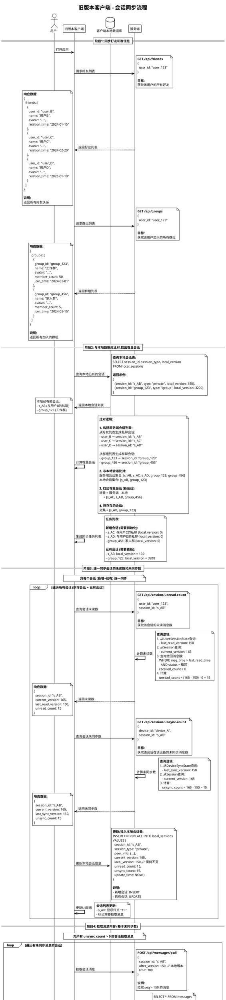

```plantuml
@startuml 旧版本客户端同步流程
!theme plain
skinparam backgroundColor #FFFFFF
skinparam handwritten false
skinparam defaultFontSize 13
skinparam arrowThickness 2

title 旧版本客户端 - 会话同步流程

actor "用户" as User
participant "旧版本客户端" as Client
database "客户端本地数据库" as LocalDB
participant "服务端" as Server

== 阶段1: 同步好友和群信息 ==

User -> Client: 打开应用

Client -> Server: 请求好友列表
note right
  <b>GET /api/friends</b>
  {
    user_id: "user_123"
  }

  <b>目标:</b>
  获取该用户的所有好友
end note

Server --> Client: 返回好友列表
note left
  <b>响应数据:</b>
  {
    friends: [
      {
        user_id: "user_B",
        name: "用户B",
        avatar: "...",
        relation_time: "2024-01-15"
      },
      {
        user_id: "user_C",
        name: "用户C",
        avatar: "...",
        relation_time: "2024-02-20"
      },
      {
        user_id: "user_D",
        name: "用户D",
        avatar: "...",
        relation_time: "2025-01-10"
      }
    ]
  }

  <b>说明:</b>
  返回所有好友关系
end note

Client -> Server: 请求群组列表
note right
  <b>GET /api/groups</b>
  {
    user_id: "user_123"
  }

  <b>目标:</b>
  获取该用户加入的所有群组
end note

Server --> Client: 返回群组列表
note left
  <b>响应数据:</b>
  {
    groups: [
      {
        group_id: "group_123",
        name: "工作群",
        avatar: "...",
        member_count: 50,
        join_time: "2024-03-01"
      },
      {
        group_id: "group_456",
        name: "家人群",
        avatar: "...",
        member_count: 5,
        join_time: "2024-05-15"
      }
    ]
  }

  <b>说明:</b>
  返回所有加入的群组
end note

== 阶段2: 与本地数据库比对,找出增量会话 ==

Client -> LocalDB: 查询本地已有的会话
note right
  <b>查询本地会话表:</b>
  SELECT session_id, session_type, local_version
  FROM local_sessions

  <b>返回示例:</b>
  [
    {session_id: "s_AB", type: "private", local_version: 150},
    {session_id: "group_123", type: "group", local_version: 3200}
  ]
end note

LocalDB --> Client: 返回本地会话列表
note left
  本地已有的会话:
  - s_AB (与用户B的私聊)
  - group_123 (工作群)
end note

Client -> Client: 计算增量会话
note right
  <b>比对逻辑:</b>

  <b>1. 构建服务端会话列表:</b>
  从好友列表生成私聊会话:
  - user_B → session_id: "s_AB"
  - user_C → session_id: "s_AC"
  - user_D → session_id: "s_AD"

  从群组列表生成群聊会话:
  - group_123 → session_id: "group_123"
  - group_456 → session_id: "group_456"

  <b>2. 与本地会话比对:</b>
  服务端会话集合: [s_AB, s_AC, s_AD, group_123, group_456]
  本地会话集合: [s_AB, group_123]

  <b>3. 找出增量会话 (新会话):</b>
  增量 = 服务端 - 本地
       = [s_AC, s_AD, group_456]

  <b>4. 已存在的会话:</b>
  交集 = [s_AB, group_123]
end note

Client -> Client: 生成同步任务列表
note right
  <b>任务列表:</b>

  <b>新增会话 (需要初始化):</b>
  - s_AC: 与用户C的私聊 (local_version: 0)
  - s_AD: 与用户D的私聊 (local_version: 0)
  - group_456: 家人群 (local_version: 0)

  <b>已有会话 (需要更新):</b>
  - s_AB: local_version = 150
  - group_123: local_version = 3200
end note

== 阶段3: 逐一同步会话的未读数和未同步数 ==

note over Client, Server
  <b>对每个会话 (新增+已有) 逐一同步</b>
end note

loop 遍历所有会话 (新增会话 + 已有会话)

    Client -> Server: 查询会话未读数
    note right
      <b>GET /api/session/unread-count</b>
      {
        user_id: "user_123",
        session_id: "s_AB"
      }

      <b>目标:</b>
      获取该会话的未读消息数
    end note

    Server -> Server: 计算未读数
    note right
      <b>查询逻辑:</b>
      1. 从UserSessionState查询:
         - last_read_version: 150
      2. 从Session查询:
         - current_version: 165
      3. 查询撤回消息数:
         WHERE msg_time > last_read_time
           AND status = 撤回
         recalled_count = 0
      4. 计算:
         unread_count = (165 - 150) - 0 = 15
    end note

    Server --> Client: 返回未读数
    note left
      <b>响应数据:</b>
      {
        session_id: "s_AB",
        current_version: 165,
        last_read_version: 150,
        unread_count: 15
      }
    end note

    Client -> Server: 查询会话未同步数
    note right
      <b>GET /api/session/unsync-count</b>
      {
        device_id: "device_A",
        session_id: "s_AB"
      }

      <b>目标:</b>
      获取该会话在该设备的未同步消息数
    end note

    Server -> Server: 计算未同步数
    note right
      <b>查询逻辑:</b>
      1. 从DeviceSyncState查询:
         - last_sync_version: 150
      2. 从Session查询:
         - current_version: 165
      3. 计算:
         unsync_count = 165 - 150 = 15
    end note

    Server --> Client: 返回未同步数
    note left
      <b>响应数据:</b>
      {
        session_id: "s_AB",
        current_version: 165,
        last_sync_version: 150,
        unsync_count: 15
      }
    end note

    Client -> LocalDB: 更新本地会话信息
    note right
      <b>更新/插入本地会话表:</b>
      INSERT OR REPLACE INTO local_sessions
      VALUES (
        session_id: "s_AB",
        session_type: "private",
        peer_info: {...},
        current_version: 165,
        local_version: 150, // 保持不变
        unread_count: 15,
        unsync_count: 15,
        update_time: NOW()
      )

      <b>说明:</b>
      - 新增会话: INSERT
      - 已有会话: UPDATE
    end note

    Client -> Client: 更新UI显示
    note right
      <b>会话列表更新:</b>
      - s_AB: 显示红点 "15"
      - 标记需要拉取消息
    end note

end

== 阶段4: 拉取消息内容 (基于未同步数) ==

note over Client, Server
  <b>对所有 unsync_count > 0 的会话拉取消息</b>
end note

loop 遍历有未同步消息的会话

    Client -> Server: 拉取会话消息
    note right
      <b>POST /api/messages/pull</b>
      {
        session_id: "s_AB",
        after_version: 150, // 本地版本
        limit: 100
      }

      <b>说明:</b>
      拉取 seq > 150 的消息
    end note

    Server -> Server: 查询消息
    note right
      SELECT * FROM messages
      WHERE session_id = 's_AB'
        AND seq > 150
        AND status != 删除
      ORDER BY seq ASC
      LIMIT 100
    end note

    Server --> Client: 返回消息列表
    note left
      <b>响应数据:</b>
      {
        session_id: "s_AB",
        messages: [
          {msg_id: 12346, seq: 151, content: "..."},
          {msg_id: 12347, seq: 152, content: "..."},
          ... (共15条)
        ],
        has_more: false
      }
    end note

    Client -> LocalDB: 存储消息到本地
    note right
      <b>插入本地消息表:</b>
      INSERT INTO local_messages
      VALUES (...)

      <b>更新本地版本:</b>
      UPDATE local_sessions
      SET local_version = 165
      WHERE session_id = 's_AB'
    end note

    Client -> Server: 上报同步确认
    note right
      <b>POST /api/sync/ack</b>
      {
        device_id: "device_A",
        sessions: [
          {session_id: "s_AB", sync_version: 165}
        ]
      }
    end note

    Server -> Server: 更新DeviceSyncState
    note right
      UPDATE device_sync_state
      SET last_sync_version = 165
      WHERE device_id = 'device_A'
        AND session_id = 's_AB'
    end note

    Server --> Client: 确认成功
    note left
      {
        success: true
      }
    end note

    Client -> LocalDB: 更新未同步数
    note right
      UPDATE local_sessions
      SET unsync_count = 0
      WHERE session_id = 's_AB'
    end note

    Client -> Client: 更新UI
    note right
      - 清除未同步角标
      - 保留未读角标 (如果有)
    end note

end

Client -> Client: 同步完成,显示会话列表
note right
  <b>最终会话列表:</b>
  - s_AB: 红点 "15" (未读15)
  - s_AC: 无角标 (新会话,无消息)
  - s_AD: 无角标 (新会话,无消息)
  - group_123: 红点 "50" (未读50)
  - group_456: 无角标 (新会话,无消息)
end note

== 总结 ==

note over Client, Server
<b>旧版本客户端同步流程总结:</b>

<b>阶段1: 同步好友和群信息</b>
✅ GET /api/friends → 获取好友列表
✅ GET /api/groups → 获取群组列表
✅ 构建服务端会话集合

<b>阶段2: 与本地比对,找出增量</b>
✅ 查询本地已有会话
✅ 比对服务端会话 vs 本地会话
✅ 计算增量会话 (新增会话)
✅ 识别已有会话 (需要更新)

<b>阶段3: 逐一同步会话状态</b>
✅ 遍历所有会话 (新增 + 已有)
✅ 逐一调用 GET /api/session/unread-count
✅ 逐一调用 GET /api/session/unsync-count
✅ 更新本地数据库
✅ 更新UI显示角标

<b>阶段4: 拉取未同步消息</b>
✅ 遍历 unsync_count > 0 的会话
✅ 调用 POST /api/messages/pull 拉取消息
✅ 存储到本地数据库
✅ 上报同步确认 POST /api/sync/ack
✅ 清除未同步角标

<b>关键特点:</b>
❌ 串行逐一查询,效率较低
❌ N个会话需要调用 2N 次接口 (未读数 + 未同步数)
❌ 需要先同步好友/群信息才能知道会话列表
❌ 增量会话需要从好友/群推导,不够直接

<b>与新版本对比:</b>
✅ 新版本: 3个接口批量返回所有数据
❌ 旧版本: 需要 2 + 2N + M 次接口调用
  - 2: 好友列表 + 群组列表
  - 2N: N个会话 × 2 (未读数 + 未同步数)
  - M: M个有未同步消息的会话拉取消息

<b>适用场景:</b>
✅ 旧版本客户端无法升级
✅ 服务端需要兼容旧协议
✅ 渐进式迁移到新版本

<b>优化方向:</b>
✅ 批量接口: 一次查询所有会话的未读数和未同步数
✅ 增量推送: 服务端主动推送新增会话
✅ 缓存优化: 减少重复查询
end note

@enduml
```
