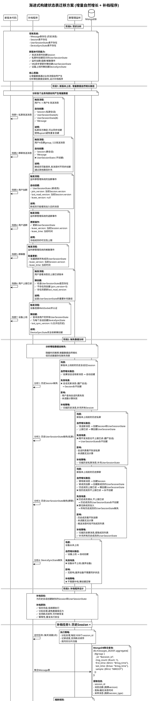

```plantuml
@startuml 渐进式构建状态表-增量+补档方案
!theme plain

title 渐进式构建状态表迁移方案 (增量自然增长 + 补档程序)

participant "新版本代码" as NewCode
participant "补档程序" as Backfill
participant "群管理监听" as GroupListener
database "MongoDB" as MongoDB

== 阶段0: 现状分析 ==

note over NewCode, MongoDB
  <b>现有系统:</b>
  - Message表存在 (历史消息)
  - Session表不存在
  - UserSessionState表不存在
  - DeviceSyncState表不存在

  <b>新版本代码能力:</b>
  ✅ 发送消息时创建Session
  ✅ 私聊时创建双方的UserSessionState
  ✅ 监听加群/退群/解散事件
  ✅ MQ异步更新时懒创建UserSessionState
  ✅ 设备上线时懒创建DeviceSyncState

  <b>核心思路:</b>
  让增量数据通过业务流程自然产生
  分析哪些数据会缺失,设计补档程序
end note

== 阶段1: 新版本上线 - 增量数据自然增长路径 ==

note over NewCode, MongoDB
  <b>分析各个业务场景如何产生增量数据</b>
end note

NewCode -> NewCode: 场景1: 私聊发送消息
note right
  <b>触发流程:</b>
  用户A → 用户B 发送消息

  <b>自动创建:</b>
  ✅ Session (私聊会话)
  ✅ UserSessionState(A)
  ✅ UserSessionState(B)
  ✅ Message

  <b>说明:</b>
  私聊双方确定,可以同步创建
  使用upsert避免重复创建
end note

NewCode -> NewCode: 场景2: 群聊发送消息
note right
  <b>触发流程:</b>
  用户A在群group_123发送消息

  <b>自动创建:</b>
  ✅ Session (群会话)
  ✅ Message
  ❌ UserSessionState (不创建)

  <b>说明:</b>
  群成员可能很多,发消息时不同步创建
  通过其他路径补充
end note

NewCode -> NewCode: 场景3: 用户加群
note right
  <b>触发流程:</b>
  监听群管理系统的加群事件

  <b>自动创建:</b>
  ✅ UserSessionState (新成员)
  - join_version: 当前Session.version
  - last_read_version: 当前Session.version
  - leave_version: null

  <b>说明:</b>
  新成员只能看到加入后的消息
end note

NewCode -> NewCode: 场景4: 用户退群
note right
  <b>触发流程:</b>
  监听群管理系统的退群事件

  <b>更新操作:</b>
  ✅ 更新UserSessionState
  - leave_version: 当前Session.version
  - leave_time: 当前时间

  <b>说明:</b>
  冻结成员的可见性上限
end note

NewCode -> NewCode: 场景5: 群解散
note right
  <b>触发流程:</b>
  监听群管理系统的解散事件

  <b>批量更新:</b>
  ✅ 批量更新所有成员UserSessionState
  - leave_version: 当前Session.version
  - leave_time: 当前时间
end note

NewCode -> NewCode: 场景6: 用户上报已读
note right
  <b>触发流程:</b>
  用户查看消息后上报已读版本

  <b>懒创建:</b>
  ✅ 检查UserSessionState是否存在
  ✅ 不存在则创建 (join_version=0)
  ✅ 存在则更新last_read_version

  <b>说明:</b>
  这是UserSessionState的重要补充路径
end note

NewCode -> NewCode: 场景7: 设备上线
note right
  <b>触发流程:</b>
  设备连接WebSocket并认证

  <b>懒创建:</b>
  ✅ 查询该用户的所有UserSessionState
  ✅ 为每个会话创建DeviceSyncState
  - last_sync_version: 0 (允许拉历史)

  <b>说明:</b>
  DeviceSyncState完全依赖懒创建
end note

== 阶段2: 缺失数据分析 ==

note over Backfill, MongoDB
  <b>分析哪些数据会缺失:</b>

  随着时间推移,增量数据自然增长
  但历史数据存在缺失场景
end note

Backfill -> Backfill: 分析1: 历史Session缺失
note right
  <b>场景:</b>
  新版本上线前的历史会话无Session

  <b>自然增长路径:</b>
  ✅ 如果该会话有新消息 → 自动创建

  <b>失效场景:</b>
  ❌ 会话无新消息 (僵尸会话)
     → Session永不创建

  <b>影响:</b>
  - 用户查询会话列表失败
  - 未读数计算失败

  <b>补档策略:</b>
  ✅ 扫描历史消息,补充所有Session
end note

Backfill -> Backfill: 分析2: 历史UserSessionState缺失(私聊)
note right
  <b>场景:</b>
  新版本上线前的历史私聊

  <b>自然增长路径:</b>
  ✅ 发送新消息 → 创建Session和UserSessionState
  ✅ 上报已读 → 懒创建UserSessionState

  <b>失效场景:</b>
  ❌ 既不发消息也不上报已读 (僵尸会话)
     → UserSessionState永不创建

  <b>影响:</b>
  - 会话列表看不到该私聊
  - 未读数无法计算

  <b>补档策略:</b>
  ✅ 扫描历史私聊消息,补充UserSessionState
end note

Backfill -> Backfill: 分析3: 历史UserSessionState缺失(群聊)
note right
  <b>场景:</b>
  新版本上线前的历史群聊

  <b>自然增长路径:</b>
  ✅ 群有新消息 → 创建Session
  ✅ 新成员加群 → 创建新成员的UserSessionState
  ✅ 历史成员上报已读 → 懒创建UserSessionState
  ❌ 但历史成员不上报已读 → 永不创建

  <b>失效场景:</b>
  ❌ 历史成员潜水,不上报已读
     → 历史成员的UserSessionState永不创建
  ❌ 群无新成员加入
     → 所有历史成员的UserSessionState缺失

  <b>影响:</b>
  - 历史成员看不到该群
  - 未读数无法计算
  - 推送消息时找不到成员列表

  <b>补档策略:</b>
  ✅ 扫描历史群消息,提取成员列表
  ✅ 补充所有历史成员的UserSessionState
end note

Backfill -> Backfill: 分析4: DeviceSyncState缺失
note right
  <b>场景:</b>
  设备从未上线

  <b>自然增长路径:</b>
  ✅ 设备上线 → 自动创建

  <b>失效场景:</b>
  ❌ 设备永不上线 (废弃设备)

  <b>影响:</b>
  ✅ 无影响,废弃设备不需要同步状态

  <b>补档策略:</b>
  ❌ 不需要补档,懒创建足够
end note

== 阶段3: 补档程序设计 ==

note over Backfill, MongoDB
  <b>补档目标:</b>
  为历史会话创建缺失的Session和UserSessionState

  <b>补档原则:</b>
  ✅ 低优先级,低峰期执行
  ✅ 分批处理,避免数据库压力
  ✅ 支持断点续传,可中断恢复
  ✅ 幂等性,重复执行安全
end note

=== 补档任务1: 历史Session ===

Backfill -> Backfill: 定时任务 (每天凌晨2点)
note right
  <b>执行策略:</b>
  - 分批处理,每批1000个session_id
  - 记录进度,支持断点续传
  - 按月份分片扫描
end note

Backfill -> MongoDB: 聚合Message表
note right
  <b>MongoDB聚合查询:</b>
  db.messages_202501.aggregate([
    {$group: {
      _id: "$session_id",
      msg_count: {$sum: 1},
      first_time: {$min: "$msg_time"},
      last_time: {$max: "$msg_time"},
      sample: {$first: "$$ROOT"}
    }}
  ])

  <b>提取信息:</b>
  - session_id
  - 消息总数 (推算version)
  - 首条/最后消息时间
  - 采样消息 (推断session_type)
end note

Backfill -> Backfill: 推断session_type
note right
  <b>推断规则:</b>
  - session_id以"group_"开头 → group
  - to_id为null → group
  - receiver_ids长度 > 2 → group
  - 其他 → private
end note

loop 遍历每个session_id

    Backfill -> MongoDB: 检查Session是否存在
    note right
      SELECT * FROM session WHERE session_id = ?
    end note

    alt Session不存在

        Backfill -> MongoDB: 创建Session
        note right
          <b>初始化数据:</b>
          - session_id: 会话ID
          - session_type: 推断结果
          - version: msg_count (消息总数)
          - create_time: first_time
          - update_time: last_time

          <b>幂等性:</b>
          使用 INSERT IGNORE 或 upsert
        end note

    end

end

Backfill -> Backfill: 更新进度记录
note right
  记录已处理的月份和session_id
  下次从断点继续
end note

=== 补档任务2: 历史UserSessionState (私聊) ===

Backfill -> MongoDB: 扫描私聊消息
note right
  <b>查询条件:</b>
  - session_type = private
  - 或 to_id IS NOT NULL

  <b>提取参与者:</b>
  - from_id, to_id
  - 去重得到双方用户
end note

loop 遍历每个私聊会话

    Backfill -> Backfill: 提取参与者: [userA, userB]
    note right
      从消息中提取 from_id 和 to_id
      去重得到双方
    end note

    loop 遍历双方用户

        Backfill -> MongoDB: 检查UserSessionState是否存在
        note right
          SELECT * FROM user_session_state
          WHERE user_id = ? AND session_id = ?
        end note

        alt UserSessionState不存在

            Backfill -> MongoDB: 创建UserSessionState
            note right
              <b>初始化数据:</b>
              - user_id: 用户ID
              - session_id: 会话ID
              - session_type: private
              - last_read_version: 0 (保守策略)
              - last_read_time: null
              - join_version: 0 (可见所有历史)
              - leave_version: null
              - join_time: 该用户首条消息时间
              - leave_time: null

              <b>保守策略说明:</b>
              last_read_version=0 表示全未读
              用户上线后上报已读时会更新
            end note

        end

    end

end

=== 补档任务3: 历史UserSessionState (群聊) ===

Backfill -> MongoDB: 扫描群聊消息
note right
  <b>查询条件:</b>
  - session_type = group
  - 或 session_id以"group_"开头

  <b>提取成员:</b>
  - 从receiver_ids提取
  - 从from_id提取
  - 去重得到所有历史成员
end note

loop 遍历每个群会话

    Backfill -> MongoDB: 聚合该群的所有参与者
    note right
      <b>MongoDB聚合:</b>
      db.messages_202501.aggregate([
        {$match: {session_id: "group_123"}},
        {$unwind: "$receiver_ids"},
        {$group: {
          _id: "$receiver_ids",
          first_time: {$min: "$msg_time"}
        }}
      ])

      <b>得到:</b>
      - 所有历史成员user_id
      - 每个成员首次参与时间
    end note

    loop 遍历每个历史成员

        Backfill -> MongoDB: 检查UserSessionState是否存在

        alt UserSessionState不存在

            Backfill -> MongoDB: 创建UserSessionState
            note right
              <b>初始化数据:</b>
              - user_id: 成员ID
              - session_id: 群ID
              - session_type: group
              - last_read_version: 0 (保守策略)
              - last_read_time: null
              - join_version: 0 (可见所有历史)
              - leave_version: null (假设未退群)
              - join_time: 成员首次参与时间
              - leave_time: null

              <b>注意:</b>
              无法从消息历史判断是否已退群
              假设都在群中,退群由监听事件更新
            end note

        end

    end

end

== 阶段4: 执行时间线 ==

note over NewCode, MongoDB
<b>完整时间线:</b>

<b>T0: 新版本代码上线</b>
✅ 增量数据开始自然增长
✅ 私聊新消息 → 自动创建Session和UserSessionState
✅ 群聊新消息 → 自动创建Session
✅ 加群事件 → 创建新成员UserSessionState
✅ 上报已读 → 懒创建UserSessionState
✅ 设备上线 → 懒创建DeviceSyncState

<b>T1: 补档程序启动 (T0后1-2天)</b>
✅ 补档任务1: 扫描历史消息,创建所有Session
✅ 补档任务2: 扫描历史私聊,创建UserSessionState
✅ 补档任务3: 扫描历史群聊,创建UserSessionState

<b>补档周期:</b>
- 每天凌晨2点执行
- 分批处理,每批1000条
- 预计1-2周完成全量历史数据

<b>T2: 补档完成后</b>
✅ Session表: 完整 (历史+增量)
✅ UserSessionState表: 完整 (历史+增量)
✅ DeviceSyncState表: 按需懒创建

<b>稳定状态:</b>
- 增量数据通过业务流程自动产生
- 补档程序可以停止或降低频率
- 仅在发现缺失时手动触发补档
end note

== 总结 ==

note over NewCode, MongoDB
<b>核心思路总结:</b>

<b>1. 增量数据自然增长 (新版本代码)</b>
✅ 私聊消息 → Session + 双方UserSessionState
✅ 群聊消息 → Session
✅ 加群事件 → 新成员UserSessionState
✅ 退群事件 → 更新leave_version
✅ 上报已读 → 懒创建UserSessionState
✅ 设备上线 → 懒创建DeviceSyncState

<b>2. 历史数据缺失分析</b>
❌ 历史Session: 无新消息的会话永不创建
❌ 历史UserSessionState(私聊): 僵尸会话永不创建
❌ 历史UserSessionState(群聊): 潜水成员永不创建
✅ DeviceSyncState: 懒创建足够,无需补档

<b>3. 补档程序设计</b>
✅ 低峰期执行,不影响主业务
✅ 分批处理,支持断点续传
✅ 幂等性,重复执行安全
✅ 补档任务1: Session (扫描消息聚合)
✅ 补档任务2: UserSessionState私聊 (提取双方)
✅ 补档任务3: UserSessionState群聊 (聚合成员)

<b>4. 关键优势</b>
✅ 无需等待客户端开发完成
✅ 增量和历史数据分离处理
✅ 业务流程自然产生增量数据
✅ 补档程序填补历史缺失
✅ 平滑过渡,风险可控
✅ 最终达到完整状态

<b>5. 最佳实践</b>
✅ Session: 发消息时同步创建
✅ UserSessionState(私聊): 发消息时同步创建
✅ UserSessionState(群聊): 上报已读时懒创建 + 补档
✅ DeviceSyncState: 设备上线时懒创建
✅ 加群/退群: 监听事件实时维护
end note

@enduml
```
