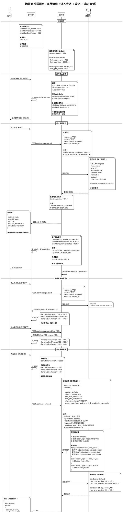

```plantuml
@startuml 场景1-发送消息
!theme plain

title 场景1: 发送消息 - 完整流程（进入会话 → 发送 → 离开会话）

actor 用户A as UserA
participant "客户端A" as ClientA
participant "服务端" as Server
database "数据库" as DB

== 初始状态 ==

note over ClientA
<b>客户端A状态：</b>
client.session_version = 100
client.lastReadVersion = 100
client.lastSyncVersion = 100

<b>未读数：</b>
unread = 0

<b>当前位置：</b>
会话列表页
end note

note over Server
<b>服务端状态（会话AB）：</b>
Session.version = 100

UserSessionState(A):
  last_read_version = 100
  last_read_time = 09:50:00

DeviceSyncState(A, device_A1):
  last_sync_version = 100
end note

== 用户进入会话 ==

UserA -> ClientA: 点击会话AB（进入会话）

ClientA -> ClientA: 记录进入会话 + 清除红点
note right
<b>记录：</b>
enter_time = now() // 10:05:00
current_session = "AB"
in_session = true

<b>清除本地红点：</b>
• 会话列表中会话AB的红点清除
• unread_count[AB] = 0

<b>关闭红点监听：</b>
• 停止监听会话AB的未读消息推送
• 防止在会话内显示红点

<b>不立即上报服务端</b>
等离开时统一上报
end note

ClientA -> UserA: 显示聊天界面（无红点）

== 用户发送消息 ==

UserA -> ClientA: 输入消息 "你好"

ClientA -> Server: POST /api/messages/send
note right
<b>请求体：</b>
{
  session_id: "AB",
  content: "你好",
  client_msg_id: "msg_001",
  device_id: "device_A1"
}

<b>注意：</b>
不携带 read_version 和 sync_version
因为发送方在会话内，离开时统一上报
end note

Server -> DB: 事务开始
note right
<b>原子操作（单个事务）：</b>

1. 插入 Message 表
   msg_id: xxx
   seq: 101
   session_id: AB
   content: "你好"
   from_id: A
   status: 0
   msg_time: 10:05:30

2. Session.version: 100 → 101 ✅

3. 提交事务
end note

DB --> Server: 事务提交成功

note over Server
<b>服务端状态更新：</b>
Session.version = 101 ✅

<b>注意：</b>
UserSessionState(A) 暂不更新
等客户端离开会话时上报
end note

Server --> ClientA: 200 OK - 发送成功
note left
<b>响应体：</b>
{
  success: true,
  msg_id: "xxx",
  seq: 101,
  session_version: 101,
  msg_time: "10:05:30"
}

<b>返回最新的 session_version</b>
end note

ClientA -> ClientA: 收到响应，更新本地状态
note right
<b>客户端A更新：</b>
client.session_version: 100 → 101 ✅
client.lastReadVersion: 100 → 101 ✅
client.lastSyncVersion: 100 → 101 ✅

<b>原因：</b>
• 自己发的消息，自动标记已读+已同步
• 在会话内，本地立即更新

<b>未读数：</b>
unread = 101 - 101 = 0

<b>暂不上报服务端</b>
end note

ClientA -> UserA: 显示发送成功

Server -> Server: 推送消息给其他成员（详见场景2）

== 继续发送多条消息 ==

UserA -> ClientA: 输入第二条消息 "在吗"

ClientA -> Server: POST /api/messages/send
note right
{
  session_id: "AB",
  content: "在吗",
  client_msg_id: "msg_002",
  device_id: "device_A1"
}
end note

Server -> DB: 写入消息
note right
seq: 102
Session.version: 101 → 102 ✅
end note

Server --> ClientA: 发送成功 (seq=102, version=102)

ClientA -> ClientA: 更新本地
note right
client.session_version: 101 → 102 ✅
client.lastReadVersion: 101 → 102 ✅
client.lastSyncVersion: 101 → 102 ✅

<b>仍在会话内，暂不上报</b>
end note

UserA -> ClientA: 输入第三条消息 "回复下"

ClientA -> Server: POST /api/messages/send (seq=103)

Server --> ClientA: 发送成功 (seq=103, version=103)

ClientA -> ClientA: 更新本地
note right
client.session_version: 102 → 103 ✅
client.lastReadVersion: 102 → 103 ✅
client.lastSyncVersion: 102 → 103 ✅
end note

== 用户离开会话 ==

UserA -> ClientA: 点击返回（离开会话）

ClientA -> ClientA: 记录离开
note right
<b>离开时间：</b>
leave_time = now() // 10:08:00

<b>当前版本号：</b>
client.session_version = 103
client.lastReadVersion = 103
client.lastSyncVersion = 103

<b>需要上报服务端</b>
end note

ClientA -> Server: POST /api/session/report
note right
<b>上报请求（支持批量）：</b>
{
  device_id: "device_A1",
  sessions: [
    {
      session_id: "AB",
      session_version: 103,
      last_read_version: 103,
      last_sync_version: 103,
      client_timestamp: "10:08:00",
      report_type: "read_and_sync" // 或 "read_only" "sync_only"
    }
  ]
}

<b>说明：</b>
• 支持一次上报多个会话
• report_type: 上报类型
  - "read_only": 只上报红点（已读）
  - "sync_only": 只上报同步数
  - "read_and_sync": 同时上报红点和同步数
• 客户端提供完整版本号信息
end note

Server -> Server: 处理上报
note right
<b>服务端处理：</b>

1. 遍历 sessions 数组
2. 根据 report_type 决定更新哪些字段
3. 服务端时间：10:08:01

<b>处理逻辑：</b>
if (report_type == "read_and_sync") {
  更新 UserSessionState.last_read_version
  更新 UserSessionState.last_read_time
  更新 DeviceSyncState.last_sync_version
}
else if (report_type == "read_only") {
  只更新 UserSessionState
}
else if (report_type == "sync_only") {
  只更新 DeviceSyncState
}
end note

Server -> DB: 更新版本号
note right
<b>更新操作（会话AB）：</b>

UserSessionState(A):
  last_read_version: 100 → 103 ✅
  last_read_time: 09:50:00 → 10:08:01 ✅

DeviceSyncState(A, device_A1):
  last_sync_version: 100 → 103 ✅
end note

DB --> Server: 更新成功

Server --> ClientA: 200 OK
note left
<b>响应（批量返回）：</b>
{
  success: true,
  results: [
    {
      session_id: "AB",
      read_version: 103,
      sync_version: 103,
      server_timestamp: "10:08:01"
    }
  ]
}
end note

ClientA -> ClientA: 确认同步完成
note right
<b>版本号对齐：</b>

客户端：
  client.lastReadVersion = 103
  client.lastSyncVersion = 103

服务端：
  last_read_version = 103 ✅
  last_sync_version = 103 ✅

<b>完全对齐！</b>
end note

ClientA -> UserA: 返回会话列表

note over ClientA, Server
<b>完整流程总结：</b>

1. 进入会话：记录进入，不上报
2. 发送消息：本地更新版本号，不上报
3. 继续发送：持续更新本地，仍不上报
4. 离开会话：统一上报一次 ✅

<b>优势：</b>
• 减少网络请求（3次发送只需1次上报）
• 批量处理，提升效率
• 逻辑清晰，进入-操作-离开
end note

== 离开会话上报失败处理 ==

note over ClientA
<b>场景：</b>
离开会话时上报失败
end note

UserA -> ClientA: 离开会话

ClientA -> Server: POST /api/session/report
note right
<b>上报请求：</b>
{
  device_id: "device_A1",
  sessions: [
    {
      session_id: "AB",
      session_version: 104,
      last_read_version: 104,
      last_sync_version: 104,
      client_timestamp: "10:10:00",
      report_type: "read_and_sync"
    }
  ]
}
end note

Server -> ClientA: ❌ 网络超时

ClientA -> ClientA: 标记待上报
note right
<b>处理策略：</b>

1. 本地状态已更新
   client.lastReadVersion = 104 ✅

2. 标记待上报
   pending_reports["AB"] = {
     session_id: "AB",
     session_version: 104,
     last_read_version: 104,
     last_sync_version: 104,
     client_timestamp: "10:10:00",
     report_type: "read_and_sync",
     last_attempt: now(),
     retry_count: 0
   }

3. 重试机制：
   • 延迟 2 秒后重试
end note

ClientA -> Server: 延迟 2 秒后重试
note right
<b>重试请求：</b>
POST /api/session/report
{
  device_id: "device_A1",
  sessions: [
    {
      session_id: "AB",
      session_version: 104,
      last_read_version: 104,
      last_sync_version: 104,
      client_timestamp: "10:10:00",
      report_type: "read_and_sync"
    }
  ]
}
end note

alt 重试成功
    Server -> DB: 更新版本号
    note right
    UserSessionState(A):
      last_read_version: 103 → 104 ✅
      last_read_time: now()

    DeviceSyncState(A, device_A1):
      last_sync_version: 103 → 104 ✅
    end note

    Server --> ClientA: 200 OK
    note left
    {
      success: true,
      results: [
        {
          session_id: "AB",
          read_version: 104,
          sync_version: 104,
          server_timestamp: "10:10:02"
        }
      ]
    }
    end note

    ClientA -> ClientA: 清除待上报标记
    note right
    pending_reports["AB"] = null ✅

    <b>版本号已同步！</b>
    end note

else 重试仍然失败
    Server -> ClientA: ❌ 网络超时或服务异常

    ClientA -> ClientA: 持久化待上报标记
    note right
    <b>持久化存储：</b>

    1. 更新待上报标记
       pending_reports["AB"] = {
         session_id: "AB",
         session_version: 104,
         last_read_version: 104,
         last_sync_version: 104,
         client_timestamp: "10:10:00",
         report_type: "read_and_sync",
         last_attempt: now(),
         retry_count: 1,
         persistent: true ✅
       }

    2. 写入本地数据库/持久化存储
       保证应用重启后不丢失

    3. 等待触发时机：
       • 下次登录时主动发送
       • 该会话收到新消息推送时立即发送
    end note

    note over ClientA
    <b>触发上报的两个时机：</b>

    1. 下次登录时：
       登录成功后，检查 pending_reports
       发现有待上报的会话，批量发送上报请求

    2. 收到新消息推送时：
       当会话AB收到新消息推送
       先补发之前未完成的上报
       再处理新消息

    详见后续场景时序图
    end note
end

== 关键设计总结 ==

note over ClientA, Server
<b>1. 进入-发送-离开模式</b>
• 进入会话：记录进入时间，清除本地红点，关闭红点监听，不上报服务端
• 发送消息：只写消息，不携带版本号，不上报
• 离开会话：统一上报一次（批量上报接口）

<b>2. 本地版本号实时更新</b>
• 发送成功后立即更新本地三个版本号
• 自己发的消息自动标记已读+已同步
• 本地计算未读数，UI实时响应

<b>3. 统一的批量上报接口</b>
• 接口：POST /api/session/report
• 支持一次上报多个会话信息
• 上报内容：
  - session_id, session_version
  - last_read_version, last_sync_version
  - client_timestamp, report_type
• report_type 类型：
  - "read_only": 只上报红点（已读）
  - "sync_only": 只上报同步数
  - "read_and_sync": 同时上报红点和同步数

<b>4. 批量上报优化</b>
• 在会话内发送N条消息，只需离开时上报1次
• 支持同时上报多个会话的状态变更
• 大幅减少网络请求（N+1 → 1）
• 提升性能和用户体验

<b>5. 服务端处理逻辑</b>
• 根据 report_type 决定更新哪些字段
• read_and_sync: 更新 UserSessionState + DeviceSyncState
• read_only: 只更新 UserSessionState
• sync_only: 只更新 DeviceSyncState
• 服务端使用当前时间作为权威时间戳

<b>6. 离开会话上报失败重试机制</b>
• 首次失败：标记待上报（含完整版本号信息），延迟 2 秒重试
• 重试成功：清除待上报标记，版本号同步完成
• 重试失败：持久化待上报标记（写入本地数据库）
• 补发触发时机：
  - 下次登录时：批量发送所有待上报会话
  - 收到新消息推送时：先补发历史上报，再处理新消息
  - 详见后续场景时序图

<b>7. 红点管理</b>
• 进入会话时：清除本地红点，关闭该会话的红点监听
• 在会话内：不显示红点，不计算未读数
• 离开会话后：恢复红点监听

<b>8. 版本号单向递增</b>
• Session.version 只增不减
• 客户端和服务端版本号最终一致
end note

@enduml
```
