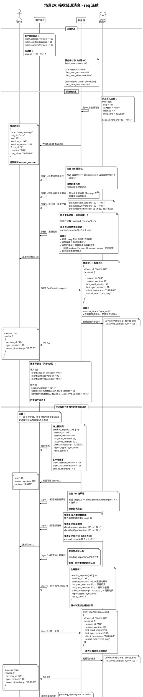

```plantuml
@startuml 场景2A-接收消息seq连续
!theme plain

title 场景2A: 接收普通消息 - seq 连续

actor 用户B as UserB
participant "客户端B" as ClientB
participant "服务端" as Server
database "数据库" as DB

== 初始状态 ==

note over ClientB
<b>客户端B状态：</b>
client.session_version = 100
client.lastReadVersion = 95
client.lastSyncVersion = 100

<b>未读数：</b>
unread = 100 - 95 = 5
end note

note over Server
<b>服务端状态（会话AB）：</b>
Session.version = 100

UserSessionState(B):
  last_read_version = 95
  last_read_time = 09:50:00

DeviceSyncState(B, device_B1):
  last_sync_version = 100
end note

== 新消息到达 ==

Server -> Server: 用户A发送新消息
note right
<b>消息写入完成：</b>
Message:
  seq = 101
  content = "你好"
  from_id = A
  msg_time = 10:05:00

Session.version: 100 → 101 ✅
end note

Server -> ClientB: WebSocket 推送消息
note left
<b>推送内容：</b>
{
  type: "new_message",
  msg_id: "xxx",
  seq: 101,
  session_id: "AB",
  session_version: 101,
  from_id: "A",
  content: "你好",
  msg_time: "10:05:00"
}

<b>携带最新 session_version</b>
end note

ClientB -> ClientB: 步骤1 - 检查消息连续性
note right
<b>检查 seq 连续性：</b>

推送 seq(101) == client.session_version(100) + 1
→ 连续 ✅

<b>消息副本完整！</b>
可以正常处理新消息
end note

ClientB -> ClientB: 步骤2 - 写入本地消息副本
note right
插入消息到本地 Message 表
构建本地消息副本
end note

ClientB -> ClientB: 步骤3 - 执行统一消费逻辑
note right
client.session_version: 100 → 101 ✅
client.lastSyncVersion: 100 → 101 ✅
client.lastReadVersion: 95 (不变，用户未读)
end note

ClientB -> ClientB: 步骤5 - 更新红点
note right
<b>红点更新逻辑（消息连续）：</b>

当前红点数：unread_count[AB] = 5

<b>消息连续时的更新方式：</b>
unread_count[AB] = 5 + 1 = 6 ✅

<b>说明：</b>
• 前提：seq 连续（步骤2已确认）
• 消息连续：本地未读数 +1
• 消息不连续：需要同步后重新计算
  （根据 lastReadVersion 和 session.version 区间计算）
• 撤回消息不增加红点
end note

ClientB -> UserB: 显示未读红点 (6)

ClientB -> Server: POST /api/session/report
note right
<b>使用统一上报接口：</b>
{
  device_id: "device_B1",
  sessions: [
    {
      session_id: "AB",
      session_version: 101,
      last_read_version: 95,
      last_sync_version: 101,
      client_timestamp: "10:05:01",
      report_type: "sync_only"
    }
  ]
}

<b>说明：</b>
• report_type = "sync_only"
• 只更新同步版本，不更新已读版本
end note

Server -> DB: 更新设备同步版本
note right
DeviceSyncState(B, device_B1):
  last_sync_version: 100 → 101 ✅
end note

Server --> ClientB: 200 OK
note left
{
  success: true,
  results: [
    {
      session_id: "AB",
      sync_version: 101,
      server_timestamp: "10:05:01"
    }
  ]
}
end note

note over ClientB, Server
<b>版本号状态（同步完成）：</b>

客户端B：
  client.session_version = 101 ✅
  client.lastReadVersion = 95
  client.lastSyncVersion = 101 ✅

服务端：
  Session.version = 101 ✅
  UserSessionState(B).last_read_version = 95
  DeviceSyncState(B, device_B1).last_sync_version = 101 ✅

<b>同步版本对齐！</b>
end note

== 待上报队列不为空时收到新消息 ==

note over ClientB
<b>场景：</b>
上一次上报失败，待上报队列中有会话AB
此时收到会话AB的新消息推送
end note

ClientB -> ClientB: 当前状态
note right
<b>待上报队列：</b>
pending_reports["AB"] = {
  session_id: "AB",
  session_version: 101,
  last_read_version: 95,
  last_sync_version: 101,
  client_timestamp: "10:05:01",
  report_type: "sync_only",
  retry_count: 1
}

<b>客户端版本：</b>
client.session_version = 101
client.lastSyncVersion = 101
unread_count[AB] = 6
end note

Server -> ClientB: 推送消息 seq=102
note left
{
  seq: 102,
  session_version: 102,
  content: "新消息"
}
end note

ClientB -> ClientB: Layer 1 - 检查消息连续性
note right
<b>检查 seq 连续性：</b>

推送 seq(102) == client.session_version(101) + 1
→ 连续 ✅

<b>消息副本完整！</b>
end note

ClientB -> ClientB: Layer 2 - 处理新消息
note right
<b>步骤3: 写入本地数据库</b>
插入消息到本地 Message 表

<b>步骤4: 更新版本号</b>
client.session_version: 101 → 102 ✅
client.lastSyncVersion: 101 → 102 ✅

<b>步骤5: 更新红点（消息连续）</b>
unread_count[AB]: 6 + 1 = 7 ✅
end note

ClientB -> UserB: 更新红点 (7)

ClientB -> ClientB: Layer 3 - 检查待上报队列
note right
<b>发现待上报任务：</b>

pending_reports["AB"] 存在 ❗

<b>策略：合并本次更新到队列</b>
end note

ClientB -> ClientB: Layer 3 - 合并到待上报队列
note right
<b>合并更新：</b>

pending_reports["AB"] = {
  session_id: "AB",
  session_version: 102, // 更新为最新
  last_read_version: 95, // 保持不变
  last_sync_version: 102, // 更新为最新
  client_timestamp: "10:05:03", // 更新时间
  report_type: "sync_only",
  retry_count: 1
}

<b>将本次更新合并到队列</b>
end note

ClientB -> Server: Layer 3 - 统一上报
note right
POST /api/session/report
{
  device_id: "device_B1",
  sessions: [{
    session_id: "AB",
    session_version: 102,
    last_read_version: 95,
    last_sync_version: 102,
    client_timestamp: "10:05:03",
    report_type: "sync_only"
  }]
}

<b>一次性上报合并后的状态</b>
end note

Server -> DB: 更新同步版本
note right
DeviceSyncState(B, device_B1):
  last_sync_version: 100 → 102 ✅
end note

Server --> ClientB: 200 OK
note left
{
  success: true,
  results: [{
    session_id: "AB",
    sync_version: 102,
    server_timestamp: "10:05:03"
  }]
}
end note

ClientB -> ClientB: 清空待上报队列
note right
pending_reports["AB"] = null ✅

<b>队列已清空！</b>
end note

note over ClientB, Server
<b>处理完成：</b>

1. 发现待上报队列不为空 ✅
2. 先处理新消息，更新本地状态 ✅
3. 将本次更新合并到待上报队列 ✅
4. 统一上报合并后的状态 ✅
5. 上报成功，清空队列 ✅
6. 版本号最终一致 ✅
end note

== 连续收到多条消息 ==

note over ClientB
<b>场景：</b>
假设从 seq=101 开始
连续收到多条新消息
end note

Server -> ClientB: 推送消息 seq=102
note left
{
  seq: 102,
  session_version: 102,
  content: "在吗？"
}
end note

ClientB -> ClientB: 处理推送
note right
<b>检查连续性：</b>
102 == 101 + 1 → 连续 ✅

<b>更新状态：</b>
client.session_version: 101 → 102 ✅
client.lastSyncVersion: 101 → 102 ✅
unread_count[AB]: 6 + 1 = 7 ✅
end note

ClientB -> UserB: 更新红点 (7)

ClientB -> Server: POST /api/session/report (sync_only)

Server --> ClientB: 200 OK

Server -> ClientB: 推送消息 seq=103
note left
{
  seq: 103,
  session_version: 103,
  content: "看到请回复"
}
end note

ClientB -> ClientB: 处理推送
note right
<b>检查连续性：</b>
103 == 102 + 1 → 连续 ✅

<b>更新状态：</b>
client.session_version: 102 → 103 ✅
client.lastSyncVersion: 102 → 103 ✅
unread_count[AB]: 7 + 1 = 8 ✅
end note

ClientB -> UserB: 更新红点 (8)

ClientB -> Server: POST /api/session/report (sync_only)

Server --> ClientB: 200 OK

note over ClientB
<b>最终状态：</b>
client.session_version = 103
client.lastReadVersion = 95
client.lastSyncVersion = 103

未读数 = 8
end note

== 关键设计总结 ==

note over ClientB, Server
<b>1. 处理新消息的完整流程（seq 连续场景）</b>
① 检查待上报队列
② 检查消息副本完整性（seq 连续性）
③ 写入本地数据库
④ 更新版本号
⑤ 更新红点（本地未读数 +1）
⑥ 如有待上报队列，合并本次更新
⑦ 上报同步进度

<b>2. 待上报队列处理策略</b>
• 队列为空：正常处理，处理完上报
• 队列不为空：
  - 先处理新消息，更新本地状态
  - 将本次更新合并到待上报队列
  - 统一上报合并后的状态
  - 上报成功，清空队列

<b>3. 消息副本完整性检查</b>
推送 seq == client.session_version + 1
→ 确认消息连续，无丢失
→ 消息副本完整 ✅

<b>4. 版本号更新顺序</b>
先更新 client.session_version（会话最大版本）
再更新 client.lastSyncVersion（已同步版本）
两者始终保持一致（接收场景）

<b>5. 红点计算逻辑</b>
• 消息连续：本地未读数 +1
• 消息不连续：同步完消息后，根据 lastReadVersion
  和 session.version 区间从消息副本中计算
• 撤回消息不增加红点

<b>6. 统一上报接口</b>
• 接口：POST /api/session/report
• report_type = "sync_only"（只更新同步版本）
• 支持批量上报多个会话
• 失败处理：标记待上报，延迟 2 秒重试，持久化

<b>7. 上报失败不影响使用</b>
• 本地版本号已更新，消息已入库
• 标记为待上报，后续自动补发
• 用户体验不受影响

<b>8. 状态对齐</b>
客户端和服务端的同步版本号最终一致
DeviceSyncState.last_sync_version == client.lastSyncVersion
end note

@enduml
```
