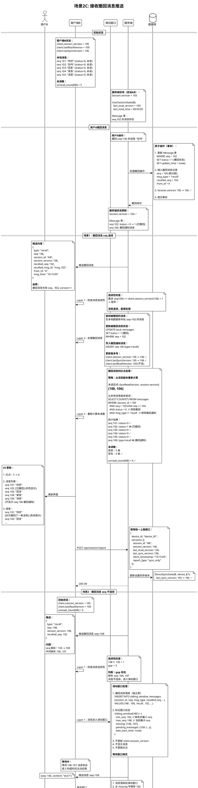

```plantuml
@startuml 场景2C-接收撤回消息
!theme plain

title 场景2C: 接收撤回消息推送

actor 用户B as UserB
participant "客户端B" as ClientB
participant "滑动窗口" as SlidingWindow
participant "服务端" as Server
database "数据库" as DB

== 初始状态 ==

note over ClientB
<b>客户端B状态：</b>
client.session_version = 105
client.lastReadVersion = 100
client.lastSyncVersion = 105

<b>本地消息：</b>
seq 101: "你好" (status=0, 未读)
seq 102: "在吗" (status=0, 未读)
seq 103: "回复" (status=0, 未读)
seq 104: "紧急" (status=0, 未读)
seq 105: "消息" (status=0, 未读)

<b>未读数：</b>
unread_count[AB] = 5
end note

note over Server
<b>服务端状态（会话AB）：</b>
Session.version = 105

UserSessionState(B):
  last_read_version = 100
  last_read_time = 09:50:00

Message 表：
seq 102 的消息存在
end note

== 用户A撤回消息 ==

note over Server
<b>用户A操作：</b>
撤回 seq=102 的消息 "在吗"
end note

Server -> DB: 处理撤回操作
note right
<b>原子操作（事务）：</b>

1. 更新 Message 表
   WHERE seq = 102
   SET status = 1 (撤回状态)
   SET update_time = now()

2. 插入撤回消息记录
   seq = 106 (新分配)
   msg_type = "recall"
   recalled_seq = 102
   from_id = A

3. Session.version: 105 → 106 ✅

4. 提交事务
end note

DB --> Server: 撤回成功

note over Server
<b>服务端状态更新：</b>
Session.version = 106 ✅

Message 表：
seq 102: status = 0 → 1 (已撤回)
seq 106: 撤回通知消息
end note

== 场景1：撤回消息 seq 连续 ==

Server -> ClientB: 推送撤回消息
note left
<b>推送内容：</b>
{
  type: "recall",
  seq: 106,
  session_id: "AB",
  session_version: 106,
  recalled_seq: 102,
  recalled_msg_id: "msg_102",
  from_id: "A",
  msg_time: "10:15:00"
}

<b>说明：</b>
撤回消息也有 seq，也让 version++
end note

ClientB -> ClientB: Layer 1 - 检查消息连续性
note right
<b>连续性检查：</b>
推送 seq(106) == client.session_version(105) + 1
→ 连续 ✅

<b>消息连续，直接处理</b>
end note

ClientB -> ClientB: Layer 2 - 处理撤回消息
note right
<b>查找被撤回的消息：</b>
在本地数据库中找 seq=102 的消息

<b>更新被撤回消息状态：</b>
UPDATE local_messages
SET status = 1 (撤回)
WHERE seq = 102

<b>写入撤回通知消息：</b>
INSERT seq 106 (type=recall)

<b>更新版本号：</b>
client.session_version: 105 → 106 ✅
client.lastSyncVersion: 105 → 106 ✅
client.lastReadVersion: 100 (不变)
end note

ClientB -> ClientB: Layer 2 - 重新计算未读数
note right
<b>撤回消息的红点处理：</b>

<b>策略：从消息副本重新计算</b>

未读区间: (lastReadVersion, session.version]
= (100, 106]

从本地消息副本查询：
SELECT COUNT(*) FROM messages
WHERE session_id = 'AB'
  AND seq > 100 AND seq <= 106
  AND status = 0  // 排除撤回
  AND msg_type != 'recall'  // 排除撤回通知

统计结果：
seq 101: status=0 ✅
seq 102: status=1 ❌ (已撤回)
seq 103: status=0 ✅
seq 104: status=0 ✅
seq 105: status=0 ✅
seq 106: type=recall ❌ (撤回通知)

<b>未读数：</b>
原来：5 条
现在：4 条 ✅

unread_count[AB] = 4 ✅
end note

ClientB -> UserB: 更新界面
note left
<b>UI 更新：</b>

1. 红点：5 → 4

2. 消息列表：
   seq 101: "你好"
   seq 102: [已撤回] (灰色显示)
   seq 103: "回复"
   seq 104: "紧急"
   seq 105: "消息"
   (不显示 seq 106 撤回通知)

3. 或者：
   seq 101: "你好"
   [对方撤回了一条消息] (系统提示)
   seq 103: "回复"
   ...
end note

ClientB -> Server: POST /api/session/report
note right
<b>使用统一上报接口：</b>
{
  device_id: "device_B1",
  sessions: [{
    session_id: "AB",
    session_version: 106,
    last_read_version: 100,
    last_sync_version: 106,
    client_timestamp: "10:15:05",
    report_type: "sync_only"
  }]
}
end note

Server -> DB: 更新设备同步版本
note right
DeviceSyncState(B, device_B1):
  last_sync_version: 105 → 106 ✅
end note

Server --> ClientB: 200 OK

== 场景2：撤回消息 seq 不连续 ==

note over ClientB
<b>初始状态：</b>
client.session_version = 105
client.lastReadVersion = 100
unread_count[AB] = 5
end note

Server -> ClientB: 推送撤回消息 seq=108
note left
<b>推送：</b>
{
  type: "recall",
  seq: 108,
  session_version: 108,
  recalled_seq: 102
}

<b>问题：</b>
seq 跳跃！105 → 108
中间缺失 106, 107
end note

ClientB -> ClientB: Layer 1 - 检查消息连续性
note right
<b>连续性检查：</b>
108 != 105 + 1
gap = 3

<b>判断：gap 存在</b>
缺失 seq: 106, 107
消息不连续，进入滑动窗口
end note

ClientB -> SlidingWindow: Layer 1 - 消息进入滑动窗口
note right
<b>滑动窗口处理：</b>

1. 撤回消息落库（独立表）
   INSERT INTO sliding_window_messages
   (session_id, seq, msg_type, recalled_seq, ...)
   VALUES ('AB', 108, 'recall', 102, ...)

2. 标记窗口状态
   sliding_window['AB'] = {
     min_seq: 106, // 缺失的最小 seq
     max_seq: 108, // 当前最大 seq
     missing: [106, 107],
     pending_messages: {108: {...}},
     wait_start_time: now()
   }

3. 不更新 client.session_version
4. 不显示消息
5. 不更新红点

<b>等待窗口填充</b>
end note

note over ClientB
<b>等待中：</b>
等待 106-107 消息到达
或 5 秒超时后主动拉取
end note

Server -> ClientB: 推送消息 seq=106
note left
{seq: 106, content: "test1"}
end note

ClientB -> SlidingWindow: 填充窗口
note right
1. 消息落库到滑动窗口
2. 从 missing 中移除 106
   missing: [107]
3. 更新窗口状态
end note

Server -> ClientB: 推送消息 seq=107
note left
{seq: 107, content: "test2"}
end note

ClientB -> SlidingWindow: 窗口填充完成
note right
<b>检测到窗口无 gap：</b>

1. missing = [] ✅
2. 窗口连续：106 → 107 → 108
3. 可以逐条消费
end note

SlidingWindow -> ClientB: 逐条执行业务逻辑
note right
<b>按 seq 顺序处理：</b>

<b>处理 seq=106：</b>
• 从滑动窗口移到会话消息表
• client.session_version: 105 → 106
• client.lastSyncVersion: 105 → 106
• unread_count[AB]: 5 + 1 = 6 ✅
• 显示消息

<b>处理 seq=107：</b>
• 移到会话消息表
• client.session_version: 106 → 107
• client.lastSyncVersion: 106 → 107
• unread_count[AB]: 6 + 1 = 7 ✅
• 显示消息

<b>处理 seq=108（撤回消息）：</b>
• 移到会话消息表
• 更新 seq=102 的 status = 1
• client.session_version: 107 → 108
• client.lastSyncVersion: 107 → 108
• <b>重新计算红点：</b>
  未读区间: (100, 108]
  SELECT COUNT(*) WHERE status = 0
  结果：6 条（102被撤回）
  unread_count[AB] = 6 ✅
• 显示撤回提示
end note

ClientB -> UserB: 更新界面
note left
<b>UI 更新：</b>

显示 seq 106, 107 的消息
显示 seq 102 被撤回
红点：5 → 6 → 7 → 6

<b>最终红点：6</b>
end note

ClientB -> Server: POST /api/session/report (sync_only)

Server --> ClientB: 200 OK

SlidingWindow -> SlidingWindow: 清空窗口
note right
sliding_window['AB'] = null ✅
end note

== 场景3：窗口超时主动拉取 ==

note over ClientB
<b>初始状态：</b>
client.session_version = 105
收到推送 seq = 108 (撤回消息)
滑动窗口等待 106-107
end note

ClientB -> ClientB: 5 秒超时检测
note right
<b>超时检测：</b>

now() - sliding_window['AB'].wait_start_time > 5s

<b>判断：超时！</b>
missing: [106, 107]
仍未收到，主动拉取
end note

ClientB -> Server: GET /api/messages/pull
note right
<b>主动拉取：</b>
{
  session_id: "AB",
  min_seq: 105,
  max_seq: 107,
  limit: 100
}

<b>拉取缺失的消息</b>
end note

Server -> DB: 查询消息

DB --> Server: 返回消息列表
note left
[
  {seq: 106, content: "test1", status: 0},
  {seq: 107, content: "test2", status: 0}
]
end note

Server --> ClientB: 返回消息

ClientB -> SlidingWindow: 填充窗口
note right
1. 将 106-107 消息落库到滑动窗口
2. missing = [] ✅
3. 窗口连续：106 → 107 → 108
end note

SlidingWindow -> ClientB: 逐条执行业务逻辑
note right
<b>模拟服务端推送，逐条处理：</b>

处理 seq=106:
• 移到会话消息表
• 更新版本号
• 红点 +1

处理 seq=107:
• 移到会话消息表
• 更新版本号
• 红点 +1

处理 seq=108 (撤回):
• 移到会话消息表
• 更新 seq=102 status=1
• 重新计算红点

<b>最终：</b>
client.session_version = 108 ✅
unread_count[AB] = 6 ✅
end note

ClientB -> UserB: 显示所有消息 + 红点 (6)

ClientB -> Server: POST /api/session/report (sync_only)

Server --> ClientB: 200 OK

== 关键设计总结 ==

note over ClientB, Server
<b>1. 撤回消息分配 seq</b>
撤回操作产生新消息（type=recall）
分配新的 seq，Session.version++
确保所有变更都有序号

<b>2. 红点计算逻辑（关键）</b>
• 消息连续 + 正常消息：红点 +1
• 消息连续 + 撤回消息：从消息副本重新计算 ✅
• 消息不连续（任何消息）：全部进滑动窗口，逐条消费计算

<b>3. 消息连续 + 撤回场景</b>
① 检查待上报队列
② 检查 seq 连续性 → 连续 ✅
③ 更新被撤回消息 status = 1
④ 写入撤回通知消息
⑤ <b>从消息副本重新计算红点</b>（核心）
⑥ 更新 UI
⑦ 上报同步进度

<b>4. 消息不连续场景（滑动窗口）</b>
① 检查待上报队列
② 检查 seq 连续性 → 不连续 ❌
③ 撤回消息进入滑动窗口
④ 等待填充（实时推送或主动拉取）
⑤ 窗口无 gap → 逐条消费
   - 普通消息：红点 +1
   - 撤回消息：重新计算红点
⑥ 上报 + 清空窗口

<b>5. 撤回消息的红点计算公式</b>
<b>无论撤回未读还是已读，统一重新计算：</b>

SELECT COUNT(*) FROM messages
WHERE session_id = 'AB'
  AND seq > lastReadVersion
  AND seq <= session_version
  AND status = 0  // 排除撤回
  AND msg_type != 'recall'  // 排除撤回通知

<b>说明：</b>
• 撤回未读消息：红点会减少
• 撤回已读消息：红点不变（不在未读区间）
• 被撤回消息本地不存在：查询结果自动排除

<b>6. 双重更新</b>
• 更新被撤回消息：status = 1
• 插入撤回通知消息：seq = new

<b>7. 统一上报接口</b>
• 接口：POST /api/session/report
• report_type = "sync_only"
• 支持批量上报

<b>8. UI 展示策略</b>
• 方案1: 显示 [已撤回] 占位
• 方案2: 显示系统提示 "对方撤回了一条消息"
• 方案3: 完全删除（不推荐，丢失上下文）
end note

@enduml
```
